<p align="center">
  
</p>

# AmiWind - Bringing TES III: Morrowind to Commodore Amiga

AmiWind converts your own Morrowind installation for an experimental native
Amiga runtime. Read the [FAQ](docs/FAQ.md) for the project vision, hardware
and current scope, and [licensing and credits](docs/LICENSING_AND_CREDITS.md)
for source provenance and what the public package contains.

## v0.0.30 - The Temple

The Balmora Temple is whole again. A scene-converter fault turned some meshes
around their own origin, leaving missing walls, see-through holes and floating
objects in the Temple's lower rooms; the same fix repairs Tharys Ancestral Tomb
and the Nord fireplaces of five Seyda Neen interiors.

| Before: v0.0.29, holes where the wall should be | After: v0.0.30, the same view |
| --- | --- |
| 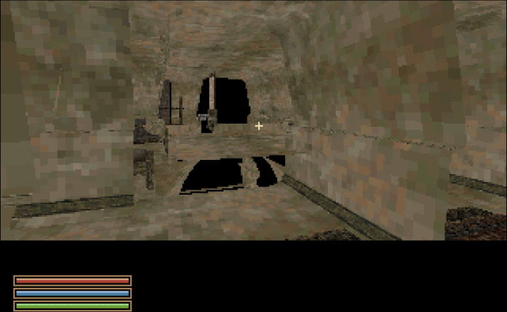 | 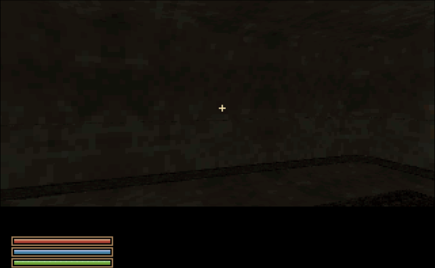 |
| 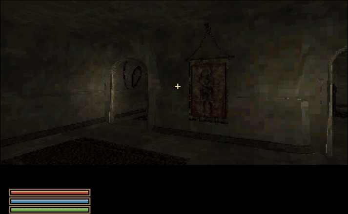 | 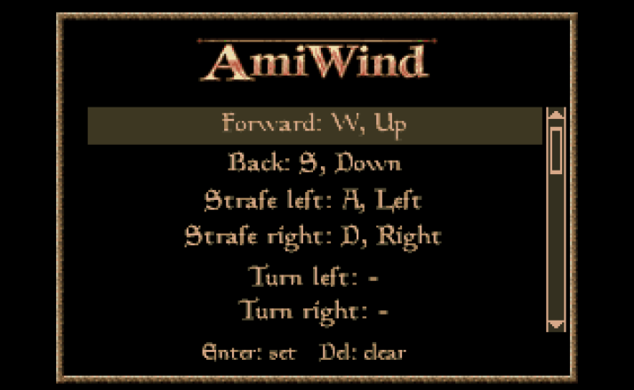 |

Also new: misplaced Census office objects from dev5 fixed, a crash fix for
Seyda Neen region changes, an Options > Controls page for rebinding keys,
arrow keys that move like W/A/S/D, NPCs lit by the floor they stand on,
glowing lantern glass and flames on placed fires (rebuilt maps only so far),
about 15 % less reading on heavy Seyda Neen crossings, less music crackle in
WinUAE (still heard on some map changes), and an engine that builds without
compiler warnings. Every lighting and loading change has a console switch.

Still open: Seyda Neen crossing pauses (a lighter rebuild of its maps is under
way), a rare load freeze seen in automated runs, and the issues carried over
from v0.0.29. See the [release notes](docs/RELEASE-v0.0.30.md) and the
[tracker](docs/BUGS.md). Development builds:
[dev3](docs/RELEASE-v0.0.30-dev3.md), [dev4](docs/RELEASE-v0.0.30-dev4.md),
[dev5](docs/RELEASE-v0.0.30-dev5.md), [rc1](docs/RELEASE-v0.0.30-rc1.md).

## v0.0.29 - Let There Be (Just a Bit More) Light

Explore with adjustable interior brightness, clearer torchlight and improved
first-person hands. Graphics settings now provide independent saved interior
and exterior controls; the Census door guard and reported Seyda shack lighting
jump have positive RC2 playtest results. Confirmation dialogs use framed buttons.

This remains an experimental demake with incomplete world and gameplay coverage.
Balmora Temple geometry holes and WinUAE music crackle/pauses remain known issues,
alongside the hand-animation transition and memory/performance limits. See the
[release notes](docs/RELEASE-v0.0.29.md) and [current tracker](docs/BUGS.md).

## Earlier v0.0.29-rc1 playtest - More Mushrooms! (...and fixes)

The **rc1 candidate is assembled** and has completed a bounded native FS-UAE
playtest: Audio controls, independent dialogue/effects levels and mushroom
pickup with save/reload were verified. Public source publication remains pending.
Final **More Mushrooms** still depends on the world-coverage and regression gates
in [the release plan](docs/PLAN-v0.0.29.md). The dev4 hotlist remains below.

- **Broader mushroom coverage:** the current memory model admits 347 of 390
  exterior maps. Forty-three maps and additional interior routes still need
  work. These are admission results, not a claim that all placements have passed
  in-game testing. See [asset coverage](docs/ASSET_COVERAGE.md).
- **Less temporary and resident RAM:** compact persistent harvest state,
  direct alias-model loading and exact edge/surface layouts preserve source
  geometry while reducing allocations. Native peaks and outdoor transition
  smoothness remain checks of their own.
- **Race-specific first-person hands:** the candidate includes a source-topology
  catalogue and corrected lighting normals, with legacy profiles retained. Bounded
  native motion comparisons show no newly detached skin triangle; the paw-like
  silhouette remains an appearance issue. Transparent sprite conversion is a
  [future investigation](docs/FIRST_PERSON_HANDS.md#investigation-first-person-hands-rendered-as-sprites).
- **Torch repairs:** nearby NPCs respond to local torchlight in bounded native
  off/on tests, and all three tested flame styles are visible. The rc1 run also
  captured held torchlight with a nearby NPC; broader actor coverage remains in
  the [tracker](docs/BUGS.md).
- **Audio work:** smaller, audio-serviced head-preview reads avoid a reproduced
  starvation case under injected disk delay. The rc1 WinUAE playtester reports
  no OST jump when entering appearance selection; a later RC2 WinUAE report
  reopens that issue. A separate
  Audio options screen with Master, Music, Effects and Dialogue sliders now has
  native arrow-key and saved-setting checks, plus independent dialogue/effects
  output checks. Broader listening and event coverage remain open.
- **Faster regression checks:** disk-backed debug help, `dbg shroompicker`
  locations and the `playvideo`, `videoplay`, `playvid` and `vidplay` aliases make
  the playtest easier to exercise.

### From the rc1 playtest

| Aim and pick | Pickup feedback |
| :---: | :---: |
| 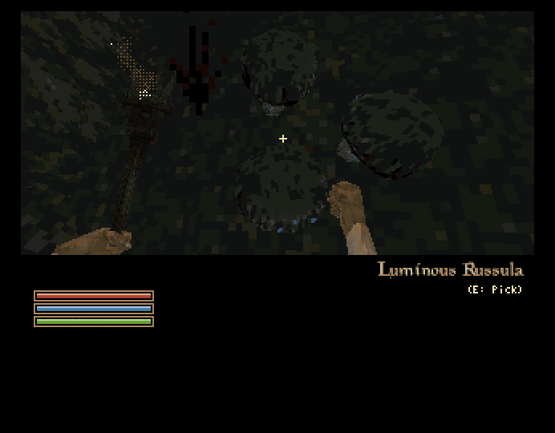 | 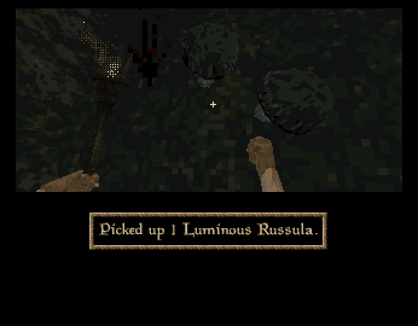 |

| Audio options | Torchlight at night |
| :---: | :---: |
| 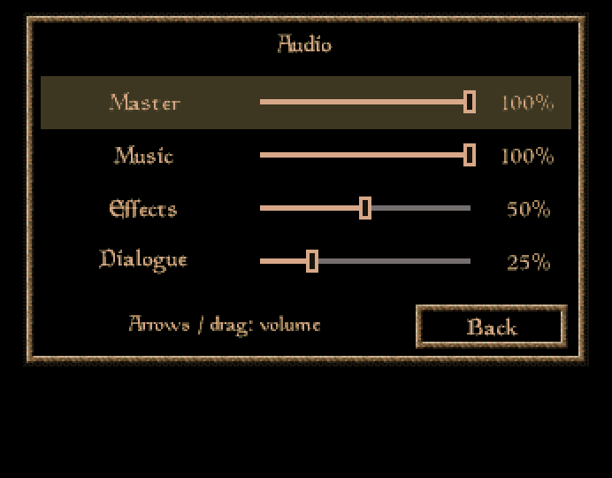 | 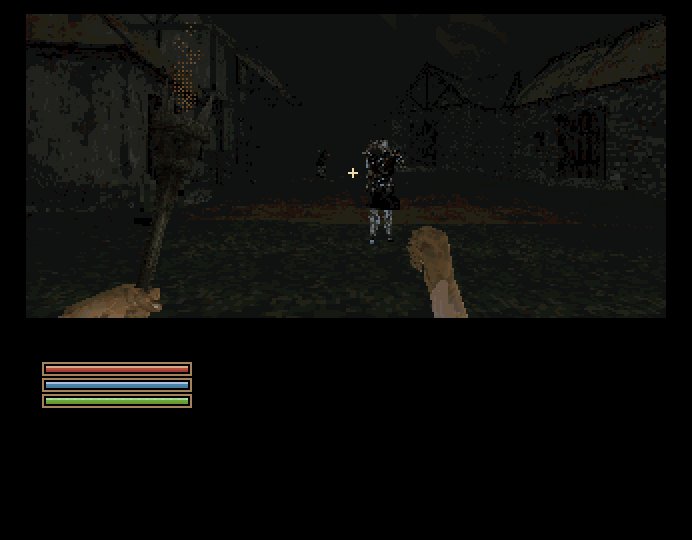 |

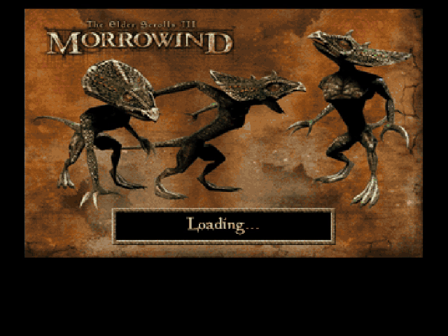

These are actual frames and a six-second clip from the same rc1 run. A debug
destination placed the player by the mushroom; the pickup and save/reload used
ordinary controls. Two distinct plants were collected and remained picked after
reload. See [capture details and earlier galleries](docs/GAMEPLAY_MEDIA.md) for
the test scope and image processing. Broader audio and world checks remain open.

<p align="center">
  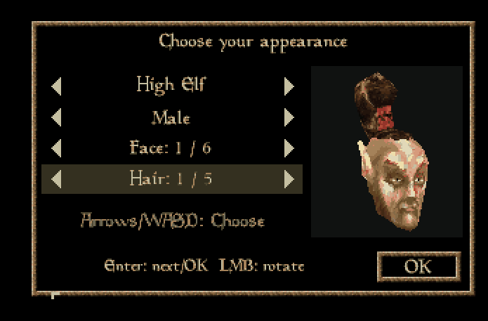
</p>
<p align="center"><em>High Elf male appearance selection in WinUAE, v0.0.29-rc1.</em></p>

This separate playtester-supplied screenshot is unchanged. The playtester
confirms that entering appearance selection caused no OST jump in rc1; this
records that earlier result. The later RC2 WinUAE playtest reopens entry
audio continuity, so it remains in the current known issues.

## v0.0.29-dev4 — WIP: More Mushrooms! (...and fixes)

**More exciting features and bug fixes —** small mushrooms to pick, steadier
free-look, clearer nights and a growing list of repairs across Vvardenfell.
This is a development preview; **v0.0.28 remains the latest stable release**.

### The hotlist: changes since v0.0.28

- **Pick your first small mushrooms.** Six original Luminous Russula placements
  form the dev4 pilot. Aim for the name and **E: Pick**, collect the ingredient,
  and the mushroom disappears. Shared placement identity, hidden inventory and
  sparse saved state keep tested pickups from returning across map changes or
  save/load. `dbg shroomtracker` reports collected mushrooms.
- **Pickup feedback and joined mushroom meshes.** The original item sound and
  rectangular notification accompany successful collection; the notification
  animation is configurable. Conversion preserves shared mesh seams. This
  pilot is the starting point for worldwide picking.
- **Free-look stays where you put it.** Legacy automatic pitch centering while
  walking is disabled by default. `aw_auto_center 1` retains the old behavior;
  explicit centering remains available. Other reported orientation resets are
  still being investigated.
- **Lighter full-screen UI.** Head/race selection and blocking journal, map and
  reading overlays can freeze world work behind a black background while the
  soundtrack and interface keep running. The live background remains selectable;
  the original name-entry scene keeps its existing behavior.
- **Character-menu improvements.** UI mode 2 adds clickable, keyboard-focused
  **OK** buttons. Confirmation and travel choices gain matching framed buttons.
  `dbg tpscene headselection` skips directly to appearance selection for testing.
- **Map and HUD repairs.** Map palette fixes remove unwanted bright dots;
  debug-map selection, teleport aliases, secondary-button panning and tab/input
  handling have been revised. Health, magicka and fatigue use independent values,
  with heading and time available in the debug HUD. Broader mouse checks continue.
- **Hands and carried equipment.** The periodic unarmed idle blink has a corrected
  animation frame range, and repaired world-map metadata restores sampled F/V
  hand/torch controls. Transition view, equipment and voice continuity have new
  preservation paths. Quickload still puts equipment away in dev4; its separate
  save-format fix is coming next.
- **More useful torchlight.** Surface-light interpolation is repaired; player
  and admitted guard lights have a configurable radius, default 192 instead of 144.
  Optional bright-base and spark flame styles are available, and torch depth bob
  is disabled by default. Guard-light cache handling is improved; intermittent
  guard visibility and dim lighting remain on the investigation list.
- **A clearer midnight sky.** The new default clears clouds around 00:00–03:00
  and brings them back toward 04:00, revealing stars and both moons. Legacy cloud
  behavior stays selectable. The improved night appearance has playtest approval.
- **Scenery repairs.** Indrele Rathryon's shack walls are restored. Tree-root
  sampling and distant terrain presentation have improvements, with occasional
  horizon gaps and popping still being worked on. The experimental terrain
  horizon renderer remains opt-in.
- **Movies: 17/17 available source videos converted.** The builder includes the
  discovered movie catalogue. Dev4 retains its higher-resolution intro alongside
  the other new outputs; checking every in-game movie event and soundtrack is
  still in progress.
- **Music: 18/18 available tracks converted.** The complete inspected soundtrack
  set is included in the builder's media output.
- **Voices: 6,447/6,447 available files converted.** Seven additional referenced
  voice sources are missing from the inspected installation and reported as such.
- **Sound effects: 717/717 available files converted.** Two additional referenced
  effects are missing. All four categories have zero failed conversions for
  available inputs; event wiring, listening checks and crackling fixes continue.
  These counts describe conversion from a local game installation; the public
  source archive contains no original game media.
- **Better development tools.** New public guides cover headless FS-UAE and
  OpenMW reference runs in Docker, machine-state inspection and repeatable
  comparisons. Asset coverage, allocation checks and a documented cell-transition
  profiling investigation help track what is present and what still costs time.

### What's cooking next

- **More Mushrooms, worldwide:** compact original-placement data, shared models
  and persistent picking across exterior cells and mushroom-containing interiors.
  Interior rooms and connecting door routes still need integration.
- **More complete saves and hands:** restore equipment intent on quickload,
  improve hand mesh joins/detail and add race-specific first-person hands.
- **Smoother exploration:** measure and improve cell read-ahead/loading pauses,
  close remaining horizon gaps, and continue torch, audio and input fixes.
- **A clearer build report:** distinguish source assets, converted output,
  installed/reachable placements and missing or unsupported content at each build.
- **Later milestones:** Caius Cosades and the Dwemer puzzle box, richer interiors,
  and a combat-testing arena remain on the roadmap.

Dev4 is a **development prerelease**, with a small mushroom pilot rather than
worldwide coverage. See the [dev4 notes](docs/RELEASE-v0.0.29-dev4.md) for tests,
known issues and exact scope, plus the [active plan](docs/PLAN-v0.0.29.md).
There are no new dev4 pictures yet; the gallery below is from v0.0.28.

## v0.0.28 — Trees and Grass, Day and Night

Trees along the road, reeds by the water, grass around the rocks. Vvardenfell's
scenery is filling out beneath red-and-gold sunsets, purple twilight and a cool
blue hour. The new night layer brings back original stars, nebulae, Masser and
Secunda, while guards prepare their torches for the night watch. All of it works
through a shared indexed sky designed for the Amiga renderer.

**The v0.0.28 release build has passed its bounded independent WinUAE playtest.**
Fresh Windows and Linux builds produce the same Amiga executable. The release
adds foliage, a shared sky, tiny background stars, both moons and timed guard
torches. Explore the new skies below and see the
[release notes](docs/RELEASE-v0.0.28.md) for verified scope and known limitations.
Source publication is completed through the separately gated release workflow.

| Sunrise 06:30 | Red sunset 18:00 | Blue hour 20:15 |
| :---: | :---: | :---: |
|  |  |  |

| Masser | Secunda | Balmora at 23:00 |
| :---: | :---: | :---: |
|  |  |  |


*Real 320×200 Amiga frames captured in WinUAE. The GIF is an eight-stage
montage with edited timing; the screenshots retain their native pixels.
[All day and night stills, plus both GIFs](docs/GAMEPLAY_MEDIA.md#v0028--trees-and-grass-day-and-night).*

- **More of the original scenery.** The prepared world includes **19,984 unique
  foliage placements**: 19,787 sprite placements across 76 shared types and 197
  mesh placements, including 192 in Balmora. The landscape retains **37,960 rock
  placements** and **816 giant mushrooms**, with joined mushroom geometry.
  These count original source placements; neighboring map copies do not add
  unique instances.
- **One sky across exterior cells.** The default V3 presentation brings red and
  gold sunsets, purple twilight and a cool blue hour, with two scrolling cloud
  layers and a moving sun. Sky, distant fog and a subtle exterior world tone
  follow the persistent clock; interiors keep their own lighting.
- **Time you can control.** The cycle starts enabled. Press **T** to wait, use
  `dbg set time sunrise` or `dbg set time 1830` to choose a moment, and
  `dbg daynightcycle off` / `on` to pause or resume automatic time. The new
  `dbg daycycle gallery` tours eight sky stages; `dbg nightgallery` previews
  the night sky, Masser, Secunda and overhead stars. Both preserve player position
  and saved time, with `here` for a fixed view and `off` to return.
- **Torchlight for the night watch.** The new guard-torch runtime equips supported
  Imperial guards in Seyda Neen and Hlaalu guards in Balmora from their original
  equipment and poses. `guards_torch_cycle` follows the saved clock;
  `dbg guardtorch on/off/auto` provides an explicit override. Independent native
  checks confirm cold loading, dawn/dusk switching and subtle animated flame
  particles for both guard types. Heavy-scene memory reserves remain limited.
  [Source rules and current acceptance](docs/TORCH.md).
- **Better tools to see what costs memory.** The 3D Map Inspector and build
  comparisons expose stored geometry, placed geometry and per-map loading
  estimates. The Seyda Neen terrain winding repair restores the missing textured
  ground; broader world geometry and performance work remains ongoing.

Press **F10** for the console, or **Shift+F10** for fullscreen. The separate
`dbg sky off` / `on` control switches the sky/fog effect while time keeps passing.
`dbg sun off` / `on` and `dbg clouds off` / `on` control the two features
independently; both start enabled. These switches also accept `1/0` and
`true/false`. Saved settings can override the shipped defaults.

The pictures above come from the stable V3 default and native night layer.
Historical V1 prototype captures remain in the [capture record](docs/GAMEPLAY_MEDIA.md).
The local converter also converts the original star/nebula textures and both
moons into a compact night layer. Some bright stars twinkle gently in cool blue,
behind the moons and clouds. `dbg starsky` toggles stars/nebula and
`dbg nightsky` toggles that whole layer; both default on and accept the same
boolean forms. `dbg skyspeed` adjusts cloud motion, with a calmer
`0.00333333333` default. Original-source stars are tiny background points behind
the nebula, clouds, scenery and complete moon silhouettes.
The night gallery and Balmora night views have been checked in WinUAE. Regional
weather and full nearby-world lighting remain follow-up work. Read the
[sky and clock guide](docs/DAY_NIGHT_AND_SKY.md) for controls and current scope.

The shared-sky build comparison removed **301,751 local sky faces across
2,664 exterior maps**. Those compared maps plus one shared sky resource saved
**131.324 MiB of disk storage** against their untouched inputs. This measures
the sky conversion alone; subsequent terrain repairs and each loaded map have
separate storage, RAM and frame-cost checks.

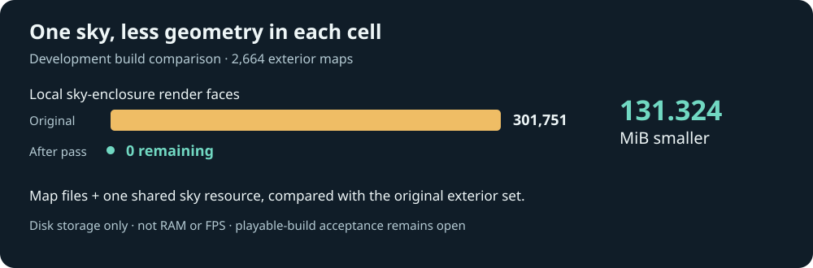

*Project-authored build comparison. [Measurement scope](docs/DAY_NIGHT_AND_SKY.md).*

## AmiWind 3D Map Inspector

**Geometry analysis and optimization planning**

The standalone [AmiWind 3D Map Inspector](docs/POLYCOUNT_INSPECTOR.md) helps
inspect converted BSP geometry and plan optimization work. It is one component
in the aspirational **AmiWind Map Optimization Toolkit** direction, not a claim
that a complete automatic optimizer or runtime profiler is finished. The
bounded hidden-surface pass remains experimental, and verified house examples
currently produce no cuts. Read its [development roadmap](docs/BUILD_TOOLKIT_ROADMAP.md)
and [exterior hidden-surface status](docs/EXTERIOR_HIDDEN_SURFACES.md).
The [Map Optimization Toolkit overview](docs/AMIWIND_MAP_OPTIMIZATION_TOOLKIT.md)
and [measured findings](docs/MAP_OPTIMIZATION_FINDINGS_2026-10-04.md) distinguish
completed representation savings from open geometry and target gates.
See the [memory notes](docs/MEMORY_ALLOCATION.md),
[cell-changing checklist](docs/CELL_CHANGING.md),
[sky and background rendering](docs/DAY_NIGHT_AND_SKY.md#shared-exterior-background-sky-implementation-candidate),
[terrain-culling status](docs/TERRAIN_VISUAL_CULL.md),
[bug journal](docs/BUG_JOURNAL.md) and [roadmap](docs/ROADMAP.md) for the details.
Original-game assets, converted proprietary content and ROMs are not distributed
with AmiWind; you provide your own legally obtained files. Playable builds and
playtest packages containing those assets stay private.

### v0.0.27 — Rocks, Mushrooms, and Then Some: playtest screenshots

These Ascadian Isles screenshots were captured in WinUAE during the rc2
playtest: closed caps, joined rims and textured undersides. They show the mushroom
work that carries into the published v0.0.27 release.

| Closed cap and rim | Giant mushrooms on the hillside |
| --- | --- |
| 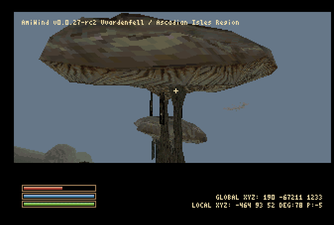 | 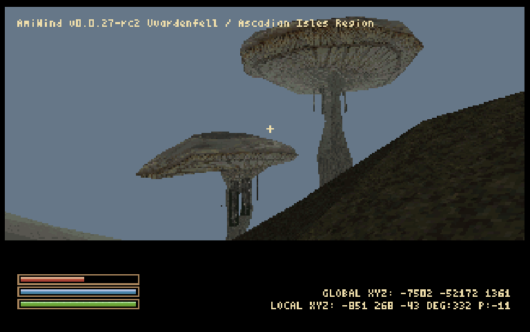 |

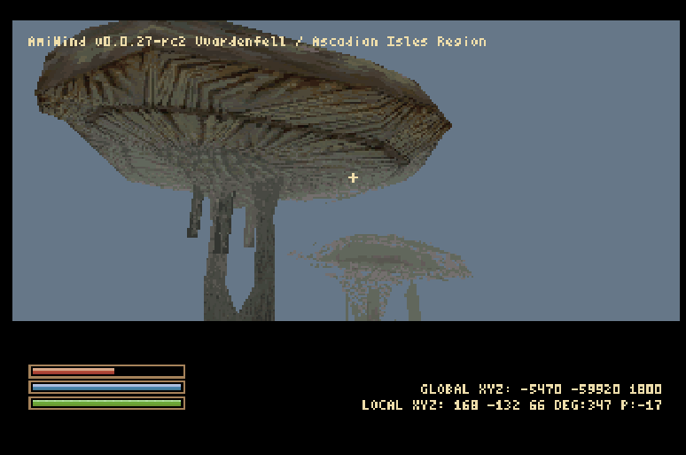

### Explore the growing world

Walk the base-game island's terrain, head into the detailed streets of Seyda
Neen and Balmora, or take a detour through the character gallery. Rocks and
giant mushrooms join terrain and water across the wider world. This release
adds foliage; other settlement scenery and wider-world actors remain
incomplete. Bloodmoon and
Tribunal world content are outside the current playable scope.

Both towns use 64 exterior subdivision cores to keep individual maps bounded.
Balmora includes 43 destination interiors, including Tharys Ancestral Tomb;
Seyda Neen keeps its opening scenes and converted interiors. Aim at doors or
residents and press **E**. NPC interaction currently provides bounded authored
greetings. Full combat, quest simulation, services, schedules and inventory remain
unfinished. See [character-state limitations](docs/CHARACTER_STATES.md).

Character creation follows the opening registration sequence: name, race,
gender, head and hair, class, birthsign and a final review. The appearance
screen has a rotating head preview. Character choices and earned journal history
persist in saves. Start a fresh character when moving from older content.

**J** opens the two-page progression journal; **M** opens the island map. Older
saved configurations regain these keys when unassigned. Journal headings stay
centred on the left page and wrap onto multiple lines. The map marker follows
source coordinates and keeps its zoom on reopen. See
[map and journal](docs/WORLD_MAP_AND_JOURNAL.md).

**F**, then **V** equips a [torch converted from the original game](docs/TORCH.md),
with an animated grip and flame attached to its source emitter. The debug header
shows the region from the game's own records. The earlier torch-crash correction
is included; its target retest and the brief fist-visibility blink remain tracked
in the [bug journal](docs/BUG_JOURNAL.md).

`dbg gallery` opens the inspection plane for **2,935 original NPC/creature
records and all 3,551 converted model assets**. Search by friendly name or source
ID, inspect equipped/base-body variants, and return to the captured game state.
Dagoth Ur's protected mask geometry and original gold texture use an exact-model
allowance, enabled by default with `aw_allow_poly_budget_over true` and
`aw_poly_budget_over_cap auto`. Wheel cycles models; middle-click opens the
browser. [Gallery controls](docs/CHARACTER_MODEL_GALLERY.md).

### Earlier glimpses of Vvardenfell

| Welcome to Balmora | Dagoth Ur, in the character gallery |
| :---: | :---: |
| 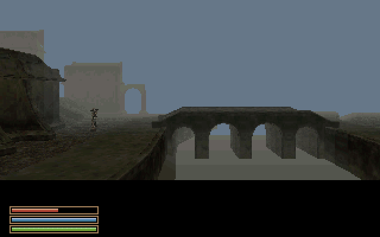 | 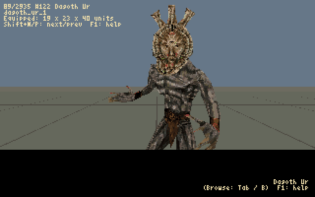 |
| **Vvardenfell world map** | **Two-page progression journal** |
| 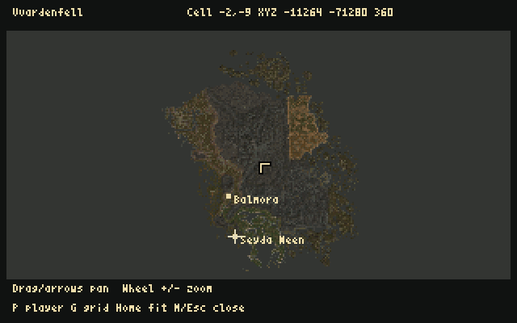 | 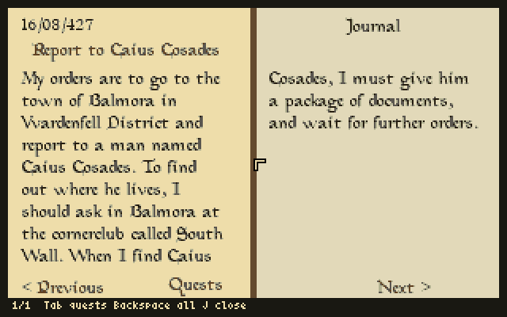 |

*Native FS-UAE captures at integer scale: map from v0.0.25-rc1, journal from
v0.0.25-dev1, town/gallery from v0.0.24. [Capture details](docs/GAMEPLAY_MEDIA.md).*

### Finding your way around

Shift+V cycles view distance. The optional compass is off by default;
`dbg compass on` enables it. GLOBAL/LOCAL XYZ aid navigation, and Ctrl debug
flight runs at twice Shift speed. M/N console typing is protected; debug Alt+M
exposes the desktop. Bindings have their own
[keymap file and reference](docs/KEYMAPS.md).

`dbg aw hors 0` creates the Nord / Barbarian / The Steed test character after
Census; `dbg tp balmora` travels to Balmora and supplies that character if absent.
`dbg tp` opens the destination picker. `dbg map tp` and `dbg tp map` open the
world-map teleport picker. See [debug controls](docs/DEBUG_OVERLAYS.md).

Automatic cell changes preserve held input and gameplay state in the transition
checks; doors and explicit travel retain their own loading behavior. The default
loader replaces maps synchronously. At automatic crossings, Loading... waits
two seconds by default; startup and explicit travel remain immediate.
Experimental read-ahead does not establish seamless background
streaming. Exact crossing, collision and state checks remain on the
[target playtest checklist](docs/CELL_CHANGING.md).

### Making room for Morrowind

The current world is a baseline for measuring and optimizing content, memory,
loading time and frame cost. Town subdivisions remain necessary; their static
heap estimates do not certify runtime safety or FPS. Future changes must retain
closed mushroom seams, original placement and UVs, collision, and continuous
terrain handoffs. See the [optimization roadmap](docs/ROADMAP.md#assemble-first-then-optimize-the-measured-world).

Large outputs automatically split into simultaneously mounted HDFs, each below
4 GiB with filesystem partitions below 2 GiB. This is not disk swapping, and more
disk capacity does not add runtime memory. Generated emulator configurations
list every required disk; the paths are also recorded in the
[build output](docs/BUILD_OUTPUT.md).

Character conversion uses a [verified persistent host cache](docs/NPC_MODEL_CACHE.md).
The full NPC gallery remains enabled by default; reused models retain the same
Amiga format and quality. [Image recovery](docs/IMAGE_RECOVERY.md) can reuse
compatible, validated conversion output. General stage resume is not available.

The reference target is **A1200 / AGA / PAL, 68040 + FPU + JIT, 2 MiB Chip and
16 MiB Z3 RAM**. Stock A1200 and physical-hardware performance are unproven.
Linux remains the established build foundation. Native Windows is experimental,
with intermittent worker and cancellation failures recorded in the
[Windows guide](docs/WINDOWS_BUILD.md) and [bug journal](docs/BUG_JOURNAL.md).

The [Docker build helper](docs/DOCKER_BUILD.md) takes your own Morrowind
installation as private runtime input. Images contain source and tools; game
data, converted assets and ROMs stay outside image layers and public releases.
The [v0.0.27 release notes](docs/RELEASE-v0.0.27.md) record the published
baseline's build and CI evidence. Earlier full-conversion and game-entry results remain in the dated
[Windows](docs/VALIDATION-WINDOWS-2026-10-02.md) and
[Docker](docs/VALIDATION-DOCKER-2026-10-02.md) records and
[v0.0.26 release notes](docs/RELEASE-v0.0.26.md).

See [world survey](docs/WORLD_SURVEY.md), [project state](docs/PROJECT_STATE.md),
[font options](docs/PAPER_FONT_OPTIONS.md) and
[conversion lessons](docs/BALMORA_CONVERSION_LESSONS.md) for more.

*For years, they thought the Nerevarine would never appear on the Commodore Amiga...*

*Well, those n'wahs were wrong! The prophecy said nothing about the frame rate.*

## About AmiWind

Created by **FlyingFathead a.k.a. Horstator**
Thanks to: **ChaosWhisperer**

> Massive thanks to everyone in the Amiga community who have been willing to
> share code and ideas to make this dream come true to a beloved platform.
> *May the wind be on your back!*

A fan-made tribute, free and open-source conversion tools, and an experimental
Amiga runtime. The growing playable world combines an island-wide terrain/scenery pass with
detailed starting towns, while much of Morrowind's gameplay remains unfinished. The A500 experiment
is preserved alongside the accelerated AGA development track.
**Official project repository:** [FlyingFathead/amiwind](https://github.com/FlyingFathead/amiwind).
**Repository root: `amiwind/`.** This directory contains the conversion tools,
complete native engine source, tests and documentation. `engine/aga/` is part of
this repository, not a second repository. See [repository layout](docs/REPOSITORY_LAYOUT.md).

**Original Morrowind game files are required. You must provide your own copy.**

> **AmiWind recommends the GOG GOTY edition of Morrowind.**
>
> AmiWind has been developed and tested primarily against the GOG Game of the Year
> release. The GOG installation includes additional loose TrueType (TTF) font assets
> that provide a better starting point for AmiWind's offline font conversion and
> rasterization.
>
> The Steam GOTY edition does not normally include these loose TTF font assets. When
> they are unavailable, AmiWind will fall back to Bethesda's original `.fnt` + `.tex`
> bitmap fonts and continue the build. This fallback is supported, but converted font
> quality and appearance may differ and may be inferior, particularly when fonts must
> be rendered at sizes different from the original bitmap assets.
>
> **For the best-tested and preferred AmiWind conversion path, use the GOG GOTY edition:**
>
> https://www.gog.com/en/game/the_elder_scrolls_iii_morrowind_goty_edition

The Steam GOTY edition remains a supported fallback input when its required game data
passes AmiWind's validation.

The AGA runtime incorporates code from **id Software's Quake** and the
**AmiQuake** lineage, modified, extended and adapted for **AmiWind**. These
components are distributed under the **GNU GPL version 2**, with the original
copyright and licence notices preserved; individual v2-or-later grants remain
intact. AmiWind's host tools and original A500 runtime are separately
**GPL-3.0-only**; see [LICENSE](LICENSE). OpenMW is a reference for file formats
and behaviour; the current converters are standalone tools and bundle none of
its code. Earlier opening experiments used it for external captures. See
[licensing and credits](docs/LICENSING_AND_CREDITS.md) for component details.

Please also support [Cloanto / Amiga Forever](https://www.amigaforever.com/) for
licensed Amiga ROMs. Supply a suitable Kickstart ROM yourself; none is included
in the public repository. Public test records identify tested ROMs by checksum.

The setup model is similar to OpenMW: point the tools at your installed game
folder. Conversion runs locally and writes to a separate workspace. This
independent project is not an OpenMW release or an official Bethesda product.

> **Public source package  -  no commercial game data or ROMs.** No Quake or
> Morrowind game data, reusable game artwork, music, voices, game
> executables, Amiga Kickstart ROMs or Workbench files are included. This source
> package includes the selected development screenshots and a short clip for documentation, but
> contains no compiled AmiWind executable or assembly recovered
> from a game binary. GPL-licensed engine source is distinct from game assets.
> Supply your own Morrowind installation to convert its data, and a suitable
> licensed Kickstart ROM to run the resulting demo in an emulator. Compiling
> the engine alone does not require game data or a ROM.

Copyrights remain with their respective holders, including the original code
contributors. Each component retains its applicable licence. Morrowind and
The Elder Scrolls, Quake, Amiga and related names belong to their respective
owners. AmiWind is an independent fan tribute, not affiliated with or endorsed
by Bethesda/ZeniMax, id Software, Commodore, Cloanto or the OpenMW project.
The GPL does not grant rights to redistribute game assets or ROMs. Locally
generated game images are private build outputs, not public source releases.

## Building and playing

**Native Windows entry point (experimental):** `build.cmd` or `build.ps1`.
Start with `.\setup-windows.cmd -Plan`, then `.\setup-windows.cmd -Yes`, and follow the
[Windows setup guide](docs/WINDOWS_BUILD.md). Windows and Linux share the Python
build pipeline. Earlier native Windows full conversion and WinUAE game-entry
checks passed; experimental reliability limits remain. The published v0.0.27
passed Linux/Windows launcher CI, Docker builder CI and the source/asset-free
build job. See the [release notes](docs/RELEASE-v0.0.27.md) for the scope of each
check; these results do not certify a full v0.0.27 gameplay run on either host.

**Quickest way to compile on Ubuntu/Debian Linux (or Ubuntu under WSL):**

```sh
./build.sh --autoinstall
```

**Easiest way to build and run on Linux:** install [FS-UAE](https://fs-uae.net/),
then point the command at your own **A1200 Kickstart 3.1 ROM**:

```sh
./build.sh --autoinstall --autorun-fs-uae \
  --kickstart-file "/path/to/your/kickstart-3.1-a1200.rom"
```

Replace the example ROM path with your actual file or a directory containing ROMs. The builder checks FS-UAE
and the ROM before setup, fills both ROM and HDF paths in the
[documented preset](docs/FS-UAE-PLAYTESTING.md), and launches the finished image.
If you omit `--kickstart-file`, it checks `~/.roms/kickstart-3.1-a1200.rom` under
the current user's home directory, then checks files directly in `~/.roms/` for
the known SHA-256. If no ROM is selected, it **asks for a file or directory**.
Directory searches select a checksum match; an explicitly selected different
ROM warns that compatibility is unverified. Noninteractive runs exit with clear
instructions if no ROM is selected. ROMs are never downloaded or included.

Select your Morrowind installation and confirm the dependency proposal. The tool
reuses installed dependencies, fetches missing pinned SDK/map tools, builds the
reference QuakeC compiler when needed, uses its Python environment automatically,
and continues into the build. APT may also ask for your sudo password and package
confirmation. Use `--autoinstall --plan` to preview setup without installing.

Start with [Linux build instructions](docs/LINUX_BUILD.md) or
[Windows host options](docs/WINDOWS_BUILD.md). Native Windows/MSYS2 has completed a full
conversion and WinUAE game-entry smoke test; its reliability limits remain
[documented](docs/WINDOWS_BUILD_ROADMAP.md). The Linux Docker builder on WSL 2 has
also completed full conversion and verified HDF assembly. These are separate
host validation results; Linux remains the established build foundation.
The tool accepts your Morrowind installation root, checks required file sizes
and known SHA-256 hashes, and reports dependency versions. Build outputs default
to ignored `out/`.

```sh
./build.sh --install-dependencies --plan
./build.sh --versions
./build.sh --check
```

These commands preview setup and check prerequisites. Follow the linked build
guide to install the required tools and build the playable HDF.

### Run AmiWind in an emulator

Already have a playable HDF? Copy
[`AmiWind-FS-UAE-launcher.py`](tools/AmiWind-FS-UAE-launcher.py) beside it and run
`python3 AmiWind-FS-UAE-launcher.py`. It suggests the newest version, remembers
your ROM, checks its checksum and configures FS-UAE. Use `--yes` for immediate
subsequent launches. See the [launcher guide](docs/FS-UAE-LAUNCHER.md).

The FS-UAE autorun command above handles configuration and launch automatically.
For manual setup or WinUAE, use the guides and steps below.

| Emulator / official homepage | Host platforms | AmiWind setup | Historical v0.0.28-rc1 template |
| --- | --- | --- | --- |
| [FS-UAE](https://fs-uae.net/) | Linux, Windows, macOS | [FS-UAE guide](docs/FS-UAE-PLAYTESTING.md) | [Download/view `.fs-uae` preset](resources/emulators/AmiWind-v0.0.28-rc1-FS-UAE.fs-uae) |
| [WinUAE](https://www.winuae.net/) | Windows | [WinUAE guide](docs/WINUAE.md) | [Download/view `.uae` preset](resources/emulators/AmiWind-v0.0.28-rc1-WinUAE.uae) |

1. Build the v0.0.28 source in preparation from your own Morrowind installation using the guide
   above. Keep every HDF listed in the build summary together. The source ZIP
   contains tools and templates; playable images are private build outputs.
2. Install an emulator from its official homepage above. Prefer the matching
   configuration generated beside your HDFs: it lists every required disk. The
   historical rc1 templates above provide a starting point for manual setup;
   final configurations are regenerated with the final v0.0.28 HDF paths.
3. Follow the matching setup guide to select your licensed **A1200 Kickstart
   3.1 ROM** and all the built HDFs. WinUAE uses RDB hardfiles on the UAE
   controller; FS-UAE uses the ROM and HDF paths in its configuration file.
4. Start emulation and click inside the window to capture the mouse. Use
   **WASD** to move and the mouse to look; see [controls and setup](docs/AGA_BUILD.md).

The presets use A1200/AGA, 68040 with FPU, 2 MiB Chip and 16 MiB Z3 Fast RAM,
with JIT and maximum CPU speed. The v0.0.16 playable image was tested with
FS-UAE 3.1.66 on Linux. The Windows checkpoint reached the game in WinUAE 6.0.3
using this hardware profile; see the [test scope](docs/VALIDATION-WINDOWS-2026-10-02.md).
The public [dry-run build](docs/CI_DRY_RUN.md) contains no game assets or ROMs
and boots to a test notice; it is not the playable demo.

## Development

The next work is to playtest and profile the expanded world: memory across
loads and crossings, town geometry, scenery continuity and frame cost. Build-time
profiling and [avoiding unnecessary recompilation](docs/BUILD_TOOLKIT_ROADMAP.md)
remain priorities alongside [the gameplay roadmap](docs/ROADMAP.md).

[FAQ](docs/FAQ.md) · [Project state](docs/PROJECT_STATE.md) · [Asset coverage](docs/ASSET_COVERAGE.md) ·
[Open bug reports](docs/BUGS.md) · [Roadmap](docs/ROADMAP.md) ·
[Repository layout](docs/REPOSITORY_LAYOUT.md) · [Release workflow](docs/RELEASE_WORKFLOW.md) ·
[Changelog](docs/CHANGELOG.md) · [Build dependencies](docs/BUILD_DEPENDENCIES.md) ·
[Build/compiler toolkit roadmap](docs/BUILD_TOOLKIT_ROADMAP.md) ·
[Licensing and credits](docs/LICENSING_AND_CREDITS.md)

Thanks to the Morrowind creators, the Amiga community, and the contributors whose
work made this experiment possible. The earlier A500 track, previous methods,
fonts and hand-rendering alternatives remain available in the source and history.

Development changes must follow the [project rules](docs/PROJECT_RULES.md), including required Linux and Windows compatibility.

### Inspect converted geometry locally

The development toolkit now includes a standalone
[Polycount Inspector](docs/POLYCOUNT_INSPECTOR.md). Open
[the local viewer](tools/polycount_inspector.html) to explore polygon edges,
optional local base textures and spatial vertex-density hotspots. Isolate an
object, compare components, or inspect from above and export a private planning
polygon. The built-in synthetic scene demonstrates the tool without game assets.

Viewer counts and display filters help investigate geometry; they do not measure
Amiga memory, change the converter or establish a gameplay fix. Your converted
scenes, textures and captures remain private.

Read [Hidden in Dirt: Seyda Neen's graphics performance bottlenecks](docs/HIDDEN_IN_DIRT.md) for measured geometry experiments and the checks behind the next town optimization.
