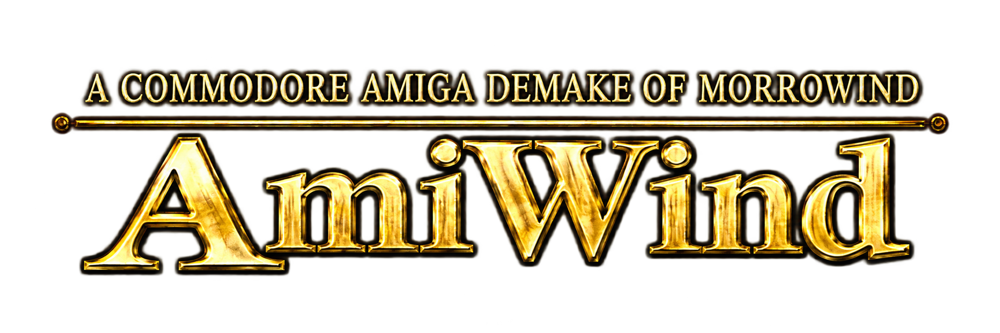
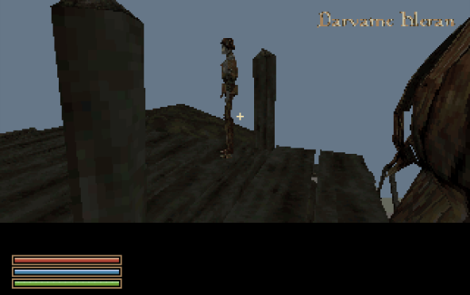
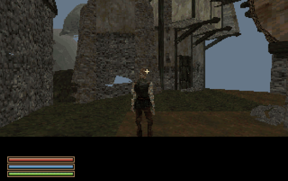
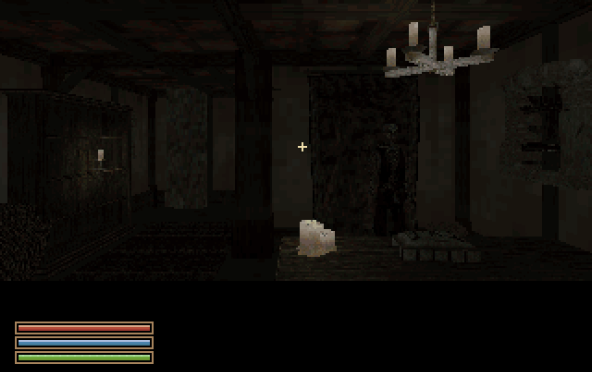
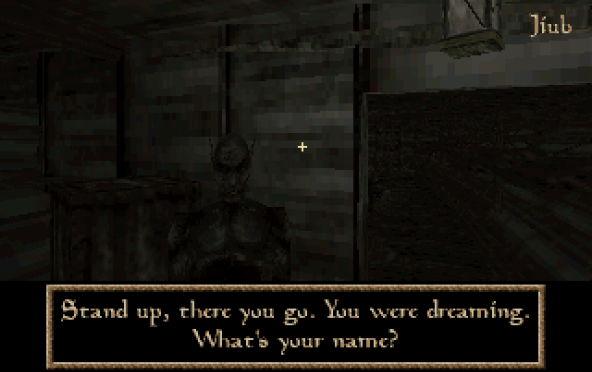
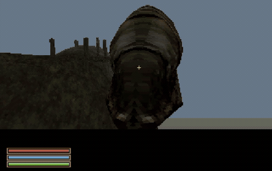

<p align="center">
  
</p>

# AmiWind

*For years, they thought the Nerevarine would never appear on the Commodore Amiga…*

*Well, those n'wahs were wrong!*

**Introducing AmiWind — A Morrowind conversion pipeline and demake for
Commodore Amiga.**

*The prophecy said nothing about the frame rate.*

## Current state of the project

**AmiWind v0.0.23-dev5** adds flat textured windows, sentence-aware speech pages,
painted-glyph centering and the restored F10 half/full console cycle. Target names
default below the viewport, above Talk: E. See the
[mesh investigation and measurements](docs/MESH_TIPS_AND_TRICKS.md). The expanded
Seyda Neen area retains all **13 town interiors**, nearby **Addamasartus**, the
prison ship, and the original **Silt Strider and Darvame Hleran** at the port.
The local cast now includes 30 ordinary
NPC placements / 27 appearances alongside the scripted introduction actors.
NPCs have solid bodies; interior furniture, lights and original door destinations
are converted from your own game data.

The dev2 **interior inspection** coverage is retained. All 16 scenes loaded in the
reference emulator, and the Tradehouse front door has been tested in both
directions. This does not certify every floor, stair or door. Cave lighting is
still basic; full dialogue, voice cycles, NPC services, inventory and combat remain
unfinished. The Strider is a placed model; travel service is planned.
See the [checkpoint evidence and limits](docs/RELEASE-v0.0.23-dev5.md) and
[29 September roadmap](docs/PLAN-2026-09-29.md).

The startup logo fades in for two seconds, holds five, then fades out for one,
with theme music from the start; Space/Enter/Esc skips. New Game plays the optional
owned intro movie (Esc skips), then uses a **blank
loading screen** into Jiub's ship scene. Ordinary travel keeps the owned loading
art. Music remains serviced through map reads and decoding; repeated interior
loads kept the selected track playing with no measured underruns after startup.
Ship waves are now converted once at **-5 dB** from the owned original recording.
The reusable loading setting is
`aw_loading_style normal|blank`; see [debug controls](docs/DEBUG_OVERLAYS.md).

Voiceovers default to **aim-only identity** (`aw_voice_dialogue_display_style 2`):
the bottom dialogue panel contains speech text, with no speaker header.
After character creation, aim at nearby NPCs to see their names below the viewport,
even when talking is unavailable. Options
→ Interface offers voice identity options, four dialogue styles and three target/
object-label positions. The new default sizes the box to the text with equal
padding and centers the lines vertically and horizontally. `dbg ui layout 1/2/3`
selects legacy, full-width or content-sized geometry.
After registration, **T** opens a 1–24 hour wait selector; **F1** shows quick help.
Waiting advances the saved time/date. Sky lighting and NPC schedules are still
pending. See [dialogue and waiting controls](docs/DIALOGUE_AND_WAIT.md).

Builds run in parallel by default, within one CPU budget. `--jobs N` sets the
limit; `--single-thread` selects one worker. New interiors also convert in
parallel. Both complete font-input variants have compiled in about seven minutes
with six workers here; this is a build measurement, not a cross-machine speedup
claim. See [parallel builds](docs/PARALLEL_BUILD.md).

**Use the TTF-converted version for the best text, especially papers and dialogue.**
The original bitmap paper font still has uneven/broken-looking strokes; it is a
compatibility fallback, not equivalent visual quality. Font selection is automatic: usable owned TTFs are preferred, with original
FNT/TEX fallback. `--bitmap-paper-ink filled` is the default; `original` selects
the older bitmap reading-page treatment. This switch does not disable TTFs.
See [font options](docs/PAPER_FONT_OPTIONS.md).

The reference target remains **A1200 / AGA / PAL, 68040 + FPU + JIT, 2 MiB Chip and
16 MiB Fast RAM**. Stock A1200 performance is unproven. The versioned preflight
waits five seconds; Space or Enter continues immediately. Build with your own game
files using the [Linux instructions](docs/LINUX_BUILD.md). Public CI builds only an
asset-free boot-notice image. Earlier intermittent freezes remain tracked in
[BUGS.md](docs/BUGS.md).

Aim at a door and press **E**. The debug scene picker and `aw_scene <map>` expose
all converted rooms for inspection. The character-creation route, bounded saves,
menus and first-person hands remain available. See [interior coverage](docs/SEYDA_NEEN_INTERIORS.md)
and [door mapping](docs/DOOR_MAPPING.md).

| Silt Strider and Darvame | Fargoth in the expanded town |
| :---: | :---: |
|  |  |
| **Inside Arrille's Tradehouse** | **Jiub dialogue with TTF-converted text** |
|  |  |



*Actual FS-UAE captures, 29 September 2026: Darvame and Jiub dialogue are dev4;
Fargoth, Tradehouse and the pan are dev2. Screenshots crop only the
emulator margins; the seven-second camera pan is reduced to 444 pixels wide / 8 fps
for the README. No generated scenery or composited characters. Dark interiors
reflect the current renderer. Capture details: [gameplay media](docs/GAMEPLAY_MEDIA.md).*

## About AmiWind

Created by **FlyingFathead a.k.a. Horstator**
Thanks to: **ChaosWhisperer**

> Massive thanks to everyone in the Amiga community who have been willing to
> share code and ideas to make this dream come true to a beloved platform.
> *May the wind be on your back!*

A fan-made tribute, free and open-source conversion tools, and an experimental
Amiga runtime. We are working toward a small, walkable slice of Vvardenfell;
this is a proof of concept, not a finished Morrowind port. The A500 experiment
is preserved alongside the accelerated AGA development track.
**Official project repository:** [FlyingFathead/amiwind](https://github.com/FlyingFathead/amiwind).
**Repository root: `amiwind/`.** This directory contains the conversion tools,
complete native engine source, tests and documentation. `engine/aga/` is part of
this repository, not a second repository. See [repository layout](docs/REPOSITORY_LAYOUT.md).

**Original Morrowind game files are required. You must provide your own copy.**

> **AmiWind recommends the GOG GOTY edition of Morrowind.**
>
> AmiWind has been developed and tested primarily against the GOG Game of the Year
> release. The GOG installation includes additional loose TrueType (TTF) font assets
> that provide a better starting point for AmiWind's offline font conversion and
> rasterization.
>
> The Steam GOTY edition does not normally include these loose TTF font assets. When
> they are unavailable, AmiWind will fall back to Bethesda's original `.fnt` + `.tex`
> bitmap fonts and continue the build. This fallback is supported, but converted font
> quality and appearance may differ and may be inferior, particularly when fonts must
> be rendered at sizes different from the original bitmap assets.
>
> **For the best-tested and preferred AmiWind conversion path, use the GOG GOTY edition:**
>
> https://www.gog.com/en/game/the_elder_scrolls_iii_morrowind_goty_edition

The Steam GOTY edition remains a supported fallback input when its required game data
passes AmiWind's validation.

The AGA runtime incorporates code from **id Software's Quake** and the
**AmiQuake** lineage, modified, extended and adapted for **AmiWind**. These
components are distributed under the **GNU GPL version 2**, with the original
copyright and licence notices preserved; individual v2-or-later grants remain
intact. AmiWind's host tools and original A500 runtime are separately
**GPL-3.0-only**; see [LICENSE](LICENSE). OpenMW is a reference for file formats
and behaviour; the current converters are standalone tools and bundle none of
its code. Earlier opening experiments used it for external captures. See
[licensing and credits](docs/LICENSING_AND_CREDITS.md) for component details.

Please also support [Cloanto / Amiga Forever](https://www.amigaforever.com/) for
licensed Amiga ROMs. Supply a suitable Kickstart ROM yourself; none is included
in the public repository. Public test records identify tested ROMs by checksum.

The setup model is similar to OpenMW: point the tools at your installed game
folder. Conversion runs locally and writes to a separate workspace. This
independent project is not an OpenMW release or an official Bethesda product.

> **Public source package — no commercial game data or ROMs.** No Quake or
> Morrowind game data, reusable game artwork, music, voices, game
> executables, Amiga Kickstart ROMs or Workbench files are included. This source
> package includes the selected development screenshots and a short clip for documentation, but
> contains no compiled AmiWind executable or assembly recovered
> from a game binary. GPL-licensed engine source is distinct from game assets.
> Supply your own Morrowind installation to convert its data, and a suitable
> licensed Kickstart ROM to run the resulting demo in an emulator. Compiling
> the engine alone does not require game data or a ROM.

Copyrights remain with their respective holders, including the original code
contributors. Each component retains its applicable licence. Morrowind and
The Elder Scrolls, Quake, Amiga and related names belong to their respective
owners. AmiWind is an independent fan tribute, not affiliated with or endorsed
by Bethesda/ZeniMax, id Software, Commodore, Cloanto or the OpenMW project.
The GPL does not grant rights to redistribute game assets or ROMs. Locally
generated game images are private build outputs, not public source releases.

## Building and playing

**Quickest way to compile on Ubuntu/Debian Linux (or Ubuntu under WSL):**

```sh
./build.sh --autoinstall
```

**Easiest way to build and run on Linux:** install [FS-UAE](https://fs-uae.net/),
then point the command at your own **A1200 Kickstart 3.1 ROM**:

```sh
./build.sh --autoinstall --autorun-fs-uae \
  --kickstart-file "/path/to/your/kickstart-3.1-a1200.rom"
```

Replace the example ROM path with your actual file or a directory containing ROMs. The builder checks FS-UAE
and the ROM before setup, fills both ROM and HDF paths in the
[documented preset](docs/FS-UAE-PLAYTESTING.md), and launches the finished image.
If you omit `--kickstart-file`, it checks `~/.roms/kickstart-3.1-a1200.rom` under
the current user's home directory, then checks files directly in `~/.roms/` for
the known SHA-256. If no ROM is selected, it **asks for a file or directory**.
Directory searches select a checksum match; an explicitly selected different
ROM warns that compatibility is unverified. Noninteractive runs exit with clear
instructions if no ROM is selected. ROMs are never downloaded or included.

Select your Morrowind installation and confirm the dependency proposal. The tool
reuses installed dependencies, fetches missing pinned SDK/map tools, builds the
reference QuakeC compiler when needed, uses its Python environment automatically,
and continues into the build. APT may also ask for your sudo password and package
confirmation. Use `--autoinstall --plan` to preview setup without installing.

Start with [Linux build instructions](docs/LINUX_BUILD.md) or
[Windows 11 / WSL](docs/WINDOWS_BUILD.md). Windows/WSL full builds remain untested.
The tool accepts your Morrowind installation root, checks required file sizes
and known SHA-256 hashes, and reports dependency versions. Build outputs default
to ignored `out/`.

```sh
./build.sh --install-dependencies --plan
./build.sh --versions
./build.sh --check
```

These commands preview setup and check prerequisites. Follow the linked build
guide to install the required tools and build the playable HDF.

### Run AmiWind in an emulator

Already have a playable HDF? Copy
[`AmiWind-FS-UAE-launcher.py`](tools/AmiWind-FS-UAE-launcher.py) beside it and run
`python3 AmiWind-FS-UAE-launcher.py`. It suggests the newest version, remembers
your ROM, checks its checksum and configures FS-UAE. Use `--yes` for immediate
subsequent launches. See the [launcher guide](docs/FS-UAE-LAUNCHER.md).

The FS-UAE autorun command above handles configuration and launch automatically.
For manual setup or WinUAE, use the guides and steps below.

| Emulator / official homepage | Host platforms | AmiWind setup | v0.0.23-dev2 configuration template |
| --- | --- | --- | --- |
| [FS-UAE](https://fs-uae.net/) | Linux, Windows, macOS | [FS-UAE guide](docs/FS-UAE-PLAYTESTING.md) | [Download/view `.fs-uae` preset](resources/emulators/AmiWind-v0.0.23-dev2-FS-UAE.fs-uae) |
| [WinUAE](https://www.winuae.net/) | Windows | [WinUAE guide](docs/WINUAE.md) | [Download/view `.uae` preset](resources/emulators/AmiWind-v0.0.23-dev2-WinUAE.uae) |

1. Build `AmiWind-v0.0.23-dev2.hdf` from your own Morrowind installation using the
   build guide above. The source ZIP contains the tools and templates, not a
   playable game image.
2. Install an emulator from its official homepage above and save a local copy
   of its AmiWind configuration template.
3. Follow the matching setup guide to select your licensed **A1200 Kickstart
   3.1 ROM** and the built HDF. WinUAE uses an RDB hardfile on the UAE controller;
   FS-UAE uses the ROM and HDF paths in the configuration file.
4. Start emulation and click inside the window to capture the mouse. Use
   **WASD** to move and the mouse to look; see [controls and setup](docs/AGA_BUILD.md).

The presets use A1200/AGA, 68040 with FPU, 2 MiB Chip and 16 MiB Z3 Fast RAM,
with JIT and maximum CPU speed. The v0.0.16 playable image was tested with
FS-UAE 3.1.66 on Linux; the WinUAE preset is configuration guidance.
The public [dry-run build](docs/CI_DRY_RUN.md) contains no game assets or ROMs
and boots to a test notice; it is not the playable demo.

## Development

[Project state](docs/PROJECT_STATE.md) · [Open bug reports](docs/BUGS.md) · [Roadmap](docs/ROADMAP.md) ·
[Repository layout](docs/REPOSITORY_LAYOUT.md) · [Release workflow](docs/RELEASE_WORKFLOW.md) ·
[Changelog](docs/CHANGELOG.md) · [Build dependencies](docs/BUILD_DEPENDENCIES.md) ·
[Licensing and credits](docs/LICENSING_AND_CREDITS.md)

Thanks to the Morrowind creators, the Amiga community, and the contributors whose
work made this experiment possible. The earlier A500 track, previous methods,
fonts and hand-rendering alternatives remain available in the source and history.
