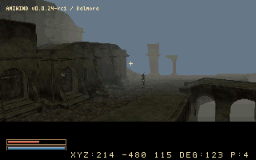
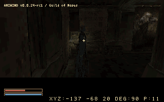

<p align="center">
  
</p>

# AmiWind

## Current state of the project

**v0.0.24-rc1 — Welcome to Balmora candidate.** Balmora now has 43 destination
interiors, 93 NPC placements and 80 living voice sets, alongside its exterior
sub-cells and Silt Strider travel. The stair/arch, terrain, gold-font and Talk
checks are recorded in the [RC release notes](docs/RELEASE-v0.0.24-rc1.md).

| Balmora exterior | Inside the Guild of Mages |
| :---: | :---: |
|  |  |

*Actual native RC1 captures in FS-UAE; no generated scenery, compositing or
brightness adjustment. [Capture details](docs/GAMEPLAY_MEDIA.md).*

All 70 exterior entrance/return routes and two additional Fighters Guild links
passed targeted native checks. The positive-Y staircase report and exact
stairs/rock wedge remain open; see the [full checklist](docs/INVESTIGATION-v0.0.24-rc1.md).
This is a candidate for owner playtesting. Stable **v0.0.24, Welcome to Balmora**
requires owner approval; v0.0.23 remains stable and dev5 remains published as a
prerelease.

Balmora uses 64 overlapping regions. Seyda Neen retains 25 regular regions,
compact intro-pier and ring-courtyard scenes, thirteen town interiors,
Addamasartus and the prison ship. Map replacement pauses behind the accepted
frozen-frame Loading... box; background streaming is planned. Full combat,
quests, NPC services and schedules remain unfinished.

The accepted Strider, Quake 90-degree FOV, base player dimensions and race/sex
view heights remain. Shift+V cycles distance; `dbg aw hors 0` creates a Nord /
Barbarian / The Steed character after Census; `dbg tp balmora` supplies that
character if none exists. `dbg tp` opens the destination picker. Aim at doors
and press E; ordinary NPC greetings use the same target as their Talk hint.

The reference target is **A1200 / AGA / PAL, 68040 + FPU + JIT, 2 MiB Chip and
16 MiB Z3 RAM**. Stock A1200 performance is unproven. Build with owned game
files using the [Linux instructions](docs/LINUX_BUILD.md). Public CI produces
asset-free checks; converted game data and ROMs stay private.

Use owned TTF inputs for the preferred reading text; bitmap fonts remain a
fallback. The gold UI also retains `dbg ui ink original` alongside the readable
candidate. See [font options](docs/PAPER_FONT_OPTIONS.md),
[debug controls](docs/DEBUG_OVERLAYS.md), [project state](docs/PROJECT_STATE.md)
and [conversion lessons](docs/BALMORA_CONVERSION_LESSONS.md).

*For years, they thought the Nerevarine would never appear on the Commodore Amiga…*

*Well, those n'wahs were wrong! The prophecy said nothing about the frame rate.*

## About AmiWind

Created by **FlyingFathead a.k.a. Horstator**
Thanks to: **ChaosWhisperer**

> Massive thanks to everyone in the Amiga community who have been willing to
> share code and ideas to make this dream come true to a beloved platform.
> *May the wind be on your back!*

A fan-made tribute, free and open-source conversion tools, and an experimental
Amiga runtime. We are working toward a small, walkable slice of Vvardenfell;
this is a proof of concept, not a finished Morrowind port. The A500 experiment
is preserved alongside the accelerated AGA development track.
**Official project repository:** [FlyingFathead/amiwind](https://github.com/FlyingFathead/amiwind).
**Repository root: `amiwind/`.** This directory contains the conversion tools,
complete native engine source, tests and documentation. `engine/aga/` is part of
this repository, not a second repository. See [repository layout](docs/REPOSITORY_LAYOUT.md).

**Original Morrowind game files are required. You must provide your own copy.**

> **AmiWind recommends the GOG GOTY edition of Morrowind.**
>
> AmiWind has been developed and tested primarily against the GOG Game of the Year
> release. The GOG installation includes additional loose TrueType (TTF) font assets
> that provide a better starting point for AmiWind's offline font conversion and
> rasterization.
>
> The Steam GOTY edition does not normally include these loose TTF font assets. When
> they are unavailable, AmiWind will fall back to Bethesda's original `.fnt` + `.tex`
> bitmap fonts and continue the build. This fallback is supported, but converted font
> quality and appearance may differ and may be inferior, particularly when fonts must
> be rendered at sizes different from the original bitmap assets.
>
> **For the best-tested and preferred AmiWind conversion path, use the GOG GOTY edition:**
>
> https://www.gog.com/en/game/the_elder_scrolls_iii_morrowind_goty_edition

The Steam GOTY edition remains a supported fallback input when its required game data
passes AmiWind's validation.

The AGA runtime incorporates code from **id Software's Quake** and the
**AmiQuake** lineage, modified, extended and adapted for **AmiWind**. These
components are distributed under the **GNU GPL version 2**, with the original
copyright and licence notices preserved; individual v2-or-later grants remain
intact. AmiWind's host tools and original A500 runtime are separately
**GPL-3.0-only**; see [LICENSE](LICENSE). OpenMW is a reference for file formats
and behaviour; the current converters are standalone tools and bundle none of
its code. Earlier opening experiments used it for external captures. See
[licensing and credits](docs/LICENSING_AND_CREDITS.md) for component details.

Please also support [Cloanto / Amiga Forever](https://www.amigaforever.com/) for
licensed Amiga ROMs. Supply a suitable Kickstart ROM yourself; none is included
in the public repository. Public test records identify tested ROMs by checksum.

The setup model is similar to OpenMW: point the tools at your installed game
folder. Conversion runs locally and writes to a separate workspace. This
independent project is not an OpenMW release or an official Bethesda product.

> **Public source package — no commercial game data or ROMs.** No Quake or
> Morrowind game data, reusable game artwork, music, voices, game
> executables, Amiga Kickstart ROMs or Workbench files are included. This source
> package includes the selected development screenshots and a short clip for documentation, but
> contains no compiled AmiWind executable or assembly recovered
> from a game binary. GPL-licensed engine source is distinct from game assets.
> Supply your own Morrowind installation to convert its data, and a suitable
> licensed Kickstart ROM to run the resulting demo in an emulator. Compiling
> the engine alone does not require game data or a ROM.

Copyrights remain with their respective holders, including the original code
contributors. Each component retains its applicable licence. Morrowind and
The Elder Scrolls, Quake, Amiga and related names belong to their respective
owners. AmiWind is an independent fan tribute, not affiliated with or endorsed
by Bethesda/ZeniMax, id Software, Commodore, Cloanto or the OpenMW project.
The GPL does not grant rights to redistribute game assets or ROMs. Locally
generated game images are private build outputs, not public source releases.

## Building and playing

**Quickest way to compile on Ubuntu/Debian Linux (or Ubuntu under WSL):**

```sh
./build.sh --autoinstall
```

**Easiest way to build and run on Linux:** install [FS-UAE](https://fs-uae.net/),
then point the command at your own **A1200 Kickstart 3.1 ROM**:

```sh
./build.sh --autoinstall --autorun-fs-uae \
  --kickstart-file "/path/to/your/kickstart-3.1-a1200.rom"
```

Replace the example ROM path with your actual file or a directory containing ROMs. The builder checks FS-UAE
and the ROM before setup, fills both ROM and HDF paths in the
[documented preset](docs/FS-UAE-PLAYTESTING.md), and launches the finished image.
If you omit `--kickstart-file`, it checks `~/.roms/kickstart-3.1-a1200.rom` under
the current user's home directory, then checks files directly in `~/.roms/` for
the known SHA-256. If no ROM is selected, it **asks for a file or directory**.
Directory searches select a checksum match; an explicitly selected different
ROM warns that compatibility is unverified. Noninteractive runs exit with clear
instructions if no ROM is selected. ROMs are never downloaded or included.

Select your Morrowind installation and confirm the dependency proposal. The tool
reuses installed dependencies, fetches missing pinned SDK/map tools, builds the
reference QuakeC compiler when needed, uses its Python environment automatically,
and continues into the build. APT may also ask for your sudo password and package
confirmation. Use `--autoinstall --plan` to preview setup without installing.

Start with [Linux build instructions](docs/LINUX_BUILD.md) or
[Windows 11 / WSL](docs/WINDOWS_BUILD.md). Windows/WSL full builds remain untested.
The tool accepts your Morrowind installation root, checks required file sizes
and known SHA-256 hashes, and reports dependency versions. Build outputs default
to ignored `out/`.

```sh
./build.sh --install-dependencies --plan
./build.sh --versions
./build.sh --check
```

These commands preview setup and check prerequisites. Follow the linked build
guide to install the required tools and build the playable HDF.

### Run AmiWind in an emulator

Already have a playable HDF? Copy
[`AmiWind-FS-UAE-launcher.py`](tools/AmiWind-FS-UAE-launcher.py) beside it and run
`python3 AmiWind-FS-UAE-launcher.py`. It suggests the newest version, remembers
your ROM, checks its checksum and configures FS-UAE. Use `--yes` for immediate
subsequent launches. See the [launcher guide](docs/FS-UAE-LAUNCHER.md).

The FS-UAE autorun command above handles configuration and launch automatically.
For manual setup or WinUAE, use the guides and steps below.

| Emulator / official homepage | Host platforms | AmiWind setup | v0.0.24-dev1 configuration template |
| --- | --- | --- | --- |
| [FS-UAE](https://fs-uae.net/) | Linux, Windows, macOS | [FS-UAE guide](docs/FS-UAE-PLAYTESTING.md) | [Download/view `.fs-uae` preset](resources/emulators/AmiWind-v0.0.24-dev1-FS-UAE.fs-uae) |
| [WinUAE](https://www.winuae.net/) | Windows | [WinUAE guide](docs/WINUAE.md) | [Download/view `.uae` preset](resources/emulators/AmiWind-v0.0.24-dev1-WinUAE.uae) |

1. Build `AmiWind-v0.0.24-dev1.hdf` from your own Morrowind installation using the
   build guide above. The source ZIP contains the tools and templates, not a
   playable game image.
2. Install an emulator from its official homepage above and save a local copy
   of its AmiWind configuration template.
3. Follow the matching setup guide to select your licensed **A1200 Kickstart
   3.1 ROM** and the built HDF. WinUAE uses an RDB hardfile on the UAE controller;
   FS-UAE uses the ROM and HDF paths in the configuration file.
4. Start emulation and click inside the window to capture the mouse. Use
   **WASD** to move and the mouse to look; see [controls and setup](docs/AGA_BUILD.md).

The presets use A1200/AGA, 68040 with FPU, 2 MiB Chip and 16 MiB Z3 Fast RAM,
with JIT and maximum CPU speed. The v0.0.16 playable image was tested with
FS-UAE 3.1.66 on Linux; the WinUAE preset is configuration guidance.
The public [dry-run build](docs/CI_DRY_RUN.md) contains no game assets or ROMs
and boots to a test notice; it is not the playable demo.

## Development

[Project state](docs/PROJECT_STATE.md) · [Open bug reports](docs/BUGS.md) · [Roadmap](docs/ROADMAP.md) ·
[Repository layout](docs/REPOSITORY_LAYOUT.md) · [Release workflow](docs/RELEASE_WORKFLOW.md) ·
[Changelog](docs/CHANGELOG.md) · [Build dependencies](docs/BUILD_DEPENDENCIES.md) ·
[Licensing and credits](docs/LICENSING_AND_CREDITS.md)

Thanks to the Morrowind creators, the Amiga community, and the contributors whose
work made this experiment possible. The earlier A500 track, previous methods,
fonts and hand-rendering alternatives remain available in the source and history.
