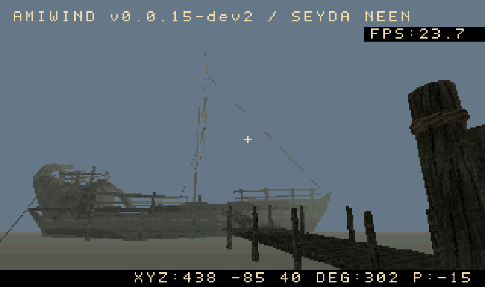
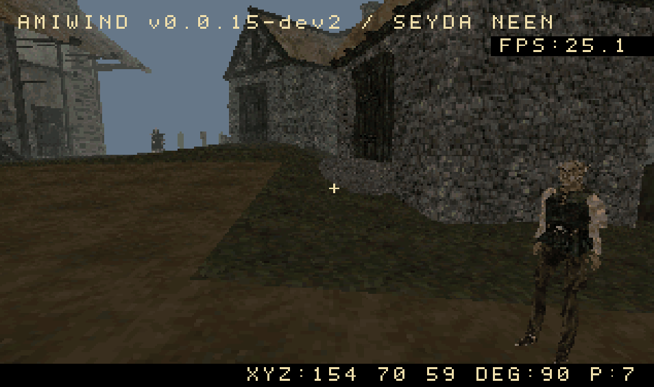
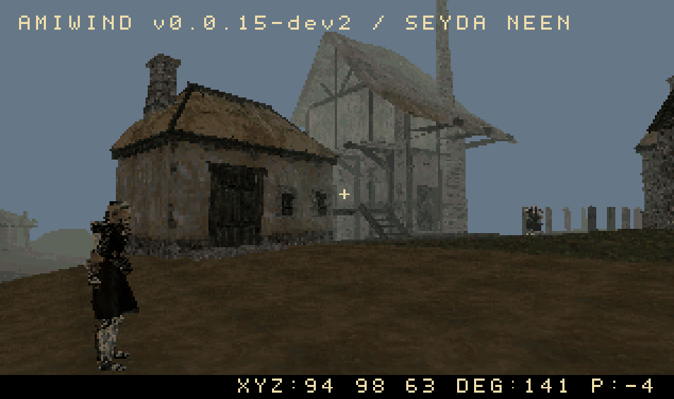
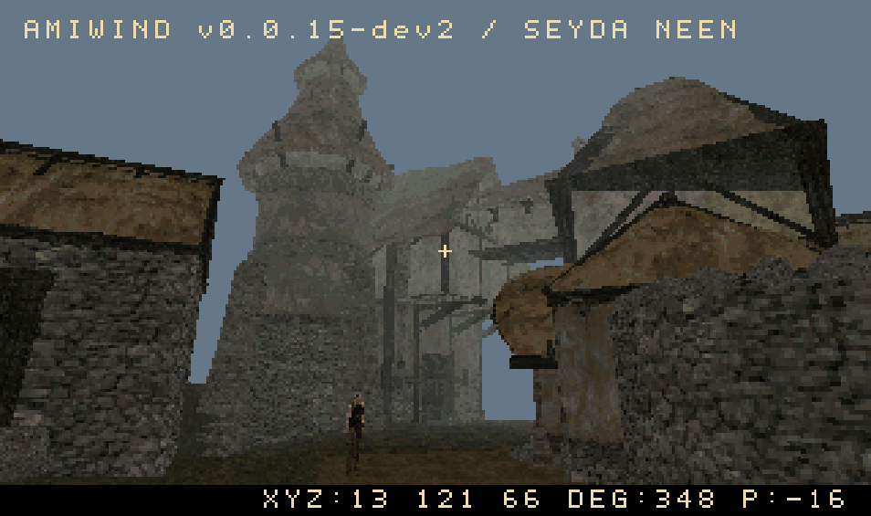
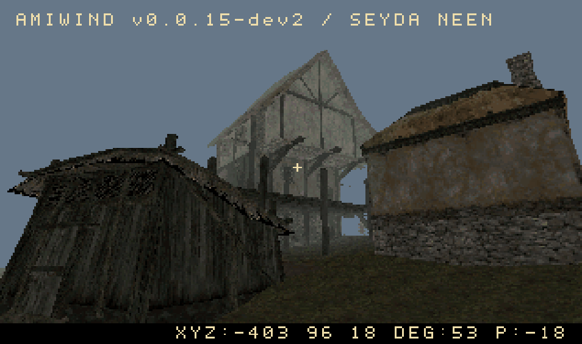

# AmiWind

*For years, they thought the Nerevarine would never appear on the Commodore Amiga…*

*Well, those n'wahs were wrong!*

**Introducing AmiWind — A Morrowind conversion pipeline and demake for
Commodore Amiga.**

*The prophecy said nothing about the frame rate.*

## Current state of the project

**A small, traversable Morrowind demake is running on the Amiga AGA development
target.** The current demo includes a bounded Seyda Neen exterior and a separate
prison-ship interior. Fargoth and two guards have dressed, animated idle models;
they turn toward the player and can play original greetings. Walking, mouse look,
collision, Nord hands, streamed music, menus and a debug console are working.
The new UI uses the original Magic Cards font and border artwork from your own
game files, with dialogue in the lower strip and an unchanged console font.

This is an early proof of concept. The scripted opening, character creation,
full conversations, quests, NPC walking and combat are not implemented. Audio stalls and scene geometry still need work. Ordinary underwater tint is
blue; actual damage retains its separate red flash. The tested emulator
reference is A1200/AGA with 68040/FPU, 2 MiB Chip and 16 MiB Fast RAM; stock A1200
performance is unproven. See the [current UI checkpoint](docs/RELEASE-v0.0.18-dev1.md)
and [next steps](docs/SEYDA_NEEN_NEXT_STEPS.md).

**AmiWind v0.0.18-dev1** uses one `VERSION` for source, tools and runtime.
See [release notes](docs/RELEASE-v0.0.18-dev1.md) and
[setup changes and validation](docs/BUILD_SETUP-v0.0.17.md).
The public dry-run image
boots to a versioned notice screen. Build locally with your own Morrowind files
for the playable scene; see [build instructions](docs/LINUX_BUILD.md).

The default `early_game_demo_start_1` opening starts in **Seyda Neen's town
center with track 04**, then continues the exploration shuffle. See
[opening selection](docs/EARLY_GAME_DEMO_START.md) for details and the optional
ship-first start.

| Ship and dock | NPCs in town |
| :---: | :---: |
|  |  |
| **Guard near town** | **Town center** |
|  |  |
| **Waterfront buildings** | |
|  | |

*Owner-supplied development screenshots from v0.0.15-dev2. Capture margins are
cropped; all five images are 954 × 565 pixels, without rescaling the game view.
Debug FPS values show individual moments, not a hardware benchmark.*

## About AmiWind

Created by **FlyingFathead a.k.a. Horstator**  
Thanks to: **ChaosWhisperer**

> Massive thanks to everyone in the Amiga community who have been willing to
> share code and ideas to make this dream come true to a beloved platform.
> *May the wind be on your back!*

A fan-made tribute, free and open-source conversion tools, and an experimental
Amiga runtime. We are working toward a small, walkable slice of Vvardenfell;
this is a proof of concept, not a finished Morrowind port. The A500 experiment
is preserved alongside the accelerated AGA development track.
**Official project repository:** [FlyingFathead/amiwind](https://github.com/FlyingFathead/amiwind).
**Repository root: `amiwind/`.** This directory contains the conversion tools,
complete native engine source, tests and documentation. `engine/aga/` is part of
this repository, not a second repository. See [repository layout](docs/REPOSITORY_LAYOUT.md).

Version 0.0.17 adds one-command dependency setup and building, optional FS-UAE
autorun, and the town-center demo opening. The owner has confirmed the rebuilt
demo works on their Linux/FS-UAE setup. See the [release notes](docs/RELEASE-v0.0.17.md).

**Original Morrowind game files are required. You must provide your own copy.**
Please support the original work by purchasing Morrowind from
[GOG](https://www.gog.com/en/game/the_elder_scrolls_iii_morrowind_goty_edition) or
[Steam](https://store.steampowered.com/app/22320/The_Elder_Scrolls_III_Morrowind_Game_of_the_Year_Edition/).

The AGA runtime incorporates code from **id Software's Quake** and the
**AmiQuake** lineage, modified, extended and adapted for **AmiWind**. These
components are distributed under the **GNU GPL version 2**, with the original
copyright and licence notices preserved; individual v2-or-later grants remain
intact. AmiWind's host tools and original A500 runtime are separately
**GPL-3.0-only**; see [LICENSE](LICENSE). OpenMW is a reference for file formats
and behaviour; the current converters are standalone tools and bundle none of
its code. Earlier opening experiments used it for external captures. See
[licensing and credits](docs/LICENSING_AND_CREDITS.md) for component details.

Please also support [Cloanto / Amiga Forever](https://www.amigaforever.com/) for
licensed Amiga ROMs. Supply a suitable Kickstart ROM yourself; none is included
in the public repository. Public test records identify tested ROMs by checksum.

The setup model is similar to OpenMW: point the tools at your installed game
folder. Conversion runs locally and writes to a separate workspace. This
independent project is not an OpenMW release or an official Bethesda product.

> **Public source package — no commercial game data or ROMs.** No Quake or
> Morrowind game data, reusable game artwork, music, voices, game
> executables, Amiga Kickstart ROMs or Workbench files are included. This source
> package includes the selected development screenshots for documentation, but
> contains no compiled AmiWind executable or assembly recovered
> from a game binary. GPL-licensed engine source is distinct from game assets.
> Supply your own Morrowind installation to convert its data, and a suitable
> licensed Kickstart ROM to run the resulting demo in an emulator. Compiling
> the engine alone does not require game data or a ROM.

Copyrights remain with their respective holders, including the original code
contributors. Each component retains its applicable licence. Morrowind and
The Elder Scrolls, Quake, Amiga and related names belong to their respective
owners. AmiWind is an independent fan tribute, not affiliated with or endorsed
by Bethesda/ZeniMax, id Software, Commodore, Cloanto or the OpenMW project.
The GPL does not grant rights to redistribute game assets or ROMs. Locally
generated game images are private build outputs, not public source releases.

## Building and playing

**Quickest way to compile on Ubuntu/Debian Linux (or Ubuntu under WSL):**

```sh
./build.sh --autoinstall
```

**Easiest way to build and run on Linux:** install [FS-UAE](https://fs-uae.net/),
then point the command at your own **A1200 Kickstart 3.1 ROM**:

```sh
./build.sh --autoinstall --autorun-fs-uae \
  --kickstart-file "/path/to/your/kickstart-3.1-a1200.rom"
```

Replace the example ROM path with your actual file or a directory containing ROMs. The builder checks FS-UAE
and the ROM before setup, fills both ROM and HDF paths in the
[documented preset](docs/FS-UAE-PLAYTESTING.md), and launches the finished image.
If you omit `--kickstart-file`, it checks `~/.roms/kickstart-3.1-a1200.rom` under
the current user's home directory, then checks files directly in `~/.roms/` for
the known SHA-256. If no ROM is selected, it **asks for a file or directory**.
Directory searches select a checksum match; an explicitly selected different
ROM warns that compatibility is unverified. Noninteractive runs exit with clear
instructions if no ROM is selected. ROMs are never downloaded or included.

Select your Morrowind installation and confirm the dependency proposal. The tool
reuses installed dependencies, fetches missing pinned SDK/map tools, builds the
reference QuakeC compiler when needed, uses its Python environment automatically,
and continues into the build. APT may also ask for your sudo password and package
confirmation. Use `--autoinstall --plan` to preview setup without installing.

Start with [Linux build instructions](docs/LINUX_BUILD.md) or
[Windows 11 / WSL](docs/WINDOWS_BUILD.md). Windows/WSL full builds remain untested.
The tool accepts your Morrowind installation root, checks required file sizes
and known SHA-256 hashes, and reports dependency versions. Build outputs default
to ignored `out/`.

```sh
./build.sh --install-dependencies --plan
./build.sh --versions
./build.sh --check
```

These commands preview setup and check prerequisites. Follow the linked build
guide to install the required tools and build the playable HDF.

### Run AmiWind in an emulator

The FS-UAE autorun command above handles configuration and launch automatically.
For manual setup or WinUAE, use the guides and steps below.

| Emulator / official homepage | Host platforms | AmiWind setup | v0.0.17 configuration template |
| --- | --- | --- | --- |
| [FS-UAE](https://fs-uae.net/) | Linux, Windows, macOS | [FS-UAE guide](docs/FS-UAE-PLAYTESTING.md) | [Download/view `.fs-uae` preset](resources/emulators/AmiWind-v0.0.17-FS-UAE.fs-uae) |
| [WinUAE](https://www.winuae.net/) | Windows | [WinUAE guide](docs/WINUAE.md) | [Download/view `.uae` preset](resources/emulators/AmiWind-v0.0.17-WinUAE.uae) |

1. Build `AmiWind-v0.0.17.hdf` from your own Morrowind installation using the
   build guide above. The source ZIP contains the tools and templates, not a
   playable game image.
2. Install an emulator from its official homepage above and save a local copy
   of its AmiWind configuration template.
3. Follow the matching setup guide to select your licensed **A1200 Kickstart
   3.1 ROM** and the built HDF. WinUAE uses an RDB hardfile on the UAE controller;
   FS-UAE uses the ROM and HDF paths in the configuration file.
4. Start emulation and click inside the window to capture the mouse. Use
   **WASD** to move and the mouse to look; see [controls and setup](docs/AGA_BUILD.md).

The presets use A1200/AGA, 68040 with FPU, 2 MiB Chip and 16 MiB Z3 Fast RAM,
with JIT and maximum CPU speed. The v0.0.16 playable image was tested with
FS-UAE 3.1.66 on Linux; the WinUAE preset is configuration guidance.
The public [dry-run build](docs/CI_DRY_RUN.md) contains no game assets or ROMs
and boots to a test notice; it is not the playable demo.

## Development

[Project state](docs/PROJECT_STATE.md) · [Roadmap](docs/ROADMAP.md) ·
[Repository layout](docs/REPOSITORY_LAYOUT.md) · [Release workflow](docs/RELEASE_WORKFLOW.md) ·
[Changelog](docs/CHANGELOG.md) · [Build dependencies](docs/BUILD_DEPENDENCIES.md) ·
[Licensing and credits](docs/LICENSING_AND_CREDITS.md)

Thanks to the Morrowind creators, the Amiga community, and the contributors whose
work made this experiment possible. The earlier A500 track, previous methods,
fonts and hand-rendering alternatives remain available in the source and history.
