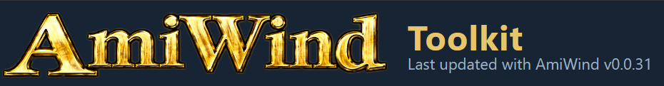
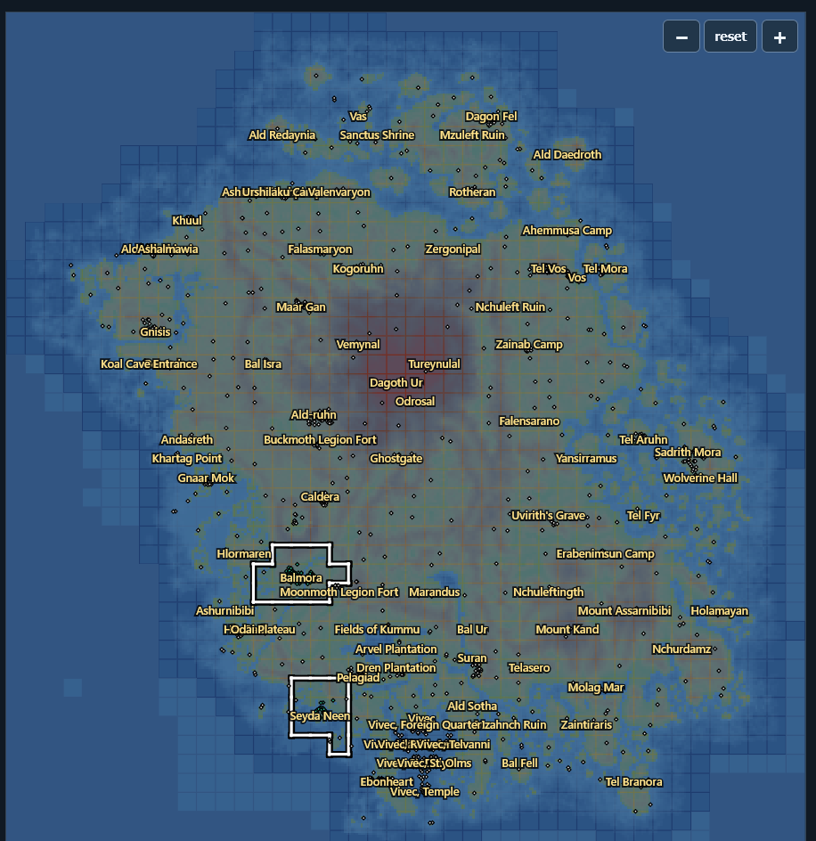

# AmiWind Toolkit



The AmiWind Toolkit is the browser workbench for anyone developing AmiWind: it
shows how much of Morrowind's world has been converted to the Amiga, what is
missing and where, and lets you open any built map in 3D to see its actual
polygons. It runs entirely on your machine; nothing is uploaded.

Nothing in the public repository shows the game world. Every view of it is
made on your machine from your own Morrowind files and your own AmiWind build
output, and stays there.

The header line "Last updated with AmiWind v..." names the AmiWind version the
Toolkit was last updated and tested with. It is changed by hand when the
Toolkit itself is next worked on, not with every release.

## Starting it

Either way opens [`amiwind-toolkit/index.html`](../amiwind-toolkit/index.html).

**With your data preloaded (recommended).** A tiny read-only server, bound to
this machine only, serves the Toolkit and your files so everything loads at
once and the Local view opens maps without picking a folder:

```bash
python3 tools/toolkit_serve.py --data DIR --maps MAPS_DIR --open
```

`DIR` holds `world-progress.json` and the local layers listed below; `MAPS_DIR`
is a build's `id1/maps` folder. Add `--metrics FILE` for the
[Map metrics layer](#map-metrics-layer). Without `--open`, browse to the address it
prints (default `http://127.0.0.1:8031/`). Python standard library only.

**Straight from disk.** Open `amiwind-toolkit/index.html` in a desktop browser
and pick the files with the **Status**, **Island (local)** and **Maps folder
(local)** buttons. Browsers do not let a page opened from disk read other files
by itself, so each one has to be chosen.

## Your data

1. **Status.** Every image build writes `world-progress.json` (counts and status
   only, no names) next to `entity-tracker.json`.
2. **Island (local)**, optional, made from your own `Morrowind.esm`:

   ```bash
   python3 tools/world_progress_background.py --esm /path/to/Morrowind.esm --out island.png
   python3 tools/world_progress_background.py --esm /path/to/Morrowind.esm --out island-world.png --style world
   python3 tools/world_progress_background.py --esm /path/to/Morrowind.esm --out island-cells.json --style cells
   ```

   `island.png` is the topographic view, `island-world.png` the look of the
   game's own World map, and `island-cells.json` the Local level: each cell's
   terrain, its original placements, and the place and region names.
3. **Maps folder (local).** A build's `id1/maps`, for the 3D Inspector.

## The three tabs

### World



Vvardenfell's exterior cells, one square per cell, north up.

- **Bottom layer** (‹ dropdown ›): the topomap (terrain converted for the whole
  island; the basis every other layer sits on) or the game's own World map look.
- **Layers**: topomap, heatmap of original entities, share of entities placed,
  full town/area maps (white border, black outline), content missing, interiors,
  named places, points of interest (interior entrances: green converted, white
  not converted), owner-checked cells, cell grid. More switches behind the
  cog (Options).
- **Map metrics** (only when a metrics layer is loaded): the estimated heap and
  BSP limits of every exterior cell; see [Map metrics layer](#map-metrics-layer).
- **Grid: on | off** at the map's top left switches the cell grid, in step with
  the Cell grid layer.
- **Zoom**: − / reset / + at the top right, the mouse wheel, or drag to pan.
- **Keys**: while the map is active (clicked, or under the mouse), the arrow
  keys or WASD pan it: up/W north, down/S south, left/A west, right/D east.
- **Hover**: the tooltip gives the cell's place and region, its map, entities
  placed against the original, interiors converted and named places. Over an
  interior-entrance marker the marker turns gold and the tooltip starts with
  "Highlighted: <name>".
- **Click** a cell: the Selected-area bar names it ("Selected area: Balmora
  (West Gash Region) · cell -3, -2 ...") and **Local view** opens it.
- **Copy state (JSON)**: the Toolkit version, the loaded data, the layers and
  the selection, ready to paste into a bug report or a message.

### Local

One cell up close: its terrain, its named places and every original placement
(filled = placed, red ring = not placed), counted by kind (statics, doors,
lights, containers, NPCs and more), and the list of places in the cell with
whether each interior is converted. **Map** lists the built maps that cover the
cell; **Show in 3D** opens the chosen one in the 3D Inspector tab.

### 3D Inspector

The compiled geometry of a built map: from above, fly view or orbit, with
wireframe or solid display, optional textures with your own palette, polygon
heatmap, collision preview, a compass and orientation gizmo, face selection and
markup for planning, and session export. Until a map is loaded it says so under
the crosshair. Open a map with **Show in 3D** in Local, or with **Open BSP /
JSON** in the inspector itself. The inspector also works on its own:
[`amiwind-toolkit/map-inspector.html`](../amiwind-toolkit/map-inspector.html),
[details](POLYCOUNT_INSPECTOR.md).

#### Sub-cell cuts and the divider

The **Sub-cell cuts** panel shows where a map is, or would be, divided: region
borders and section cuts are drawn as translucent coloured rectangles standing
through the map, in the perspective and the From above views, with a label on
each. Hover one for its name and position. **Show cuts and region borders**
turns them all off; **Show coverage** turns off the dashed coverage outlines.

- **Load cut overlay JSON** draws an overlay written by
  `tools/region_cuts.py` (or exported by the divider). For a town region map:

  ```bash
  python3 tools/region_cuts.py town --config config/balmora.json --map bm019 --out bm019-cuts.json
  python3 tools/region_cuts.py town --config config/seyda-bounded-regions.json --map sn012 --out sn012-cuts.json
  python3 tools/region_cuts.py plan --plan section-plan.json --out room-cuts.json
  ```

  A town overlay holds the map's own core (solid) and coverage (dashed) plus
  the cores of every region that reaches into it, so the borders you see are
  the sub-cell cuts that pass through that map. A section plan overlay holds
  each section's coverage box and each portal as a plane at its split.
- **The divider** adds cuts by hand: **Add X cut** (a plane of constant X) or
  **Add Y cut**. Move a cut with the position box or slider, or drag it in
  **From above**; drag its end squares to shorten it. Undo and Redo cover every
  cut change. The panel lists, for every section between the cuts, its faces,
  the placements inside it and straddling it, lightmap bytes and an estimated
  heap share against the 11,534,336-byte map budget (an estimate, with its
  method printed under the numbers).
- **Export cut overlay JSON** saves the cuts and sections as an overlay;
  **Export section plan JSON** writes them in the format of
  `tools/prepare_interior_sections.py` (2 to 8 sections, one portal per shared
  cut), with the fields only a build can supply marked `PENDING`. **Import
  cuts** reads either file back. Nothing is installed or changed in any map.

Interiors are divided at doorways and corridors first
([interior sections](INTERIOR_SECTIONS.md)); the divider is where you try those
cuts against the actual polygons before writing the plan. Format and method:
[sub-cell cuts](POLYCOUNT_INSPECTOR.md#build-020-sub-cell-cuts-and-divider).

## Map metrics layer

The Map metrics layer shows, for every exterior cell, how close the maps
covering it come to the engine's limits: the estimated map heap against the
11,534,336-byte budget, and faces, texinfo, nodes, clipnodes, marksurfaces,
vertexes, edicts, inline brush models, static flames and lights against
theirs. It is an estimate made from your own game data, before anything is
converted, so you can see where the world will not fit and plan the sub-cell
cuts there.

### Making the layer

1. Run the builder's world estimate on your own Morrowind data files. It writes
   `metrics.json` and `metrics.csv`, one row per proposed map: every exterior
   sub-cell region (its core cells, set and counts) and every interior cell,
   each with `cur_*` columns (what the converters convert today) and `evr_*`
   columns (every placed object converted, actors as edicts).
2. Serve it with the Toolkit. The server converts the table when it starts:

   ```bash
   python3 tools/toolkit_serve.py --data DIR --maps MAPS_DIR --metrics metrics.json --open
   ```

   Or convert it once into the smaller layer file and serve that:

   ```bash
   python3 tools/world_metrics.py metrics.json --out world-metrics.json
   python3 tools/toolkit_serve.py --data DIR --metrics world-metrics.json
   ```

   Opened from disk, pick `world-metrics.json` with **Metrics (local)**.

The layer file (format `aw-world-metrics-1`) holds, per exterior cell, the
worst value of each metric among the regions whose core lies in the cell, its
ratio to the limit and the region it comes from, plus the cell's region list;
every region's values; every interior's values; and summary counts. Optional
columns missing from the table are left empty. It holds names and numbers from
your game data: keep it with your own files. Without `--metrics` the server
serves no layer and the World Map shows no Map metrics bar.

### Reading it

- **Map metrics** switches the layer; it widens the map to Solstheim.
- **Metric**: heap, faces, texinfo, nodes, clipnodes, marksurfaces, vertexes,
  edicts, inline models, static flames or lights.
- **Current content | Everything**: today's converters, or every placed object.
- **Texinfo limit**: 32,767 today or 65,535 planned.
- **Colours** (value / limit, as on the world heat map chart): the palest blue
  is up to 50 %, then one darker blue per 10 % up to 100 %; red is over the
  limit. Bloodmoon (Solstheim) cells have a dark outline. Town labels come
  from your local `island-cells.json`.
- The bar and the side panel count the cells that hold at least one region
  over the limit, and the cells with objects.
- **Hover** a cell: its coordinates and name, the worst value, its share of
  the limit and the region it comes from.
- **Click** a cell: the panel under the map lists every sub-cell region with
  its core in the cell, with all its numbers; the region that sets the cell's
  value is outlined for each metric. **3D** opens a region in the 3D Inspector
  when a map of that name is in your maps folder; the built maps covering the
  cell are listed with their own **3D** buttons.
- **Interiors table**: every interior (the Tribunal set is interiors only),
  filtered by set, by name and by "over any engine limit" (lights excluded) or
  "over the selected metric's limit", sorted by any column.
- **Copy state (JSON)** includes the layer, metric, content, counts and the
  clicked cell.

The limits are the engine's own: `AMIWIND_HEAP_MB` (the map heap budget),
`MAX_MAP_FACES`, `MAX_MAP_NODES`, `MAX_MAP_VERTS`, `MAX_MAP_MARKSURFACES`, the
clipnode count check (65,520), `MAX_EDICTS` (600), the inline model budget
(220), `STATIC_FLAME_MAX` (128) and `MAX_DLIGHTS` (32, as if every light were
a dynamic light). `tests/test_world_metrics.py` checks them against the
sources.

## Using it for development

- **Find what is missing.** In World, turn on *Content missing* or the
  *Heatmap*; zoom in on the hot spots; hover for placed-against-original counts;
  open the cell in Local to see exactly which placements are not placed.
- **Check a converter change.** Rebuild, load the new `world-progress.json`
  (and maps folder), compare the cell counts and look at the map in 3D. The
  entity tracker gives the reason for every placement that is not placed
  ([trackers](trackers/README.md)).
- **Report a bug precisely.** Select the cell, press *Copy state (JSON)* and
  paste it into the report together with the in-game position.
- **Find what will not fit.** Load the Map metrics layer, pick a metric and
  *Everything*; click a red cell to see which sub-cell region is over and by
  how much, then plan its cuts in the 3D Inspector's divider.
- **Plan optimisation.** Open a heavy map in the 3D Inspector, use the polygon
  heatmap and face markup to find what to simplify; see the
  [Map Optimization Toolkit](AMIWIND_MAP_OPTIMIZATION_TOOLKIT.md).
- **Plan lighting.** [Light sources](LIGHT_SOURCES.md) counts every original
  lamp, candle, torch and fire per cell (`tools/light_sources.py census`).

## Other parts

| Part | What it is | Where |
| --- | --- | --- |
| Trackers | Entity tracker (original against placed, with reasons) and world progress table, written by every image build; POI checklist. | [trackers](trackers/README.md), [world progress](trackers/WORLD_PROGRESS.md) |
| Map optimisation | Map inspection, conversion and verification tools for reducing compiled-world costs. | [Map Optimization Toolkit](AMIWIND_MAP_OPTIMIZATION_TOOLKIT.md) |
| Console commands | Every `dbg` command in the game's own catalogue. | [console commands](AMIWIND_CONSOLE_COMMANDS.md) |
