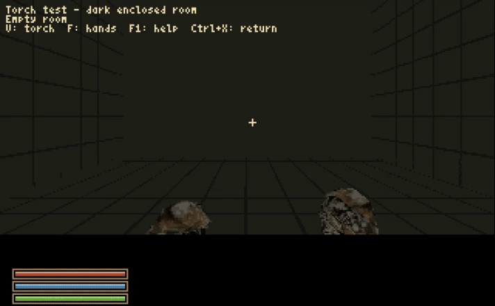

# Development history

## v0.0.29-rc2: Let There Be (Just a Bit More) Light

AmiWind v0.0.29-rc2 brings adjustable indoor brightness and improved torch controls, alongside the focused playtest repairs made since RC1.

Options > Graphics now offers six brightness steps, from 1.0 to 1.5. Interior brightness defaults to 1.2 and includes static lighting on NPCs. Exterior brightness is a separate control and starts at 1.0. Both settings are saved. A value of 1.0 is the original baseline; 1.2 applies a single 20% gain before the renderer's existing limits. Torch lighting is handled separately.

For console adjustment, use `dbg luma interior 1.3`. Existing interior-luma aliases remain available. Builds can omit the controls with `--disallow-luma-controls` or `--no-luma-controls`; explanatory console replies remain in those builds. Native performance verification is still pending, so no frame-time improvement or zero-cost claim is made here.

The silent GIF below shows the approved torch off/on/off sequence recorded in the actual game. It uses the earlier tested follow-up candidate's original frames, with GIF palette quantization and timing rounding. It is functional evidence for that torch sequence, not a capture of the final RC2 package.

RC2 keeps the original RC1 Balmora Temple map. A narrowly scoped converter correction is included in source, but its diagnostic rebuild did not resolve the broader missing walls and floors. Those Temple geometry and collision reports remain open. The prison-guard Enter music jump, heavy-load audio crackles, and incomplete world/interior coverage also remain open.

This is a release candidate for continued playtesting. Final source, package checksums, and delivery status belong with the completed release artifacts. Remote public-source publication is not claimed by this draft.

## 0.0.28 — Trees and Grass, Day and Night — in preparation, 4 October 2026

- Selected stable release identity 0.0.28; scoped local native acceptance passed. Public publication remains pending.
- V3 is default: stronger red/gold twilight, purple/blue hour, two original-cloud
  layers, moving sun and fog-based world tone; independent sun/cloud toggles start on.
- Added the original star/nebula and Masser/Secunda atlas, gentle star twinkle
  behind full moon discs, and default-on `dbg starsky` / `dbg nightsky` controls.
- Added `dbg daycycle gallery` camera tour, adjustable `dbg skyspeed` (default
  0.00333333333), `dbg inputtrace`, and original-asset guard torches with
  `guards_torch_cycle` / `dbg guardtorch on/off/auto`.
- Corrected enlarged source stars with AWN2 point roles and full upper-sky
  mapping: 163 original-source points behind visible nebula and complete moon
  masks, with black-background gaps transparent. All sixteen moon tiles remain
  unchanged; nebula uses original alpha.
- Added `dbg nightgallery [here/off]`: four eight-second views at 23:00 on the
  saved date, covering the current wide view, Masser, Secunda and overhead stars
  without moving the player or changing saved time/settings.
- Corrected coordinate-arrival traces starting in solid ceiling shells, with a
  bounded same-XY clear-start search and unchanged standing/floor checks.
- Expanded the OST source queue to four stereo PCM blocks (64 KiB), with
  4 KiB refill slices and buffer-size diagnostics. Shared mixer timing,
  speech and guard voices are unchanged. An initially positive owner
  listening report was immediately qualified: audible artifacts remain,
  mostly at load-ins and in heavy scenes. The music issue stays open, with
  further investigation deferred until after publication; this is a
  functionally tested mitigation.
- Finalization011 host gates pass: 824 tests per host (Linux 820 pass/4 skip;
  Windows 732 pass/92 skip) and identical 744,860-byte Amiga compiles from the
  same 206 runtime sources. The 1,096 frozen source files match, and the Linux
  Docker target-ABI gate passed.
- Image014 cold guard-admission failure was corrected in build011. Independent
  image015 WinUAE acceptance passed its scoped cold-guard, boundary, visible-particle,
  five-map pressure, eight-stage day-gallery and four-stage night-gallery checks.
  The 137 fresh captures, 10,766-file readback and three partition checks passed.
  Minimum logged peak clearance was 1,812,304 bytes, below the unchanged 2 MiB
  safety reference; production memory gate did not pass. Music artifacts remain
  an owner-deferred known issue. Hosted CI, tag and publication remain pending.
- Corrected reversed LAND edge winding across the bounded 64-map batch. Image015
  passed all eight day and four night gallery stages, bounded sky inspection and
  renderer-state restoration. Broader routes and unrestricted play remain outside
  this native test scope.
  Historical rc1/V1 captures retain attribution; v0.0.27 is still published.
  See [stable preparation](RELEASE-v0.0.28.md).

## 0.0.28-rc1 — Trees and Grass, Day and Night — candidate, 4 October 2026

- Prepared original-placement world foliage with 76 shared sprite types;
  preserved rocks, giant mushrooms and detailed Balmora mesh foliage.
- Converted 2,664 exterior maps to one shared sky, removing 301,751 local sky
  faces and saving 137,703,336 aggregate disk bytes against untouched inputs,
  including the shared asset once.
- Added persistent-clock sky/fog colors, default-on automatic day/night control,
  fractional clock ticks and explicit exact/named time controls. T waits remain
  available with the automatic cycle paused.
- Corrected static foliage-link allocation/accounting and startup comment
  separators; retained measured failed terrain trials and the current inspector.
- Both host suites and Amiga compiles passed; normalized executables match byte
  for byte. New HDF assembly/readback passed. Independent gameplay acceptance
  and publication remain pending. See [candidate scope](RELEASE-v0.0.28-rc1.md).

## 0.0.27 — Rocks, Mushrooms, and Then Some — 3 October 2026

- Published stable source release with 37,960 exterior rock placements and 816
  giant mushrooms across 2,526 world regions; joined mushroom caps preserve
  source geometry and UVs.
- Bounded Seyda Neen/Balmora town maps, held-input/player-state preservation at
  automatic crossings, final-map heap estimates and loader memory corrections.
- Retained settlement markers in both map modes, readable selector styling,
  configurable two-second loading-text delay, and an 18-track music catalogue.
- Generated WinUAE and FS-UAE configurations mount every required HDF together.
- Complete Linux Docker suite and asset-free compile passed; all four exact-
  commit hosted CI jobs and publisher downloaded-asset verification completed.
- Target heap/FPS/crossing/map-panel acceptance remains open. The In-Game map is
  a terrain-overview prototype; full condition-aware voices and the 17-video
  catalogue remain future work. Playable packages stay private.

See [the release evidence and limits](RELEASE-v0.0.27.md). Later editorial
corrections clarify this release state without changing its tag or source asset.

## 0.0.26

Tools/source-only Linux Docker builder using the established converter,
allowlisted build context, pinned Ubuntu base and recorded tool versions.
Private read-only input staging and persistent Linux build/cache volumes;
offline full conversion and export helper. Dedicated asset-free Docker CI
with diagnostic retention, alongside native Linux and Windows parity checks.
Full final-version conversion, export and WinUAE game entry passed locally,
alongside 433 synthetic tests (3 skips). The cached conversion took 26m06s;
the earlier cold rc1 conversion took 35m03s. Hosted CI gates publication.
See [Docker validation](VALIDATION-DOCKER-2026-10-02.md).

## 0.0.26-rc1

Native Windows setup/build scripts and portable archive paths/Amiga line endings.
Windows-only xdftool batching fixes the full-image command-length failure.
Full conversion plus recovered image assembly passed, followed by WinUAE game
entry; historical full-image evidence retains its v0.0.25 identity. Native
Windows remains experimental, with intermittent worker and cancellation defects
open. Linux is the established foundation. Docker and input helpers are planned
for final v0.0.26. See [rc1 release notes](RELEASE-v0.0.26-rc1.md).

## 0.0.25

Completion-order NPC gallery scheduling prevents queue stalls behind slow early
models. Cumulative reused/converted/failed progress and explicit stage headings.
Stable export order and existing model-cache identities are preserved.

## 0.0.25-rc10

Persistent dependency-verified character model caching, compatible stopped-rc9
model import, gallery capacity checks and explicit reuse statistics. Full NPC
gallery coverage, protected geometry and runtime rendering remain unchanged.

## v0.0.25-rc9

- Convert the original torch, animated grip and source emitter-aligned flame;
  share equipment attachment math between the mesh and flame anchors.
- Preserve 3D/sprite hand options and the rc8 dynamic-light crash correction.
- Add original-game region names to the version/world debug header.
- Add original CELL grid/labels to the generated atlas as a separate toggle.
- Document torch anatomy, the open hand blink/state reports, asset-gallery plans,
  confirmed scaled-flora omissions and actual payload versus HDF capacity.
- Restore NPC-gallery conversion, inspection-map compilation and verified staging
  to normal builds. Enabled by default; `--no-npc-gallery` is debugging-only and
  never removes required world NPCs. Check the gallery before world-terrain.
- Keep checked recovery of engine, gallery and image with retained terrain and
  strict actor checking.

## v0.0.25-rc8

- Repair F-then-V crash caused by treating a scenery collision leaf as a node.
- Light each brush model's visible faces, including non-colliding scenery and
  collision trees with no face references; preserve local light transforms.
- Reproduce rc7's fault through the render entry point with AddressSanitizer and
  add a regression covering face ownership, bounds, expiry and tiled exclusions.
- Record owner rc7 build/CI success separately from the subsequent runtime crash.
- Retain engine/image-only recovery and strict actor checks. Target retest pending.

## v0.0.25-rc7

- Fit initial NPC idle-mesh contact while retaining source coordinates and strict
  final auditing; preserve certified positions in the runtime.
- Resolve region names from original CELL/REGN data for the optional compass and
  regular map footer. Add select-then-confirm `dbg tp map`.
- Fill uncovered outdoor background with sky instead of the pale clear colour;
  water rendering remains unchanged.
- Add F-then-V placeholder torch, one bounded dynamic light and correct local
  light coordinates on transformed cave pieces. Shift+V keeps draw distance.
- Document original actor progression states separately from contact geometry.
- Retain checked engine/image-only recovery from completed rc3 conversions.
- Record source/native/placement evidence and untested runtime limits in the
  [rc7 release notes](RELEASE-v0.0.25-rc7.md).

## v0.0.25-rc6 — 1 October 2026

- Default compass/heading HUD to hidden; add saved `aw_compass` and
  `dbg compass on/off`, `1/0`, `true/false`.

- Repair the image-stage world/journal receipt collision with `regions.awr`.
  Keep exact file and payload-hash validation; cover mixed world-directory
  contents with a regression test.
- Run world UI generation/validation before world-terrain and provide bounded
  rc3 image recovery using verified retained terrain, with all image gates intact.
- Consolidate rc4 host helpers, rc5 build summaries and subsequent roadmap
  updates into one complete source package that applies directly to rc3.
- Include detected compiler/toolkit and Python/package versions, selected
  executable identities and worker allocation in the final footer and JSON.
- Audit compile order and worker scheduling in the toolkit roadmap, separating
  code-confirmed constraints from unmeasured optimization proposals.
- Make world-terrain build time the top engineering priority: phase profiling,
  validated reuse across new run names and reduced duplicate BSP/collision work.
- Prioritize native Windows/MSYS2 within the Windows roadmap; keep WSL2 as a
  fallback. Correct the earlier WSL2-first proposal recorded for rc5 below.
- Keep optional bundled QCC, GPU asset conversion and GPU-assisted QCC as future
  investigations. No new acceleration backend or world-build speedup is claimed.
- Include matching rc6 emulator templates, source receipt and direct-update
  metadata. Preserve all earlier source and release records.

## v0.0.25-rc5 — 1 October 2026

- Add a terminal-width completion footer with local start/end timestamps and
  timezone offsets, monotonic elapsed time, final file size in GiB/bytes and SHA-256.
- Print success only after all selected stages and final output hashing pass.
  Failed/cancelled runs show elapsed time without a completed-output claim.
- Count recognized engine compiler-warning lines separately and retain details
  in the stage log. Save the same summary beside the external build logs as JSON.
- Document WSL2 Ubuntu as the first proposed Windows-host experiment; retain
  separate, untested native Windows/MSYS2 acceptance.
- Record bundled pinned QCC and switchable compiler providers as a proposal;
  retain current external installation and selection behavior.
- Pass 353 source tests and freshly compile the versioned Amiga engine/preflight
  and asset-free test image on Linux. Full game conversion and Windows remain
  separate, incomplete acceptance work.

## v0.0.25-rc4 — 1 October 2026

- Add host-aware executable and virtual-environment discovery plus a read-only
  `--host-plan` inventory. Windows automatic setup remains unimplemented.
- Pass the selected Python interpreter through the engine's GNU make invocation,
  preserving spaces, quotes and literal dollar signs for the POSIX shell.
- Add an explicit/managed console-font path and forward it to conversion and
  provenance. Keep the existing Linux system-font fallback.
- Add a single-path MSYS2 `cygpath` helper; Windows QCC integration remains future
  work. Document compiler-runtime differences and staged Windows acceptance.
- Keep C fixture temporary files inside the isolated test directory. Pass all
  345 source tests, compile the rc4 engine/preflight and validate Linux QuakeC.
- Record the prior rc3 full-build disk exhaustion separately from native
  compilation. Full image and native Windows acceptance remain open.

## v0.0.25-rc3 — 1 October 2026

- Restrict exterior window flattening to exterior scenes. Preserve the original
  window mesh and collision when the same asset is placed inside an interior.
- Close scenery archives on conversion failures as well as successful returns.
- Reproduce rc2's Warehouse failure, verify the repaired conversion, and confirm
  exterior output is byte-identical with the same inputs.
- Compile the native engine; pass 336 host tests and 21 real-input build stages.
  Whole-island terrain conversion and final image validation remain incomplete.
- Document the generic installed-game layout and remove account-specific path
  examples from maintained documentation. Deliver public source only.

## v0.0.25-rc2 — 1 October 2026

- Reconcile original rc1 and checkpoints 001/004/006 without losing later modifier,
  launcher and configurable five-autosave fixes.
- Select original named containers and supported assets in known game folders;
  ignore personal transfer ZIPs before validation/hashing.
- Retain only the current dev1 journal screenshot; preserve owner cleanup.
- Source-only handoff for local compilation; native rc2 acceptance remains open.

## v0.0.25-rc1 — 1 October 2026

- Move Seyda Neen's island handoff inside actual ground coverage; retain both
  detailed town conversions and the frozen polymap's 2,526 region divisions.
- Refine shoreline triangles where coarse sampling submerged original dry land;
  correct ocean-only enclosure ceilings and restore original ground/water textures.
- Show universal source XYZ and local XYZ, with a normal-view compass. Refresh
  the map's player marker from the simulated position and retain zoom/pan on reopen.
- Protect M/N console input from Amiga system screen shortcuts. Reserve deliberate
  desktop access for debug Alt+M. Add Ctrl debug flight at twice Shift speed.
- Separate editable keymaps from settings and maintain [KEYMAPS.md](KEYMAPS.md).
- Defer unexplored-map masking; retain the 23 existing contact findings.

## v0.0.25-dev1 — 1 October 2026

- Convert the surveyed island footprint into 2,526 terrain/water regions, using
  the recovered polymap subdivisions and preserving detailed Seyda Neen and Balmora.
- Share duplicate BSP lighting and visibility blocks without changing their
  decoded contents; remove 382,833,220 bytes from the initial terrain build.
- Balance the payload across two FFS partitions inside one self-contained HDF.
  Document partition capacity, device addressing and the former 1 GiB build cap.
- Centre and wrap journal headings on the left leaf; update the native screenshot.
- Restore unassigned J/M bindings, gallery wheel/middle-button input and the
  exact-model polygon allowance needed for Dagoth Ur. Repair the reported Balmora
  terrain material in every affected town-region copy.
- Retain the 23 known ground-contact findings. This is a development playable;
  [scope and verification](RELEASE-v0.0.25-dev1.md) remain explicit.

## v0.0.24 - Welcome to Balmora (and Vvardenfell!) - 1 October 2026

- Owner-approved milestone release of RC4's game/features, with freshly compiled
  final-version runtime and preflight identities.
- Present the whole-island base-game map and density survey as a major mapping
  milestone; explicitly exclude Solstheim/Bloodmoon and Tribunal content.
- Feature character creation, Dagoth Ur, native Balmora/map/journal screenshots
  and precise coverage on the main page. Exact image ignore exceptions and
  release allowlists keep the public captures tracked.
- Carry all 3,551 model assets and the RC palette, collision, targeting and
  journal improvements. Retain 23 unresolved placement findings explicitly;
  release approval does not change the automated audit result.
- [Release notes](RELEASE-v0.0.24.md).

## v0.0.24-rc4 — 1 October 2026

Whole-base-master terrain/geometry survey, private interactive atlas and terrain
inspection mesh; native M map and J two-page journal with earned dated history,
quest links and AWS2 saves. Assets load on demand and are freed on close.
Includes screenshot-tracking validation. Whole-island 3D traversal, inventory
and complete quest scripting remain future work; the 23 placement findings
remain open. See [scope and evidence](RELEASE-v0.0.24-rc4.md).

## v0.0.24-rc3 — 1 October 2026

Owner-requested recovery candidate: complete gallery conversion, bounded exact-model
allowances up to 1,024 triangles, preserved Dagoth mask detail, two authored airborne
inspection poses, repaired skin-tone lookup tables, gallery cursor/paging and a
collision-trace correction for the three RC2 walking stalls. Adds the island
terrain/polygon-density plan and M/I/J interface roadmap. The 23 strict ground
contact findings remain open. See [scope and evidence](RELEASE-v0.0.24-rc3.md).

## v0.0.24-rc2 — 1 October 2026

Interim owner-testing checkpoint: gallery browser/help/return, bounded per-model
geometry allowances, canonical ground placement and independent contact audit,
close NPC targeting, birthsign ordering, guarded hill-material repair, Options
scrolling and measured experimental read-ahead. The strict contact and walking
findings remain open. See [full scope and limits](RELEASE-v0.0.24-rc2.md).

## v0.0.24-rc1 — 30 September 2026

**AmiWind v0.0.24-rc1 — candidate for Welcome to Balmora.**

Balmora now includes 43 destination interiors (42 city interiors plus Tharys
Ancestral Tomb), 93 NPC placements (90 living and three authored corpses), and
80 living NPC voice sets. Original links cover 70 exterior entrances and two
additional same-room Fighters Guild links. All 43 maps passed native loading;
all 70 entrance/return routes and both internal links passed targeted native
checks. Ordinary walking checks cover the reported stairs/arches except the
unresolved positive-Y report. The exact stairs/rock wedge is also still open.

Full selected interior geometry is retained, including distant-origin towers
and previously omitted dressing. The checklist records stair collision and
slope classification, ground-material repairs, clearer gold e/H glyphs, shared
NPC targeting, the guard's final dock post and filename packaging corrections.
These are local checks, not owner acceptance of every route or the full game.

The accepted Strider, frozen-frame Loading... box, Shift+V, 90-degree FOV,
base player hull and race/sex eye heights remain. Balmora has 64 overlapping
regions; Seyda Neen has 25 regular regions plus the intro pier and ring
courtyard. Loading replaces a BSP synchronously. Background streaming,
whole-map polygon-density analysis, full NPC services, schedules, combat and
quest simulation remain future work. Greetings use a bounded authored fixture.

Stable v0.0.23 and the published dev5 prerelease remain unchanged. Final
v0.0.24 needs the owner's green light. See [RC scope](RELEASE-v0.0.24-rc1.md),
[complete checklist](INVESTIGATION-v0.0.24-rc1.md),
[conversion lessons](BALMORA_CONVERSION_LESSONS.md) and
[Amiga naming constraints](RELEASE_WORKFLOW.md#amiga-limitations).

## v0.0.24-dev4 — 30 September 2026

- Add `dbg tp` for the existing destination menu, and direct `balmora`,
  `seydaneen`, `prisonship` and converted-map shortcuts. Retain `dbg scene`.
- Resolve interior entrances from their destination catalogue when teleporting
  out of Balmora. Reject missing scene files before leaving the current scene.
- Add 30 Seyda Neen regions, a compact first-exit pier and separate ring courtyard;
  remove unused BSP data while preserving complete selected placements.
- Extend accepted frozen-frame loading and checked state-preserving arrivals.
- Default character confirmation to Choose; center review title with page count.
- Lock the Census front exit during registration; supplement long-pier containment.
- Move distance presets to Shift+V; preserve custom numeric bindings. Both region
  exteriors cap effective distance at 540; other scenes retain the stored setting.
- Preserve authored collision surfaces for the blocked Hlaalu b17 stair opening;
  keep player dimensions, FOV and the accepted dev3 Strider unchanged.
- Record new stair/door appearance reports as open Balmora fixes and defer the
  whole-map polygon-density study to the next version.
- See [scope and validation](RELEASE-v0.0.24-dev4.md).

## v0.0.24-dev3 — 30 September 2026

- Share Seyda Neen's inspected Strider profile in Balmora; rebuild the 16 affected
  regions. Collision, entities and the other 48 maps remain unchanged.
- Add Options → Area loading: Freeze frame / Black screen. Freeze is the default
  for region crossings; hold the displayed image and palette with a small top
  Loading box. Reuse the existing loading-art storage; retain music servicing.
- Record positive dev2 exterior feedback, missing Balmora interiors, the reported
  faster city performance and Seyda Neen subdivision/prefetch investigation.
- Pass 279 host tests; native warning review remains 82, with no new diagnostics.
  See [validation and limitations](RELEASE-v0.0.24-dev3.md).

## v0.0.24-dev2 — 30 September 2026

- Restore original Balmora architectural geometry after generic reduction
  destroyed open facades; rebuild all 64 regions with bounded 896-unit overlap.
- Preserve authored collision surfaces in the two reported bridge/temple arches.
  Measure the physical standing box in the native runtime against original scale.
- Export original race/sex heights for the first-person eye, replacing the fixed
  Nord fixture. Keep 90-degree Quake FOV and bob; record an optional FOV slider
  as a performance-gated roadmap item.
- Follow the dock guard's clear final approach to the actual goal; align ordinary
  NPC and Strider driver Talk hints with their respective interaction conditions.
- Record matched boat performance, native captures and remaining limits in
  [the investigation](INVESTIGATION-v0.0.24-dev2.md) and the existing mesh notes.
- Pass 278 host tests. Review native warnings: 85 to 82, no added diagnostic.

## v0.0.24-dev1 — 30 September 2026

Initial Balmora exterior, 64 overlapping regions, 1,488 scenery placements,
18 residents and return Strider travel. See [original scope](BALMORA-v0.0.24-dev1.md).
Its generic architectural reduction was defective; dev2 corrects that conversion.

## v0.0.23-dev4 — 29 September 2026

Padded content-sized dialogue and caret/rotation regressions; 2/5/1-second logo
with continuous title music; optional opening quote overlay; sprite background
depth and deferred NPC floor placement. See [release notes](RELEASE-v0.0.23-dev4.md).

## 0.0.23-dev2 — 29 September 2026

- Expand the exterior beyond the port; retain crossing object bounds, the missing
  rock mound, original Silt Strider and Darvame.
- Convert all thirteen town interiors plus Addamasartus through bounded parallel
  room jobs; preserve doors, source placements, cave water height and save identity.
- Add the local cast, beast skeleton support and shared solid NPC collision.
- Correct entity visibility capacity and unsigned BSP collision-node handling;
  reduce plane allocation and use an 11 MiB heap within the same reference RAM.
- Add normal/blank loading styles and black movie-to-Jiub loading. Service music
  during common file/model/entity loading without clearing the music DMA buffer.
- Restore authored ship-wave emitter gain by removing the extra 5 dB reduction.
- Refresh README gameplay captures, explicit media exceptions and dated roadmap.
- Retain default parallel compilation and both TTF / bitmap font paths.

See `RELEASE-v0.0.23-dev2.md` for measured checks and incomplete gameplay.

## v0.0.23-dev1 - parallel builds, 29 September 2026

- Public package revision 2 removes two trailing-whitespace defects that blocked
  owner publication and enforces whitespace checks before packaging/delivery.
  Runtime identity and private compiled images remain unchanged.
- Resume numbered development checkpoints after the v0.0.22 public release.
- Schedule independent build stages concurrently under one automatic CPU budget.
- Use bounded process workers for scenery, previews, BSP geometry/lightmaps,
  intro actors, character heads and music; preserve deterministic output order.
- Propagate compiler limits through interiors/Census, keep complete stage logs
  and cancel dependent work on failure. Add `--serial-stages` for diagnosis.
- Compile and boot private playtests with TTFs and with bitmap-only font inputs.
  Document automatic font selection and the existing filled paper-ink default.
- Preserve gameplay code; sea audio, continuous music verification and the
  remaining Seyda Neen interiors are subsequent checkpoints.

See [release scope and validation](RELEASE-v0.0.23-dev1.md).

## v0.0.22 - normal public source release, 29 September 2026

- Promote the reconciled v0.0.21-dev8 source checkpoint to a normal GitHub release.
- Keep the dev8 boot/launcher, paper-font and CPU-query behavior unchanged.
- Use plain `0.0.x` numbering for public releases going forward; older `-devN` tags
  remain historical development checkpoints.
- No new gameplay feature, HDF build, emulator acceptance or parallel-build speedup
  is claimed by this version-only promotion.

See [release scope and validation](RELEASE-v0.0.22.md).

## v0.0.21-dev8 - reconciled boot/launcher and paper-font sources, 29 September 2026

- Preserve the uploaded dev7 boot checker, five-second report/skip behavior,
  launcher and dry-run startup ordering without replacing them with dev5 files.
- Integrate the approved paper-only bitmap ink candidate, enabled by default
  when TTF conversion is unavailable. Keep preferred TTF and dialogue/menu fonts.
- Add `--bitmap-paper-ink filled|original` and an external `--build-config` JSON
  override, with actual-source diagnostics and private conversion receipts.
- Give paper text a separate optional font cache so small character UI is not
  affected; retain safe missing/invalid/allocation-failure fallback.
- Handle `OSError` from Python's process CPU-count query and test that fallback.
- No parallelization overhaul, new HDF or emulator acceptance is claimed here.

See [release scope and validation](RELEASE-v0.0.21-dev8.md).

## v0.0.21-dev7 - visible five-second preflight and dry-run boot order, 29 September 2026

- Keep a successful `AmiWindCheck` report visible for five seconds by default.
  Space or Enter skips the countdown immediately; the wait is timer-backed rather
  than a CPU-speed-dependent busy loop.
- Do not rely on shell-console scrollback for startup diagnostics.
- Put `AmiWindCheck` into the asset-free dry-run HDF and run it before the existing
  `AmiWindDryRun` notice. A failed hardware check still stops before the notice via
  `FailAt 10`.
- Preserve the existing dry-run notice after the preflight and keep the exact
  AmiWind version generated from the single root `VERSION` file.

See RELEASE-v0.0.21-dev7.md for scope and validation.

## v0.0.21-dev6 - versioned boot/environment preflight, 29 September 2026

- Expand `AmiWindCheck` into a readable startup checklist. It reports the exact
  AmiWind version, Exec API level, 68040-class CPU, internal FPU, PAL timing,
  AGA machine class, Chip/Fast memory and usable Z3/32-bit memory path.
- Keep host-only facts honest: the Amiga guest labels JIT, CPU-speed/cycle policy
  and exact ROM-file revision as host checks instead of guessing them.
- Make generated native version data supply the preflight banner, pass/fail footer
  and `$VER: AmiWindCheck ...` identity from the single root `VERSION` file.
- Make the portable FS-UAE launcher enforce the reference A1200/68040-NOMMU/FPU,
  JIT, `uae_cpu_speed=max`, 32-bit addressing and 2 MiB Chip + 16 MiB Z3 profile.
  It backs up a mismatched existing config, corrects only the managed machine
  settings/paths, preserves unrelated options, and prints a host checklist.
- A reference-ROM checksum match is identified as Kickstart 3.1 A1200 40.68. An
  unknown ROM remains a warning rather than a false identification.

See RELEASE-v0.0.21-dev6.md for scope and validation.

## v0.0.21-dev5 — GOG TTF preference and Steam font fallback, 28 September 2026

- Prefer the GOG GOTY `BookArt/*.ttf` font sources for host-side AmiWind
  rasterization when present. GOG GOTY remains the recommended source edition.
- Support Steam GOTY's normal lack of loose BookArt TTFs by falling back to the
  matching Bethesda `Fonts/*.fnt` + `.tex` pairs instead of aborting stage 13.
- Report every preferred TTF as found/not found, the selected source per font
  family, the GOG recommendation/link, and the possible quality difference.
- Convert Magic Cards, Century Gothic, Century Gothic Big and Daedric families at
  16/14/12 px. If a preferred TTF exceeds native AWF limits, fall back safely to
  its bitmap family rather than clipping or corrupting glyphs.
- Add Steam-style and GOG-style font-source regression tests. No gameplay change
  is claimed relative to dev4.

See RELEASE-v0.0.21-dev5.md for validation and the remaining real-install test.

## v0.0.21-dev4 — evening world-mapping checkpoint, 28 September 2026

- Record Horstator's optional polygonal POI-region fallback if cell streaming
  cannot meet the Amiga's measured budgets, starting with Seyda Neen.
- Preserve both conversion strategies, original cell semantics and stable
  reference state; plan concealed crossings, loading feedback and memory checks.
- Package the updated diary, world-mapping plan and roadmap with a native rebuild
  carrying the dev4 identity. Gameplay and converted assets remain as in dev3.
  Region swapping and doorway simplification are not implemented by this release.

See RELEASE-v0.0.21-dev4.md for validation and save compatibility.

## v0.0.21-dev3 — opening maintenance and interaction hints, 28 September 2026

- Two-line lower-right NPC hints: 12 px Morrowind name and current console-font
  action (`npc_interaction_layout_template_001`); matching opening aim/use query.
- Arrows/WASD menu choices; fighting unlocked by hall paper acceptance rather
  than final release; persistent courtyard ring depletion and atomic pickup.
- Compiled standing-hull room audit for support, connected steps and fall edges.

- Restore the scripted Census room floor/walls; correct dock proximity anchors.
- Use black/gray reading text on white and retain more Census wall-art detail.
- Record playtest bugs with fixed Y/N, version and verification status.

Highlight New Game when opening its confirmation dialog, so Enter starts the
intro immediately. Esc and explicit Cancel return to the menu. The hidden mouse
position starts over the selected button as well. See RELEASE-v0.0.21-dev3.md.

## v0.0.21-dev2 — opening barrier correction, 28 September 2026

Correct compound rotations of the 22 collision-only opening references. Preserve
the original positions, dimensions and CharGenState lifetime. Add converter and
state regression coverage, an indexed journal incident, and persistent opening
access/research priorities. See RELEASE-v0.0.21-dev2.md for exact validation
coverage and pending owner acceptance.

## Portable launcher helper — 28 September 2026

Add `tools/AmiWind-FS-UAE-launcher.py` for existing local images: numeric release
and development-version selection, date tie-breaking, saved ROM/settings,
non-blocking ROM checksum warnings and automatic FS-UAE configuration with
backups. Enter accepts the suggested image; `--yes` launches immediately.
This host-tool follow-up leaves runtime v0.0.20 unchanged. See FS-UAE-LAUNCHER.md.

## v0.0.20 — 28 September 2026

Prison-ship hull ambience reduced by 5 dB per static mixer channel; audio files
and other uses remain unchanged. Enabling debug overlays also enables coordinates.
Corrected the current FS-UAE 24-bit-addressing option and two compiler-detected
array-row bounds violations. Recorded intermittent ship-exit/menu freezes and
the persistent Silt Strider-port report; their causes remain unresolved.
See RELEASE-v0.0.20.md and BUGS.md.

## v0.0.19 — 28 September 2026

Public release of the accumulated 0.0.18 checkpoints: intro/movie, UI/menus,
loading screens, entrance prompts and parallel builds.
Routine soundtrack notices now obey the debug-overlay switch at their source.
Music events still log privately, and explicit status queries still work.
See RELEASE-v0.0.19.md.

## v0.0.18-dev5 — 28 September 2026

Original main-menu art with bottom-right version, centered Esc menu and New Game
confirmation, larger logo/movie frames and readable private title cards. Original
loading screens replace transition-console flashes by default; debug overlays
default off. Deck guard greeting/reminder, visible town entrance names and safe
missing-interior feedback, private source layout reference, automatic compiler
jobs with explicit overrides. See RELEASE-v0.0.18-dev5.md.

## v0.0.18-dev4 — 28 September 2026

Project-logo startup fade and upper-menu/README branding, main-menu title music,
reset of the selected New Game track,
optional streamed prophecy movie with Esc, mapped hatch activation bounds,
ship NPC body collision and escort waiting, default-off disk indicator,
actor-cache staging correction and three-line loading credits. See
RELEASE-v0.0.18-dev4.md for validation and unfinished work.

## v0.0.18-dev3 — 28 September 2026

Original main-menu background with a separate palette, distinct return-to-game
and main-menu flows, disabled Load, and New Game into the ship. Conservative
animated alias bounds permit rejecting off-screen actors before disk-cache
loads. See RELEASE-v0.0.18-dev3.md for verification and remaining work.

## v0.0.18-dev2 — 28 September 2026

First ship-script adapter, original introductory voices/name entry, talking and
blinking head poses, female appearances, path-grid escort movement, ship ambience
and darker hold lighting. Distinct HUD colors, optional outer frame off by default,
New Game entry and integrated private conversion. See RELEASE-v0.0.18-dev2.md for
verification and remaining dock/Census work. Journal filename corrected.

## v0.0.18-dev1 — 28 September 2026

Original proportional Magic Cards UI, private original border/bar conversion,
black lower-strip sliding subtitles, font selection with preserved console, and
native font/clipping validation. See RELEASE-v0.0.18-dev1.md for the exact scope;
this checkpoint does not claim the completed intro or gameplay resource systems.

## v0.0.17 — 28 September 2026

One-command confirmed dependency setup and continuation, isolated fresh tools,
bounded game-directory discovery, actionable download failures, corrected tool
probes, QuakeC preflight, and one authoritative VERSION file. CI exercises the
same installer with public tools and an asset-free image. Test-004 completed the
owner's full game-data build; the owner subsequently confirmed test-006 works.
See [validation scope](VALIDATION-v0.0.17.md) and [release notes](RELEASE-v0.0.17.md).

- Optional FS-UAE autorun checks the emulator and owned ROM before building,
  accepts a ROM file or directory and prompts if none is selected, and fills both paths in the documented preset.
- `early_game_demo_start_1` is enabled by default: town-center spawn in Seyda
  Neen, track 04 first, then the exploration shuffle. Ship-first startup remains
  selectable; interior transitions do not reset the demo opening.

## v0.0.16

- First consolidated repository release under FlyingFathead/amiwind.
- Unify source/runtime/image/archive versions and reject mismatched native strings.
- Add the requested boot credits and project address.
- Change ordinary underwater tint from the inherited brown shift to blue; preserve independent damage flashes.
- Set exterior fog/draw default and menu reset to 540; retain other distances.
- Carry forward guided dependency/input checks, WSL/GOG discovery, asset-free CI and documentation screenshots.
- Provide matching full source, incremental source and private playable packages.
- Opening sequence and original-font UI integration remain unfinished.

See RELEASE-v0.0.16.md for validation and patch-base details.

## 0.12.1.dev1 / runtime source still v0.0.15-dev2

- Consolidate the public checkout into one `amiwind/` root.
- Include the complete selected AGA engine under `engine/aga/`.
- Build the checked-in engine directly in an external work directory.
- Use bundled native source for host regression checks by default.
- Rename host distribution/release root to `amiwind`; retain legacy workspace compatibility.
- Record official project URL and accepted font/UI direction.
- Add confirmed host/optional SDK setup, version comparison and complete reference-file hashing.
- Detect WSL and offer a matching default GOG installation; accept any chosen install root.
- Default build output to ignored out/ and expand accidental-game-file ignore rules.
- Add asset-free GitHub Actions compilation and a versioned boot-notice HDF.
- Add a top-level project-state summary and five uniformly cropped documentation screenshots.
- No water, fog, gameplay or original-font integration is claimed.

See REPOSITORY_LAYOUT.md for migration and verification.

## 0.12.0.dev2 / runtime v0.0.15-dev2

- Preserve structural ship-interior source surfaces and UVs to repair hull intrusion.
- Add a scene-picker popup via `dbg scene change`, retaining direct commands.
- Add live fog/draw-distance commands and Options → Graphics slider; replace
  floating-point depth-table rebuilds with integer threshold bands.
- Add default-off FPS HUD using existing profiler timing.
- Add a private base-master NPC/door/container audit and synthetic deletion tests.
- Preserve exterior method_001 and record the complete owner follow-up list.
- Keep underwater tint, audio pops, exterior formation and performance reports open.

See CHECKPOINT_017_VALIDATION.md for measured scope and remaining limits.

## 0.12.0.dev1 / runtime v0.0.15-dev1

- Add the dim prison-ship interior and source-derived hatch links; one resident scene.
- Preserve music identity across map changes and validate arrival floors.
- Convert hollow shell collision as thin prisms; remove same-side recursive hull descent.
- Compact console default, fullscreen toggle, page scrollback, overlay alias.
- Calibrate Nord eye height independently of collision; add DEG and pitch to coordinates.
- Keep 3D hands and add an experimental compile-time sprite bake/draw path.
- Record repeatable conversion recipes and private input/tool/source fingerprints.

See CHECKPOINT_016_VALIDATION.md for evidence, failures and open reports.

## 0.11.0.dev1 / runtime v0.0.14-dev1

- Convert the complete arrival-ship assembly, including its ACTI hull.
- Reduce ship exterior geometry/material textures on the host; use separate
  authored collision geometry instead of visual detail for the physical hull.
- Add solid configurable console background and space-separated debug aliases.
- Add a readable original bitmap font and retain the previous font as `retro`.
- Record ship departure/source behavior, dim opening-interior priorities, NPC
  collision work, and a planned day/night/sky interface with frozen-time tests.

See CHECKPOINT_015_VALIDATION.md for measured scope and remaining limits.

## 0.10.0.dev1 / runtime v0.0.13-dev1

- Decode BSP face plane indices as unsigned and reject out-of-range indices.
- Increase preallocated render buffers after measuring dock-view overflow.
- Bake Nord hands and authored idle/draw/lower/punch clips locally.
- Add Escape menu, disabled future options and confirmed Exit.
- Add coordinate strip, debug master/aliases and default-off RAM indicator.
- Add pitch-directed noclip flight, numbered safe recall point 0 and exit restart hint.
- Extend the temporary sea backdrop; add its independent visibility toggle.
- Export ordered private voice records with original conditions and scripts.
- Preserve per-version user confirmations and remaining visibility reports.

See CHECKPOINT_014_VALIDATION.md for native scope and remaining limits.

## 0.9.0.dev2 / runtime v0.0.12-dev2

- Bound expanded architectural hulls to remove distant solid spikes.
- Add `aw_blockers` and NPC facing/greeting diagnostics.
- Turn nearby NPCs toward the player; add bounded proximity Hello/reset.
- Replace the compound E binding so console key releases cannot trigger speech.
- Preserve original ordered wander settings for the next walking milestone.
- Add the owner FS-UAE guide and versioned FS-UAE/WinUAE presets to both packages.
- Retain existing Quake bob, stairs, music and rendering implementation.

See CHECKPOINT_013_VALIDATION.md for evidence and remaining limits.

## 0.9.0.dev1 / runtime v0.0.12-dev1

- Bake dressed Fargoth and two guards, eight idle poses and original voice auditions.
- Add nearby E interaction with a cooldown; retain nonblocking actor placement.
- Match player/world collision to base humanoid bounds; fix ground support and stairs.
- Preserve Quake camera bob and existing music/door renderer fixes.
- Add native stair/actor evidence, host tests and a matching WinUAE preset.
- Track Nord first-person hands and punching separately from later combat logic.

See CHECKPOINT_012_VALIDATION.md for scope, limits and hashes.

## 0.8.3.dev4 / runtime v0.0.11-dev4

- Reproduce the fresh-boot movement lock before using diagnostic recovery.
- Find a grounded standing-hull spawn with short exits in all four directions.
- Share spawn validation with recovery; preserve the old pose on failure.
- Retain dev3 rendering, world assets, music and filesystem fixes unchanged.
- Save Fargoth/guard outfit, skeleton and dialogue research for the NPC milestone.

See CHECKPOINT_011_VALIDATION.md for the fresh native movement evidence.

## 0.8.3.dev3 / runtime v0.0.11-dev3

- Correct legacy root-block metadata that made filesystem revalidation fail.
- Rotate collision with buildings and preserve the nearest floor hit when
  another collider starts overlapped; fully blocked moves keep their original
  position. Use the standard standing hull width.
- Add F10/grave console, noclip/tcl, safe recovery and reproducible diagnostics.
- Consume mouse input safely while the console is open; copy event data before
  returning its OS message. Escape closes the console before quitting the game.
- Match far culling to fog depth, retain partial bounds and truncated PVS lists.
- Include window attachments previously omitted from the mesh conversion.
- Tighten nearby surface-depth ordering; keep old tolerance for comparison.

See CHECKPOINT_010_VALIDATION.md for verified scope and remaining limitations.

- Shared BSP meshes with source UVs, transform variants and separate multipart
  collision; 136 placements / 52 variants fit the existing 8 MiB hunk.
- Corrected surface pool exhaustion, depth-pair writes, rotated clipping and
  degenerate texture extents. Section-wise BSP input lowers temporary memory.
- Fixed native track00 filename regression, title filtering, shuffle/history
  controls and bounded PCM refills; full distinct native song completions logged.
- Fixed 32 KiB Chip leak on shutdown and false contiguous-memory rejection after
  quitting. `amiwind` relaunch and hardware checks passed twice.
- Guided Linux build, restored credits/notices and versioned presets under
  resources/emulators. 51 host tests, guided build and HDF readback passed.
- Startup audio deadlines, terrain/mesh joins and later gameplay remain open.
  See [checkpoint-009](CHECKPOINT_009_VALIDATION.md) for exact scope and counters.

# Development source 0.8.3.dev1 / runtime v0.0.11-dev1

- Guided Linux build, restored README credits/notices, versioned public WinUAE preset.
- Music title filtering, history controls, bounded prefetch and transition diagnostics.
- Renderer overflow counters; geometry repair still experimental.
- 47 host tests passed; full guided HDF build/readback passed. Native acceptance pending.
- See [development record](DEVELOPMENT_011.md); v0.0.10 remains the latest released playable checkpoint.

# Runtime v0.0.10 / source 0.8.2 — 27 September 2026

- Reproduced the reported 80000027 failure with 4 MiB Fast RAM.
- Added a small 68000 preflight before the engine: OS, CPU/FPU, AGA, free and contiguous memory checks.
- Replaced the large malloc request with checked, aligned Exec Fast-memory allocation and matching cleanup.
- Added current WinUAE setup guidance, corrected owner config and explicit 2 MiB Chip / 16 MiB Fast reference.
- Scene, textures and all 18 music streams remain byte-identical to checkpoint-007.
- Owner reports v0.0.9 boots in WinUAE after complete-ROM selection, and that selecting maximum CPU speed resolved the slow/glitching run; corrected config preserves that setting. No new hardware-performance claim.

# Runtime v0.0.9 / source 0.8.1 — 27 September 2026

- Fixed the missing icon.library requester on bare-ROM boot by removing unused
  Workbench tooltype/icon handling and desktop close/reopen code.
- Removed the explicit icon.library open from the experimental CLIB2 adapter too.
- Added a linked-Hunk executable gate at engine build and image assembly;
  icon.library/workbench.library references now fail packaging.
- Boot banner, HUD and Amiga executable version identify v0.0.9.
- Kept the checkpoint-006 world, textures and audio byte-identical. Only the
  native executable changes in the filesystem payload.
- Added startup regression tests and separate 3.1/3.1.4 ROM validation records.

# Runtime v0.0.8 / source 0.8.0 — 27 September 2026

- First AGA HDF checkpoint: bounded walkable Seyda Neen, static BSP proxies,
  baked facade textures, foliage sprites, palette fog and distance controls.
- Independent C2P, GPL C spans, standalone content initialization and original HUD.
- Full installed OST on disk, stereo streaming, natural song transitions and
  no-adjacent-repeat bags; three late mixer updates remain a known test issue.
- Native frame/stage/memory/music profiles and matched-run regression comparison.
- Pinned reproducible runtime patch plus complete separate corresponding source.
- README credits and community thanks; optimization history preserves failed trials.

Earlier checkpoint notes follow unchanged.

---

# Changelog

## 0.7.0 source / AmiWind v0.0.6 checkpoint-005

- Adopt AmiWind as the working title; generate the versioned loading banner.
- Deduplicate identical title/exploration music by converted PCM hash. Add
  exploration/battle shuffled bags with no immediate repeat, ordered F6/F7
  audition, F8 group audition and bounded native track-open diagnostics.
- Preserve complete songs, stereo DMA buffers and the tested async4k scheduler.
- Export static NIF geometry/materials/textures and placed bounds into a private
  indexed archive; add host turntables, cache accounting and packet validation.
- Retain door names/destinations for later activation/interior work.
- Document a separate expanded-Amiga renderer option, OpenMW/Quake translation
  boundaries, GPL requirements and credits. No external engine code is bundled.
- Native scenery and game mechanics remain pending; this build still renders
  the existing A500 terrain scene.

## 0.6.0 source / demo v0.0.5 checkpoint-004

- Add native frame/refill histograms, reproducible fixed-scene benchmarks,
  provenance checks and profile decoding/comparison tools.
- Compare blocking 16 KiB, async 16 KiB, async 8 KiB and async 4 KiB reads;
  choose async4k with cooperative audio service during long render passes,
  retaining the same 48 KiB queue.
- Pack full music files into three 32 MiB OFS partitions in one RDB HDF, with
  volume-qualified music paths and persistent native profile output.
- Verify native write/readback, missing/truncated-file recovery, movement,
  playlist transitions and return to DOS on the 1 MiB KS 1.3 baseline.
- Adopt GPL-3.0-only for project source. Retain external game/ROM separation,
  original purchase links and an explicit licence-compliant OpenMW baker option.
- Add storage/API limits, source studies for Doom/DoomAttack/AmiQuake, and
  measured next-step decisions. Renderer/scenery still matches checkpoint-002.

## 0.5.0 source / demo v0.0.4 checkpoint-003

- Convert all installed base-game music files, preserving complete tracks.
- Stream stereo PCM from a 64 MiB HDD image through 48 KiB of Chip buffers.
- Keep OS input/disk/audio services active; queue audio.device requests.
- Add automatic playlist advance/wrap and F6/F7 track selection.
- Report disk read count, maximum latency, starvations and read errors.
- Save the measured 7.1429 fps streaming baseline before refill optimization.
- Document storage tiers, raw-archive options and the capacity/performance distinction.
- Preserve separate, checked public source and private runtime packages.

## 0.4.0 source / demo v0.0.3 checkpoint-002

- Add a filled 97x97 heightfield with near-to-far column occlusion.
- Bake coarse surface colours from 19 original terrain textures.
- Add projection/row lookup tables; record 10.6857 fps on a short dense-fog route.
- Default to dense fog; keys 1/2/3 select distance and Tab retains wireframe.
- Use the blitter for long vertical spans and avoid a second frame wait.
- Start the terrain camera ashore; retain WASD, mouse and the original audio.
- Print presented-frame counts/timing on exit for performance comparisons.
- Rename boot images to MorrowindDemo-v0.0.3.hdf/adf and the executable to
  MorrowindDemo. Keep prior checkpoint packages immutable.

## 0.3.0 source / opening and terrain walk v0.0.2

- Add a bounded 33x33 wireframe view of original Seyda Neen terrain on the 68000.
- Add keyboard decoding, WASD, left Shift, mouse yaw/pitch, Enter and Escape.
- Use fixed-point projection, time-based movement and a blitter HUD copy into
  double-buffered one-plane screens; retain the opening stills and PCM playback.
- Record 1 MiB A500 emulator validation, ROM hashes and WinUAE setup guidance.
- Keep HDF as the development default and ADF as a boot fallback. No textures,
  NPC gameplay, collision or disk streaming are implemented in the walk.

## 0.2.0 source / opening v0.0.1

- Add a native 68000/OCS opening vignette, stereo PCM loop and centred voice cue.
- Add external OpenMW still capture and 16-colour planar/PCM build tools.
- Generate and read back bootable OFS ADF and 4 MiB HDF images.
- Validate A500/1 MiB/KS1.3 boot, scene change and DOS restoration; record ROM SHA-256.
- Keep all game-derived assets and the optional private ROM out of source releases.
- Free movement is the next requested renderer milestone, not part of this vignette.

## 0.1.3 — 27 September 2026

- Specified OpenMW itself as the intended host character-rendering backend.
- Documented capture integration work and the verified engine licence reference.

## 0.1.2 — 27 September 2026

- Documented the host-side reduce/bake/map/pack pipeline and final image assembly.
- Distinguished implemented terrain conversion from the planned native build.

## 0.1.1 — 27 September 2026

- Added humanoid body/appearance template design configuration.
- Separated body rig, equipment, combat style and animation state in the design.
- Kept the previously packaged source version immutable.

## 0.1.0 — 27 September 2026

- Created the named proof-of-concept repository from the initial extraction tools.
- Added the user-supplied game-folder setup and external-workspace conversion flow.
- Added input inventory, terrain audit, packet verification and optional PC previews.
- Added an allocation-free portable C terrain reader and cross-language checks.
- Enforced external original/derived-data paths and explicit source packaging.
- Added synthetic workflow tests and immutable, validated source archives.
- Documented fan-tribute status, original-game requirement and GOG/Steam links.
- Added a separate owner-only development bundle with external game data.
- Recorded stereo music/channel-sharing and character sprite pipeline proposals.

### rc6 image recovery follow-up

- Run actual actor contact before expensive world terrain, and repeat it on the
  final image payload. The 23 placement defects remain unresolved.
- Add explicit exact-report private-test acceptance, preserving failed audits,
  strict production defaults, changed-payload rejection and distinct HDF names.
- Record owner-reported successful rc3 private assembly; retain rc6 game/runtime
  validation limits. Include both rc3 hotfixes in the complete rc6 overlay.
