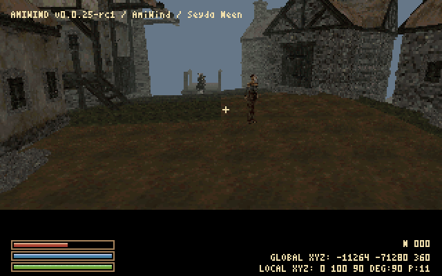

# Development overlays

Runtime command reference, updated for the v0.0.28 candidate on 4 October 2026.
Open the console with F10 or the key left of 1 (normally
§ on the Finnish layout). Boolean commands accept on/off, true/false and 1/0,
case-insensitively. With no value they report their setting.

| Command | Default | Purpose |
| --- | --- | --- |
| `amiwind_show_debug on` | off | Master switch; enabling also turns coordinates on |
| `amiwind_debug_all on` | off | Alias of the master switch |
| `amiwind_debug_coords on` | off until master enabled | Player XYZ, DEG heading and P pitch in the bottom-right strip |
| `amiwind_debug_showram on` | off | Alias of the actual `showram` setting |
| `showram 0` | 0 | Original numeric cache-thrashing indicator setting |

Master off hides the title/place, control hints, coordinates and renderer debug
indicators. Every explicit master enable also enables coordinates; an existing
saved coordinate-off preference does not prevent this. Use `debug coords off`
afterward to hide coordinates separately. Master-off also sets coordinates off.
Queries and invalid arguments leave
the selection unchanged. Enabling master does not enable showram or FPS.
Crosshair, menus, dialogue/subtitles and loading
feedback remain visible; they are not debug overlays. Commands are small
resident handlers; no disk lookup is needed for these toggles.

The compact console-font rows show **GLOBAL XYZ** in original source units and
**LOCAL XYZ** in converted scene units (one quarter scale). Both report the
simulated player origin, not eye height. Exterior source coordinates are
`(local + region_origin) * 4`, including the region's Z origin. Interior global
coordinates are explicitly unavailable. DEG is engine yaw, normalized to 0..359
(0=+X, 90=+Y); P is pitch. The normal HUD compass uses geographic north (+Y),
clockwise bearings and eight direction labels. When enabled with `dbg compass on`,
it remains visible with debug off; rc6 defaults it to hidden.

For a missing wall, record both coordinate rows plus view direction. `aw_pos`
prints local and global position, the scene name and source cell; local XYZ alone
does not identify an island region. `aw_view x y z yaw pitch` reproduces a local
camera in the same scene while noclip is enabled.
For collision add `aw_blockers`. Use `aw_recover` to return to the safe spawn.
The reserved strip slightly changes the viewport, so keep its setting identical
for performance/visibility comparisons. Hiding overlays restores the view area.

The blue square was the cache-thrashing indicator, not a gameplay element. Its
absence with showram disabled does not prove cache thrashing has stopped; retain
profiles and model-load diagnostics during memory-budget changes.

## Sea-height visibility

`amiwind_debug_sealevel on/off` defaults **on** and accepts the same boolean
spellings. It shows/hides the converted `*water` surface. The exterior datum is
global **source Z=0**; in a rebased terrain region its local Z is `-origin.z`.
This can help inspect the shoreline, low terrain and pier clearance. It does
not change water contents, swimming, collision or terrain heights. It is
independent of the overlay master; hiding text overlays does not remove the sea.

The old bounded demo backdrop is historical. The island conversion covers the
frozen survey's 1,404 cells and 2,526 regions. rc1 preserves original shoreline
samples where coarse triangulation changed land/water classification. See
[WORLD_TERRAIN.md](WORLD_TERRAIN.md) for coverage and remaining limits.

## Flight and recall

Noclip W/S follows the full view direction, including pitch; A/D strafe and
Shift boosts speed. With debug enabled, Ctrl gives twice the Shift speed;
Ctrl+Shift does not add a further multiplier. E/Q remains world up/down. No inertia on key release and
no diagonal speed bonus. Safe collision re-entry is unchanged.

M remains the map in debug/noclip, and M/N remain ordinary console letters.
Alt+M deliberately exposes the desktop only with debug enabled. Default and
personal bindings are separate from graphics/settings configuration; see the
maintained [keyboard and command reference](KEYMAPS.md).

`amiwind_debug_reset_location 0` returns to the validated Seyda Neen town spawn
and restores walking. Other IDs are rejected without moving the player. From the ship this loads the town first; in town it uses the existing checked
recovery path. It is a fixed diagnostic link, not general fast travel.
`aw_recover` remains available. Future IDs will need explicit scene identity,
position/orientation and safe-spawn validation.

## Readable console and space-separated commands

Checkpoint-015 adds `debug help` (or `dbg help`), which lists the supported commands and their
arguments. `dbg ...` and `amiwind debug ...` are equivalent prefixes. Old underscore commands
remain valid. Use PageUp/PageDown to scroll help.

| Command | Purpose |
| --- | --- |
| `debug reset location 0` | Safe town recall and return to walking |
| `debug coords on` | Show XYZ |
| `debug all off` | Hide debug text/indicators |
| `debug showram on` | Explicitly enable the cache indicator |
| `debug sealevel off` | Hide temporary sea geometry |
| `debug pos` / `debug blockers` | Position/collision diagnostics |
| `debug noclip` / `debug recover` | Fly through geometry / safe town recovery |
| `debug view x y z yaw pitch` | Repeatable camera while noclip is on |
| `debug console bg color black` | Solid console background, default black |
| `debug console bg color blue` | Nearest available palette blue |
| `debug console bg color gray` | Nearest available palette gray |
| `debug console bg color 24 24 32` | Nearest palette entry to RGB values 0–255 |
| `debug font readable` | New original 5x7 glyphs in the existing 8x8 cells |
| `debug font retro` | Retained previous font, unchanged |

Colors are palette matches, not new palette allocations. Solid fill replaces
cached console artwork and covers every visible console row each draw. There
is no opacity mode or extra framebuffer. The readable/retro atlas choice affects normal-size console/menu/HUD
and lasts for the session; restart defaults to readable. Both atlases are stored
on disk; one 16 KiB atlas remains active. A validated font switch uses a temporary
16 KiB stack buffer, not a second permanently resident atlas.

`dbg daynightcycle on/off` controls automatic game-time advancement; `dbg sky
on/off` independently controls sky/fog presentation. Both are implemented and
default on. See [day/night controls and limits](DAY_NIGHT_AND_SKY.md).

## Compact console in checkpoint-016

The default console font is original 3x5 glyphs in 4x6 cells. It has a 475-byte
glyph table and reuses the existing 16 KiB text history. `dbg console font normal`
returns to 8x8 cells; `dbg console font small` restores compact text. For the old
look use both `dbg console font normal` and `dbg font retro`. Small text does not
replace the retained atlases. Font/size choices are session settings.

Shift plus the physical key left of 1 (Finnish §) opens/toggles full-height
console; Shift+F10 is the fallback. Ordinary §/F10 opens/closes it. PageUp and
PageDown scroll by a page; Shift+Up/Down are layout fallbacks. New messages keep
a scrolled view anchored. Size changes retain text, although old soft line wraps
remain line breaks. No new GUI or unbounded scrollback allocation.

`debug overlay off` / `dbg overlay true` / `amiwind debug overlay 0` all address
the existing debug master; on/off, true/false and 1/0 are accepted. This does not
hide gameplay menus or the crosshair.

`dbg scene ship` and `dbg scene town` retain their aliases. The scene picker and
`dbg scene <map>` also cover the 13 town interiors and Addamasartus; see
[the scene list](SEYDA_NEEN_INTERIORS.md). `dbg recover`
finds a checked spawn in the current scene; `dbg reset location 0` returns to town.
`dbg eyeheight` reports eye offset and height above the feet. An optional numeric
offset (4..24 runtime units above the hull origin) supports comparison, e.g.
`dbg eyeheight 13.3` restores the old nominal camera for this scene session.

`dbg dimensions` reports the live player box and BSP standing-hull dimensions,
then compares standing-body and point sweeps along all six axes. In a known flat
calibration room, subtract their stopping coordinates to measure the effective
physical half-extents. In ordinary scenery the two sweeps can hit different
surfaces; do not interpret those differences as a new player size.

## Reproducing a reported view

`dbg coords on` in v0.0.15-dev2 already shows XYZ, DEG (horizontal yaw) and P
(vertical pitch). Capture all fields plus version and area. Keep the same fog,
overlay/viewport and hand mode for comparisons. Existing owner lower-hold views:
(12,142,-9), DEG47/P11; (-3,276,-8), DEG282/P10; (7,234,-9), DEG95/P-8.

## Teleport shortcuts and destination menu (v0.0.24-dev4)

Use these during play:

| Command | Destination / action |
| --- | --- |
| `dbg tp` or `dbg tp menu` | Open the destination picker |
| `dbg tp X Y` | Original Morrowind global XY; checked terrain/water arrival |
| `dbg tp balmora` | Balmora exterior at the converted arrival point |
| `dbg tp seydaneen` | Seyda Neen exterior at the checked town recall point |
| `dbg tp prisonship` | Imperial Prison Ship interior |
| `dbg tp census` | Census and Excise Office |
| `dbg tp tradehouse` | Arrille's Tradehouse |
| `dbg tp lighthouse` | Lighthouse interior |
| `dbg tp addamasartus` | Addamasartus |

Other converted map names from [the scene list](SEYDA_NEEN_INTERIORS.md) work too.
Names are case-insensitive. `seyda` / `town` and `ship` retain their short aliases.
`debug tp ...` and `amiwind debug tp ...` use the same handler. Teleport uses the
existing scene state capture and checked arrival path, not a New Game reset.
Missing map files and unknown destinations are rejected before leaving the scene.
This is a development shortcut and can bypass the intended opening route.

`dbg scene change` remains an alias for the same menu. The picker lists all 17
converted logical scenes, including Balmora, plus Cancel. Arrows/Tab scroll the
list; Enter or mouse selects; Escape returns without loading. Missing scene files
are disabled. It does not expose arbitrary filenames, individual `bmNNN` regions,
or unconverted Balmora interiors. Legacy `dbg scene <map>` commands remain.

The entrance lookup for an interior now uses its destination catalogue even
when invoked from Balmora. Previously the picker could offer a Seyda Neen interior
but search Balmora's unconverted door catalogue and fail to find the entrance.

## Live exterior fog/draw distance (checkpoint-017)

`dbg fog distance 500` and `debug draw distance 500` set the same value. Both
other prefixes and the old `dbg drawdistance` spelling work. No value prints
the current distance; new commands accept whole numbers 128..1400 and reject
invalid input. The default/Medium value remains **700**. One local unit equals
four source Morrowind units; 700 is 2800 source units. This is forward view
depth, not a radius or a real-world metre measurement.

Escape → Options → Graphics has a live slider. Select Fog distance and use
Left/Right (10-unit steps), Shift+Left/Right (1-unit nudges), or click the bar. Select Medium/default to restore
700. Escape/Back returns to the main menu; Return to game resumes. Try 500 or
400 for a shorter view. **Shift+V** cycles requested 450/540/1000 distance.
Bare 1/2/3 no longer set distance. Startup removes only the exact old generated
numeric distance bindings; unrelated custom bindings survive. Both Balmora and
Seyda Neen region exteriors cap effective distance at 540 so the view stays within
converted overlap. The larger stored request remains available in other scenes.

Fog still starts at 40% of the selected depth and becomes opaque at 100%; BSP
and model rejection use the same distance with the existing small safety margin.
Changing it does not reload geometry or resize the heap. Only the existing
32 KiB inverse-depth table is refreshed: 15 integer divisions and band fills
replace 32,767 floating-point divisions. That distance-setting optimization left
per-pixel fog and culling work unchanged. The later day/night candidate adds cached
color selection and direction-based sky haze without changing the depth bands.
Potential savings from a shorter distance come from rejected geometry,
not from making a menu value adjustable. Indoor visibility remains unchanged;
setting the distance indoors affects the next exterior view.

The live slider is a session adjustment. Explicit settings persistence and a
more complete Options UI remain later work. Increasing distance cannot load
geometry missing from the converted scene.

## FPS display

`dbg fps on/off` (also true/false/1/0 and the other debug prefixes) controls a
default-off FPS readout on the second top-right line. It averages rendered game
frames over approximately one second using the profiler's existing time sample.
No extra clock call, file access or unbounded history is added. The number is
AmiWind's frame rate, not WinUAE's video refresh rate or host compositor FPS.
`dbg overlay off` hides it while preserving its individual setting. Use the
same overlay/viewport settings when comparing views.

## Loading presentation

For exterior sub-cell crossings, Options → Area loading selects **Freeze frame**
(default) or **Black screen**. `aw_region_loading 1` holds the last frame/palette
with a small top Loading box; `aw_region_loading 0` restores blank transitions.
The setting is saved in the configuration. Neither option changes BSP loading
latency or enables background streaming.

`aw_loading_style normal` is the default for ordinary scene loads. `aw_loading_style blank` selects a
black loading frame with no artwork or text for subsequent loads. Other values
fall back to normal. This setting lasts for the session. The opening movie uses
a one-transition blank override; ordinary doors return to the selected default.

Loading style controls presentation only. Map loads preserve the selected music
track and buffered samples, and service playback between bounded reads and
decode batches. Deliberate track changes, pauses and movie audio retain their
existing meaning. This is cooperative servicing on the main Amiga task; slow
individual disk operations can still exceed a playback deadline.

`soundinfo` also prints the live sound channels (sample name, emitter gain,
left/right volume and playback position), plus the loading-music flag. This helps
separate a missing loop from a quiet or distant one. Ship waves now use the
converted source gain; the earlier extra 5 dB reduction is removed.

## Dialogue, target names and time

- `dbg ui dialogue 2`: default speaker above; `1`: classic inside name;
  `3`: target-only identity; `4`: speaker at upper right.
  Archived parameter: `aw_dialogue_box_display_method`.
- `dbg ui targetnames on/off`: independent upper-right aimed NPC label, default
  on; enabled only after Census review or in the inspection demo. Archived
  parameter `aw_target_names`; unrelated to the master diagnostics overlay.
- `dbg ui targetplace below/topright/hudleft`: place aimed NPC names.
  `dbg ui labels below/topright/hudleft`: independently place object/action labels.
- `dbg timeofday`: show time/date; append an hour in [0,24), or `morning`,
  `night`, `midday`, `day`, `evening`, `sunset`, `sunrise`, `dawn`, `dusk`.
  Preserves legacy evening=18:00 / sunset=19:00 aliases.
- `dbg set time 0630`: exact four-digit HHMM, preserving date; rejects invalid
  hours/minutes. Named snapshots: dawn=05:30, sunrise=06:00, morning=09:00,
  midday=12:00, day=14:00, evening=17:00, sunset=18:00, dusk=19:00, night=00:00.
- `dbg daynightcycle on/off` (true/false, 1/0): archived `aw_daynightcycle`,
  default on. Off pauses automatic clock/cloud progression while preserving the
  chosen timescale. Explicit `dbg set time`, `dbg timeofday` changes and T waits
  still advance/set the same saved clock. On resumes without wall-time catch-up.
- `dbg sky on/off` (true/false, 1/0): archived `aw_daynight`, default on.
  Shared exterior sky and distance fog follow the saved clock; off restores the
  original sky and baseline fog independently of the cycle switch. Interiors
  retain their authored environment. The current candidate includes sun, original
  night textures and both moons; regional weather remains follow-up work. `aw_timescale 0` also freezes
  automatic time; 30 remains the default rate.
- `aw_wait` opens the hours selector (T by default); `aw_quick_help` opens help
  (F1). `bind t aw_wait` and `bind F1 aw_quick_help` restore these defaults.

Boolean forms are case-insensitive; either switch without an argument reports
its setting. Invalid values leave it unchanged. Shipped defaults are overridden by
saved user configuration. For repeatable captures use `dbg daynightcycle off`,
then `dbg set time 0630` (or another exact/named time); resume with
`dbg daynightcycle on`. Automatic ticks now retain sub-millisecond fractions to
avoid frame-rate-dependent drift; the saved world clock remains the only calendar.

The earlier V1 Clear-profile sky/fog checkpoint replaced coarse ordered
dithering with cached remaps; its approximately 8 KiB table growth and 63-method
09:05 EEST fixture result are historical. The corrected V3/night/guard source
passes full 822-test gates and matching Amiga compiles, including tiny-star,
arrival and cloud-speed corrections. Native replay remains pending; earlier
startup/default/clock results do not validate those changed bytes. See [day/night implementation and
limits](DAY_NIGHT_AND_SKY.md), [current release evidence](RELEASE-v0.0.28.md) and
[dialogue and waiting](DIALOGUE_AND_WAIT.md).

`aw_show_speaker_name_during_voiceovers 0/1` controls voiced speaker identity
(default 0). Options → Interface provides these same persisted settings.

Voiceover identity: `aw_voice_dialogue_display_style 2` (default) forces aim-only
identity and suppresses all speaker headers. Style 1 honours
`aw_show_speaker_name_during_voiceovers 0/1` and the dialogue layout.

## dev4 layout and opening quote

`dbg ui layout 3` selects padded content-sized dialogue (default); `2` keeps full
width with centered text, `1` retains the fixed legacy body. Saved parameter:
`aw_dialogue_box_layout`. Classic speaker method 1 keeps its exact older layout.

`aw_intro_text_overlay 0/1` switches original/readable first movie text, when the
private optional opening card is present. Aim-only identity also works during
sampled introductory speech; input prompts and character selectors suppress it.

## dev5 playtest controls

`dbg hud type 2` is the default compact version/location banner; type 1 retains
the original size. `dbg render order 2` selects the corrected mesh span ordering;
type 1 keeps the legacy renderer for matched-camera comparisons.

`dbg aw hors 0` resets to Hors (male Nord, Barbarian, The Steed), after Census in
Seyda Neen square. `dbg tp balmora` creates Hors only without an existing
character. `dbg door sounds on/off` controls authored opening/closing samples.
`dbg inputtrace on/off` logs raw key and mouse events in the console; with
`-condebug` they also reach the debug log. It accepts `true/false` and `1/0`,
case-insensitively. No argument reports its state. Tracing defaults off and is
not an archived preference; `dbg input trace` remains an alias. Use
`dbg inputtrace off` immediately after collecting the needed input evidence,
because mouse motion produces many lines. Visual playtests and sky captures
keep tracing off.

`dbg daycycle gallery` previews eight sky stages in a camera tour, eight seconds
each. On the tested Seyda Neen town map it uses the recorded scenic viewpoints;
other exteriors use the current eye with changing look directions. Add `here` to
keep the current view. The player is never moved. Escape, command repetition or `dbg daycycle gallery off`
returns to real game time without changing the saved date or sky settings.
`dbg nightgallery [here/off]` gives a four-stage 23:00 tour: current wide view,
Masser, Secunda, then overhead stars, eight seconds each. Eye position never
changes. Moon directions use the saved date and the renderer's orbit; a moon
below the horizon is labelled and that stage keeps the current view. `here`
keeps all camera angles unchanged too. Escape, repetition, `off`, completion or
map change restores the normal view/time. Console/menu pauses the tour. Saved
clock, date, player and sky settings remain untouched; clouds/scenery still
occlude the sky. Native verification of this new command remains pending.

`dbg skyspeed [0..100]` controls only cloud scrolling. The default multiplier
`0.00333333333` is approximately one-three-hundredth of the old cloud speed
and one third of the preceding `0.01` setting; `0` stops clouds and `1`
restores the old speed. The sun and saved clock keep their existing rate. See [sky controls](DAY_NIGHT_AND_SKY.md).
`dbg starsky on/off` controls the stars and nebula; `dbg nightsky on/off` controls
the complete night layer including Masser and Secunda. Both also accept `1/0` and
`true/false`, default on and save as `aw_starsky` and `aw_nightsky`. Query either
without an argument. The master `dbg sky` switch and interior isolation still apply.
Selected bright stars have gentle, sometimes cool-blue twinkle; the complete
moon discs, including their unlit phases, occlude the stars.

`dbg guardtorch on/off/auto` controls the current guard-torch candidate. On/off
also accept `true/false` and `1/0`; `auto` clears the session override. The
archived `guards_torch_cycle` setting defaults true and accepts those Boolean
forms. Automatic use requires an original inventory torch and a validated
exterior, strictly before 06:00 or after 20:00. `on` includes supported Imperial
and Hlaalu guard records regardless of inventory or time; it does not equip
unrelated NPC classes. Corpse/dead, swimming and asset-validity checks still
apply. Final combined native acceptance is pending. See [guard torch policy,
source rules and resource limits](TORCH.md#guard-torches-and-the-clock--implementation-in-progress).

Frame CSV now also records server time and surface-order mode, separating
movement/logic cost from world rendering. Shift+V stays unchanged.

## Reconciled input and defaults

Shift/Ctrl/Alt are refreshed from each native input qualifier, with Caps Lock
limited to letters and focus changes clearing held input. Legacy personal
keymap.cfg loads before keymaps.cfg. The maintained canonical reference is
KEYMAPS.md. Autosave default is five; aw_autosaves 0..16 remains an archived
setting in config.cfg and Options > Autosave history.

The compass/heading HUD defaults to hidden in rc6. Use `dbg compass on` or
`dbg compass off`; `1/0` and `true/false` are also accepted, case-insensitively.
`dbg compass` alone reports the current setting. It remains independent of
`dbg all`/`dbg hud`. The archived config variable is `aw_compass`, with shipped
`config/game.cfg` default `aw_compass 0`; saved user settings override that
default on startup. Invalid values leave the setting unchanged.

## rc7 navigation and cave lighting

`dbg compass on` now displays heading plus the original game's region name at
the player's coordinates. The compass remains off by default. The ordinary M
map shows the same region below its viewport regardless of compass visibility.
See [map lookup and teleport](WORLD_MAP_AND_JOURNAL.md#region-name-and-debug-teleport).

`dbg tp map` (or `dbg map tp`) selects a point with a red crosshair, then requires the TELEPORT
button or Enter to confirm. Escape cancels.

During play, `dbg tp -14231 -76109` uses original Morrowind global X/Y,
without a Z argument. Decimal coordinates and exponents are accepted; invalid,
non-finite, out-of-range or extra arguments leave state unchanged. Coordinates
must resolve to an available converted destination. The existing checked map
teleport route preserves player state and validates the standing hull at arrival.
It places the feet above terrain, or above the actual BSP water surface when
terrain is submerged. A blocked arrival uses the existing checked scene-spawn
fallback and reports it. The four focused Linux native fixtures pass; emulator/target acceptance is pending.

 **F, then V** equips the temporary
[carried torch](TORCH.md); Shift+V continues to cycle draw distance.

## Version, world and original region

The exterior debug header reads `AmiWind v<version> Vvardenfell / <region>`.
The simulated player's coordinates are converted to original world coordinates,
then to the source CELL and its RGNN region ID. Display text comes from that
REGN record's FNAM, including the original wording. No nearest-region guessing
or generated terrain IDs are used. The heading/compass remains separate.
Interior headers show the level's original area name; unavailable exterior
region data is labelled unavailable. Long headers are clipped with an ellipsis
at the selected HUD font width. This does not change normal compass defaults.
