# AmiWind gallery

In-game screenshots of the Amiga build, taken in an Amiga emulator, without retouching; newest first.
The game art shown is converted from the original Morrowind data and belongs to ZeniMax Media Inc.
What changed in each version: [changelog](CHANGELOG.md).

## v0.0.32: Vivec

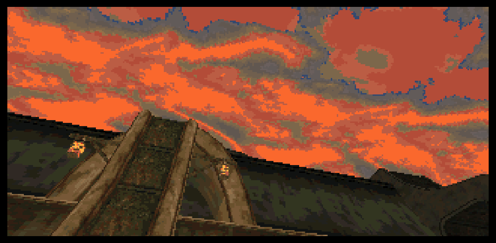

| | |
| --- | --- |
|  |  |
| **A lantern-lit bridge pillar** against a blazing sunset. | **A Vivec canal at night**, lanterns on both sides. |
| 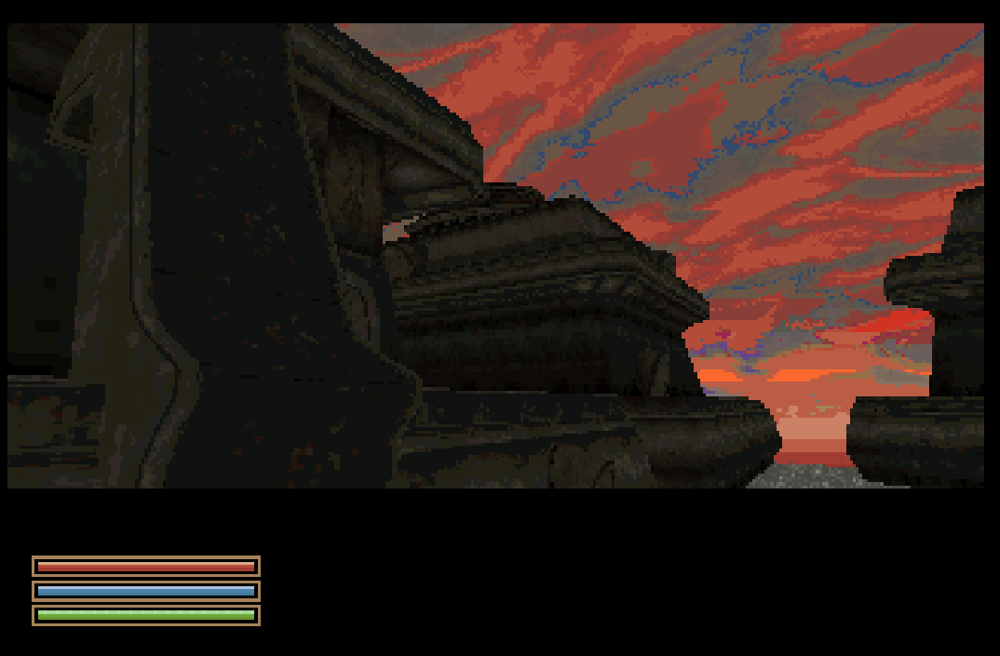 | 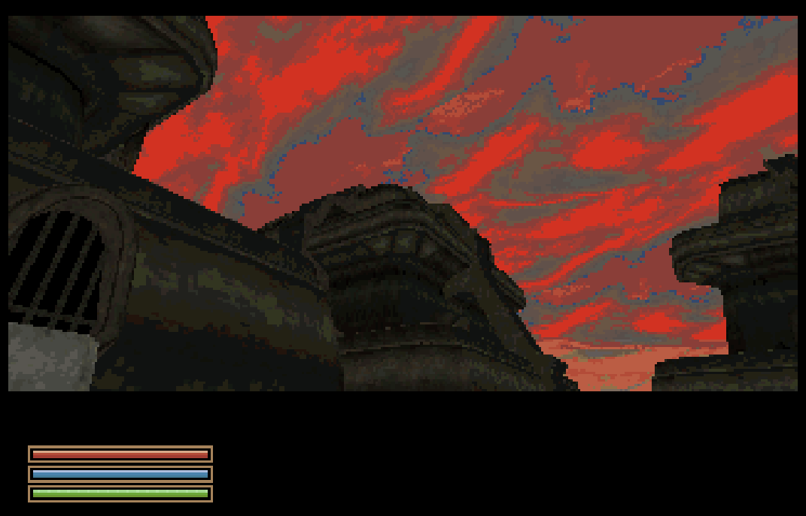 |
| **Sunrise over the cantons.** | **Canton tops and a barred window** under a red sky. |
| 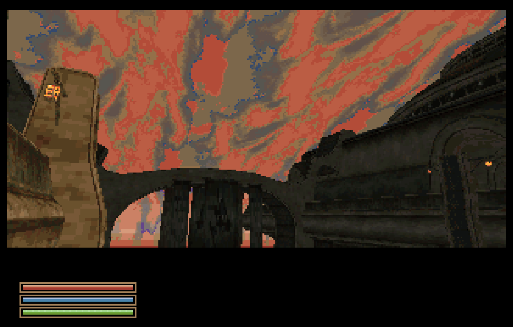 | 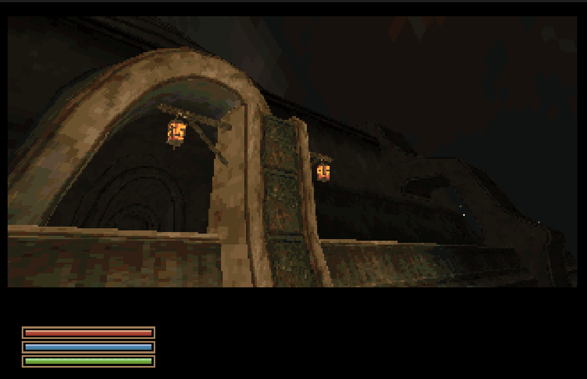 |
| **The bridge to the Arena at dusk**, a lantern on the pillar. | **The same bridge at night**, two lanterns lit. |
| 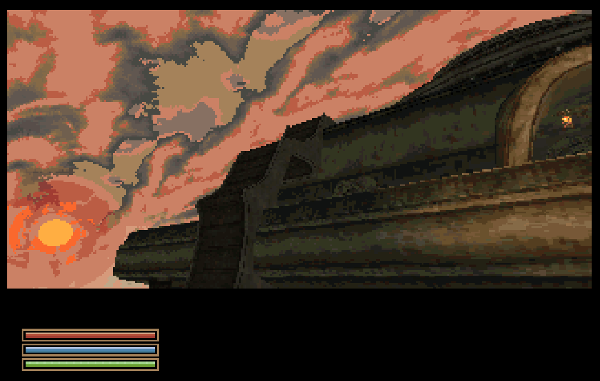 | 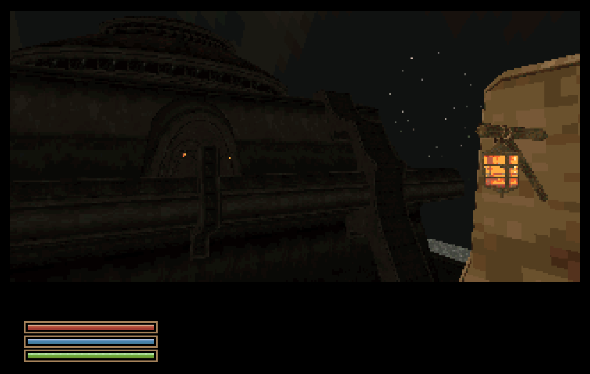 |
| **The sun sets beside the Arena**, a lantern in the arch. | **The Arena at night**, a lantern in the foreground. |
| 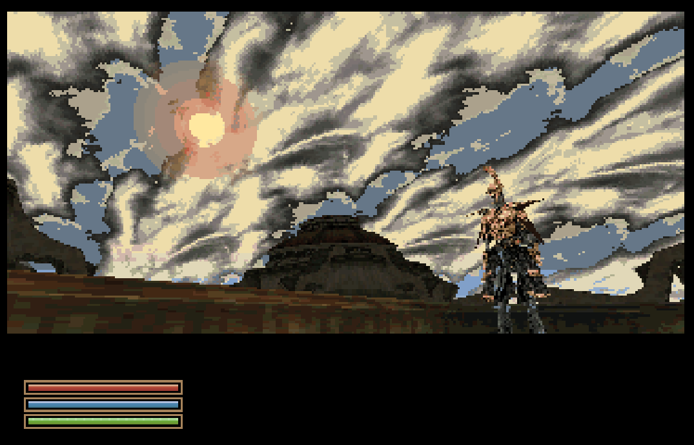 | 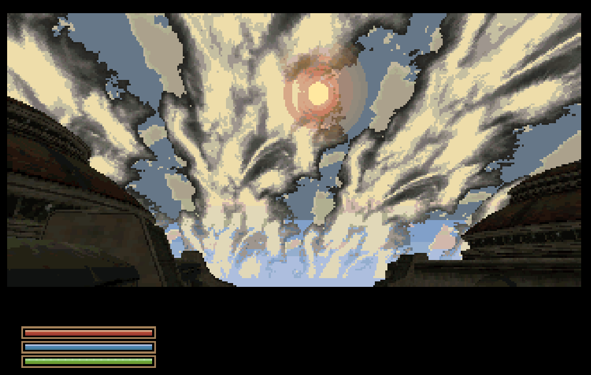 |
| **A guard under the sun**, the Arena behind. | **The sun between two cantons.** |

## v0.0.31: Lamps, Lanterns and Loading

| | |
| --- | --- |
| 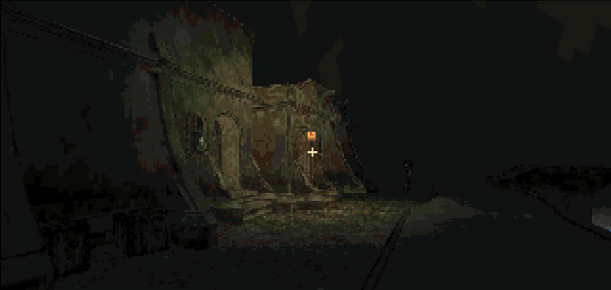 | 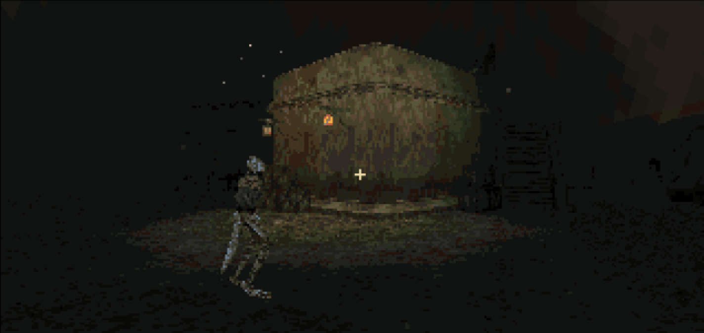 |
| A street lamp lights the wall and the street at 01:19. | A lamp-lit house at 02:18, with a passer-by. |
| 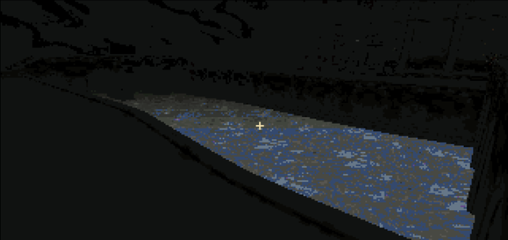 | 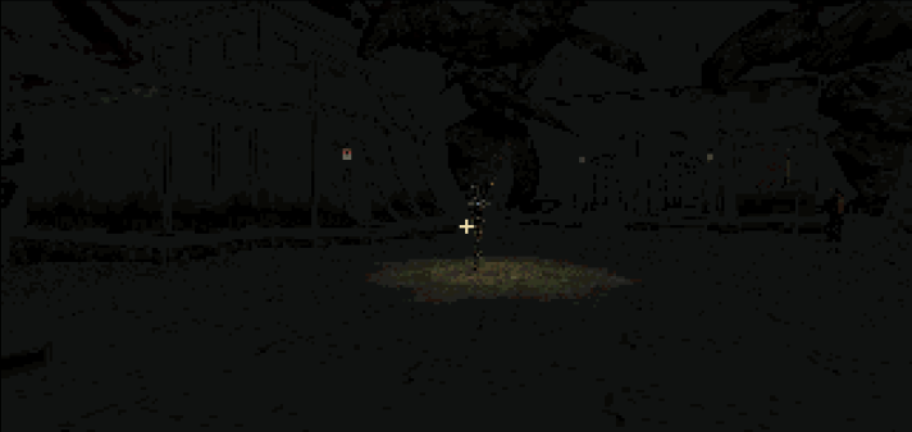 |
| The Odai river glittering at 22:46. | A plaza guard with his torch at 21:38. |
| 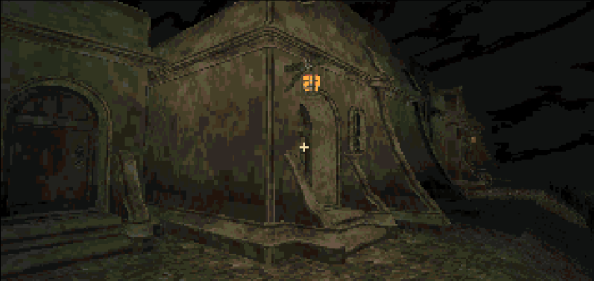 | |
| A house corner lit by its lamp at 22:36. | |

## v0.0.30: The Temple

| | |
| --- | --- |
|  |  |
| Before: see-through holes in the Temple lower entrance (v0.0.29). | After: the same view with the wall in place. |
|  | |
| The Temple lower room: doorway and banner. | |

## v0.0.29: Let There Be (Just a Bit More) Light

| | |
| --- | --- |
|  |  |
| Nord hands and a held torch at night. | Choosing a High Elf face and hair. |
|  |  |
| A Luminous Russula, ready to pick. | Picked. |

## v0.0.28: Trees and Grass, Day and Night

| | |
| --- | --- |
|  |  |
| Sunrise at 06:30, Seyda Neen. | Golden hour at 17:00. |
|  |  |
| Red sunset at 18:00. | Blue hour at 20:15. |
|  |  |
| Masser over Balmora at 23:00. | Secunda over Balmora at 23:00. |
|  |  |
| A Balmora street under the night sky. | Both moons over Balmora. |

## v0.0.27: Rocks, Mushrooms, and Then Some

| | |
| --- | --- |
|  |  |
| Giant mushrooms in the Ascadian Isles. | A closed giant-mushroom cap. |
|  | |
| The joined underside. | |

## v0.0.25

| | |
| --- | --- |
|  |  |
| The Vvardenfell map with source coordinates. | Global and local coordinates with the compass. |

## v0.0.24: Balmora

| | |
| --- | --- |
|  |  |
| A Balmora bridge. | A Balmora street. |
|  |  |
| The riverfront. | The Mages Guild. |
|  |  |
| Dagoth Ur's gold mask. | The island map. |

## v0.0.23: The opening

| | |
| --- | --- |
| 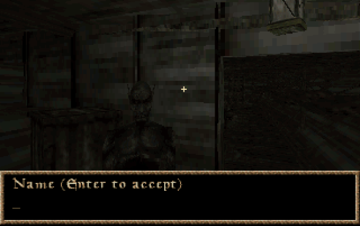 | 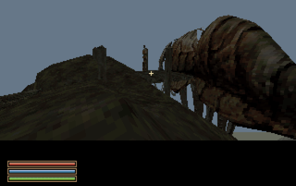 |
| The prison ship. | The Seyda Neen port. |
|  |  |
| Fargoth. | The tradehouse. |
|  | 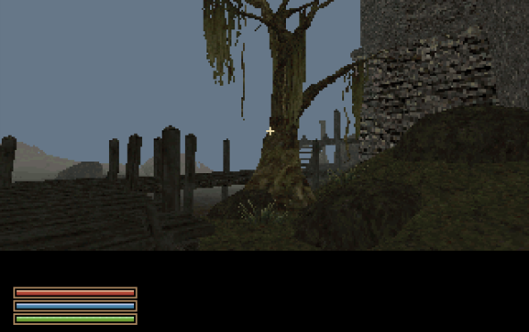 |
| Darvame Hleran, the silt strider caravaner. | A Bitter Coast tree. |

## v0.0.15: First steps in Seyda Neen

| | |
| --- | --- |
|  |  |
| The ship and the dock. | The town centre and tower. |
|  |  |
| Wooden and stone buildings by the waterfront. | A resident beside a building. |
|  | |
| A guard near the buildings. | |
