# Gameplay media

## v0.0.28 — Trees and Grass, Day and Night

Captured on 4 October 2026 from the release engine in WinUAE. Every PNG is a
lossless conversion of a native 320×200 PCX frame: no repainting, color correction,
sharpening or scaling. V3 is the shipped default. These are engine screenshots,
not the private reference photographs used to discuss the sky.

### From dawn to night

| Dawn 05:30 | Sunrise 06:30 |
| :---: | :---: |
|  | 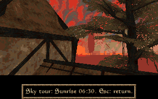 |

| Midday 13:00 | Golden hour 17:00 |
| :---: | :---: |
| 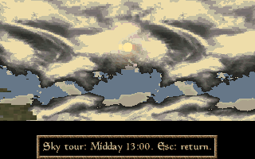 | 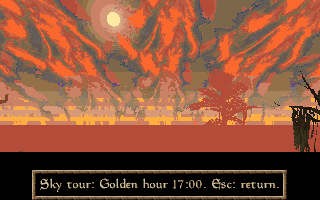 |

| Red sunset 18:00 | Dusk 19:00 |
| :---: | :---: |
| 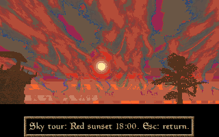 | 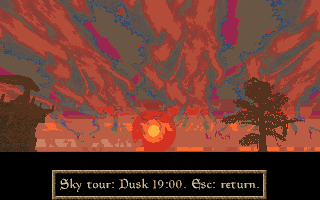 |

| Blue hour 20:15 | Night 23:00 |
| :---: | :---: |
| 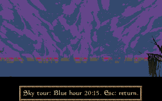 | 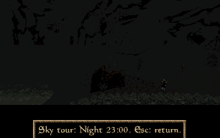 |

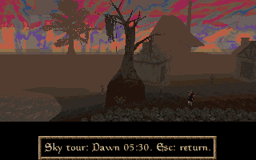

`dbg daycycle gallery` supplies the scenic views and captioned render times.
The saved clock remains 13:17, and the saved player state is restored when the
tour ends. The GIF selects one unchanged frame per stage, held for 1.4 seconds;
it does not represent natural time progression or measured frame rate.

### Night over Balmora

| Wide view | Masser |
| :---: | :---: |
| 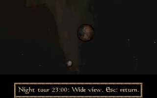 | 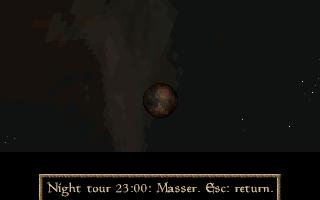 |

| Secunda | Overhead stars |
| :---: | :---: |
| 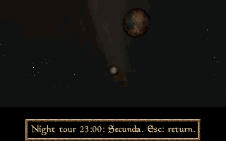 | 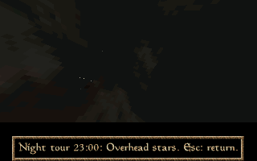 |

`dbg nightgallery` previews the wide view, Masser, Secunda and overhead stars
at 23:00 on the saved date. This montage holds each selected native frame for
1.8 seconds. The saved clock and player state remain unchanged. Tiny stars stay
in the background behind the complete moon discs, clouds and opaque scenery.

### Balmora streets at 23:00

| Balmora at 23:00 | Balmora at 23:00 |
| :---: | :---: |
| 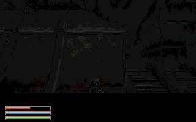 | 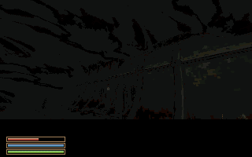 |

| Balmora at 23:00 | Balmora at 23:00 |
| :---: | :---: |
| 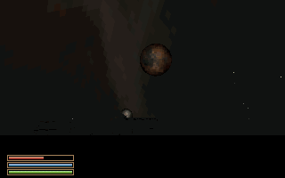 | 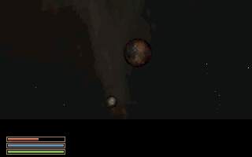 |

These separate views use the actual 23:00 clock and a scripted camera. The
streets are dark; the moon-rooftop view includes only a small roof silhouette.
The original palette and exposure are preserved.

The capture build passed the bounded independent native checks described in
[the release notes](RELEASE-v0.0.28.md). This establishes the shown scenes and
controls, not physical-hardware performance or an unrestricted world playthrough.

## v0.0.23-dev2 captures — 29 September 2026

Captured on 29 September 2026 from the actual compiled 68040 Amiga runtime in
FS-UAE 3.1.66, using the unchanged A1200/AGA/PAL/2 MiB Chip/16 MiB Z3/JIT profile.
The no-TTF converted input was used. The final checkpoint retains the captured
geometry and characters; later changes restored ship-wave gain and increased
surface/edge capacity after a different port viewpoint exposed overflow.

The four PNGs are 592 × 372 crops of the emulator display, including the game
HUD. No colour/brightness adjustment or generated content was applied. The port
and Fargoth views use the debug free camera. The Tradehouse view follows an actual
front-door activation. The prison view shows the name prompt after the movie.
The seven-second GIF is an actual in-engine port camera pan, captured at 10 fps
and reduced to 444 pixels wide / 8 fps with a 128-colour GIF palette. It has no
audio and is not a performance benchmark.

Only these exact paths are public media exceptions in `.gitignore` and
`tools/release.py`; other game images, audio, converted assets and ROMs stay out of
source archives. The release check verifies signatures and size limits (1 MiB
per screenshot, 4 MiB for the selected GIF).

## v0.0.23-dev3 captures — 29 September 2026

The README ship dialogue and corrected port hill are native FS-UAE captures from
dev3, cropped to the same 592×372 game area. Existing Tradehouse/Fargoth images
and the port pan retain their dev2 attribution. The before/after rock views in
WHAT_ARE_ROCKS.md use the same reported camera. None is generated or composited.
Only explicitly named promotional PNGs are exceptions to the global image ignore
and public source allowlist; private reference images remain excluded.

## v0.0.23-dev4 captures — 29 September 2026

New README Darvame and Jiub screenshots are native TTF-playtest captures, cropped
only to the game display. The restored-tree capture records the reported camera
`-71 -429 38 / 262 / -7`. Existing Fargoth, Tradehouse and port GIF remain dev2.
The screenshot exceptions are exact filenames; all other generated/owned media
remain excluded. No generated imagery, brightness changes or compositing.

## v0.0.24-rc1 captures — 30 September 2026

The README and RC notes show native Balmora exterior and Mages Guild frames
captured from a writable copy of the matching production HDF. The production
binary hash is verified against the package. Diagnostic free-camera placement
is used for reproducible composition; images are not traversal proof.

PNG conversion preserves the native screenshot pixels, with no generated
content, compositing, colour or brightness adjustment. Dark interior lighting
is the current renderer's output. Only the two exact RC1 PNG paths are added
to the public media allowlist; raw captures and other game assets stay private.
The final stable release must keep verified screenshots near its release info
under the logo, at the top of Current state of the project.

## v0.0.24-rc2 captures — 1 October 2026

Three 320×200 PNGs preserve native screenshot pixels from the final RC2 production
executable in Linux FS-UAE, using the stated A1200/AGA/PAL 68040/FPU/JIT profile.
They show the Balmora bridge, the western street/guard and the eastern riverfront.
Diagnostic camera origins/yaw/pitch are `214,-480,115 / 125 / 5`,
`-495,-501,142 / 89 / -4`, and `232,282,80 / 223 / 4`. These are composition
positions, not proof of natural walking to those locations. No brightness, colour
or content alterations were made. The directory-backed capture run checks the
same binary and content later written to the HDF; the packaged-image boot check
is a separate receipt. Raw captures and diagnostic views stay private.

## RC3 captures — 1 October 2026

The RC3 release adds a close gallery view of Dagoth Ur and a Balmora street
view after the focused city-centre walking test. Both are native 320x200 FS-UAE
captures from the RC3 engine, without colour correction or compositing. Debug
camera placement is used; the gallery uses its documented steady daylight.
The mask view enables the byte-specific geometry allowance. These document
appearance and a tested view, not unrestricted gameplay acceptance.

## RC4 island map and journal

The RC4 map and journal images are native 320 by 200 UI captures shown at integer
2x scale. The images come from the final writable-copy HDF run; native pixels are
scaled by nearest-neighbour sampling without an emulator border. No colour
adjustment, compositing or invented map/journal artwork is applied. The player
is the debug Hors character in Balmora; the journal text is the actual opening
entry granted by the existing captain-duty state transaction. The map depicts
terrain coverage, not a claim that all shown land is already playable.

## v0.0.24 final release captures - 1 October 2026

Six new images come from a writable copy of the finished v0.0.24 HDF, running
its source-matched production executable. The final run completed 282 frames
with zero surface/edge overflow. Journal pixels before and after quickload
match exactly; the deliverable image was verified unchanged. Raw PCX files,
commands, native logs and the image receipt accompany the private package.

The public PNGs are 640 by 400 nearest-neighbour enlargements of native 320 by
200 frames, with no colour/brightness adjustment, generated imagery or
compositing. Hands and the crosshair are disabled through existing runtime
settings for the composition views. Camera placement is diagnostic, not evidence
of natural walking to each position. Gallery steady daylight and the exact-model
geometry opt-in are the existing documented settings, not screenshot-only code.

| Capture | Camera origin / yaw / pitch |
| --- | --- |
| Balmora bridge | `214,-480,85 / 125 / 6` |
| Balmora street | `-495,-501,142 / 75 / 0` |
| Balmora riverfront | `232,282,65 / 223 / 4` |
| Dagoth Ur mask, gallery record 122 | `0,26,13 / 270 / 0` |
| Island map and journal | Restored Hors character in Balmora |

| Streets and residents | Riverfront architecture |
| :---: | :---: |
| 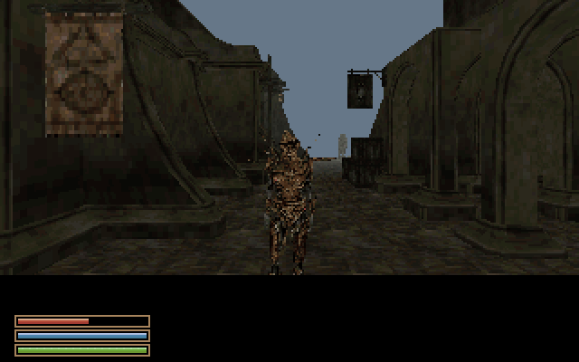 | 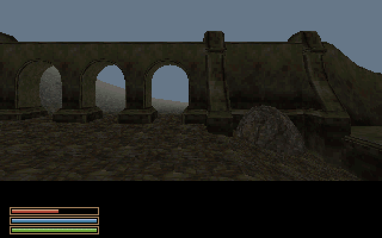 |

Every image has an exact `.gitignore` exception, a documentation-media allowlist
entry, and a source-package entry. The owner-run publishing helper also requires
all packaged public files to be tracked before committing. Other private
captures and converted assets remain excluded.

## v0.0.25-dev1 corrected journal — 1 October 2026

The README journal is a genuine 320x200 native frame, enlarged exactly 2x with
nearest-neighbour sampling. The heading is centred within the left leaf and the
Quests control stays clear of the spine. It shows the earned opening entry for
the debug Hors character. It was captured with the matching 68040 executable in
FS-UAE using the documented 2 MiB Chip / 16 MiB Z3 profile. No generated content,
colour changes or compositing were used. Raw PCX, commands and native log are
retained in the private evidence. Historical images remain unchanged.

## v0.0.25-rc1 navigation captures — 1 October 2026

The new README map and navigation HUD images come from the matching rc1 native
runtime with the stated FS-UAE profile. They are exact nearest-neighbour 2x
enlargements of 320x200 PCX frames, without colour changes or compositing. The
Seyda view uses a diagnostic local camera at `0,100,90 / 90 / 12`; its source
position is `-11264,-71280,360`. The map header and white cross use that position.
The normal-view compass was also checked with debug overlays disabled. Raw
frames and commands remain in the private evidence.

## v0.0.28-rc1 first day/night captures — 4 October 2026

The three README images are actual game-produced 320×200 PCX frames, converted
losslessly to PNG without resizing, color changes, compositing or generated
content. They were captured from a writable copy of the private HDF in WinUAE
6.0.3, using the A1200/AGA/PAL 68040/FPU/JIT profile with 2 MiB Chip and 16 MiB Z3
RAM. Original HDFs, raw captures and native logs remain private.

| Public image | In-game time |
| --- | --- |
| `amiwind-v0.0.28-rc1-sunrise.png` | 06:00 |
| `amiwind-v0.0.28-rc1-sunset.png` | 18:00 |
| `amiwind-v0.0.28-rc1-night.png` | 00:00 |

All three use the same diagnostic camera, local origin `100,-180,180`, yaw 135,
pitch 10. Automatic time is paused for these reproducible stills. The ordinary
clock advance, pause/resume and saved-time restoration were tested separately;
these photographs are not evidence of natural walking or cell transitions.

This first implementation changes the shared sky and distant fog. It does not
yet draw a sun, moons, stars or weather, or relight nearby world surfaces. Its
palette bands and bright warm haze remain visible here. The experimental terrain
candidate also has known neighbor-height and overlapping-resident contact
errors: the images document current appearance, not accepted terrain or a
finished release.

The exact engine SHA-256 is
`f19ea3089bfb73b3bea801334f51a76a722c54316f471d8d1271807347f3d2d2`;
the photographed experimental map SHA-256 is
`083040730dcd41112f3015e2c8604b08eb588dad33138b30bab80596c33dbd5d`.
Only these three named documentation PNGs are added to the public media
exceptions. Other captures, game assets, playable images and ROMs remain private.
