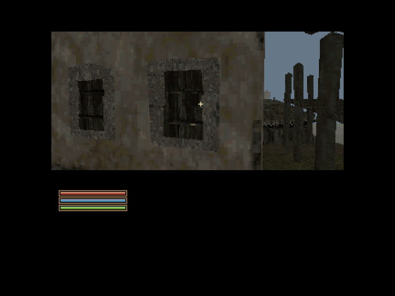

# Mesh tips and tricks: expensive scenery

Working findings through v0.0.24-dev3, 30 September 2026. Separate observed
performance, source inspection and proposed fixes; update this record after
native visual checks. A compiling mesh is not proof that its detail is useful.

## Case 1: Seyda Neen façades and projecting windows

### 1) Problem

In dev4, certain outdoor views become much slower while other views, including
a view containing only the bridge, remain fast. The user identified projecting
window surrounds on a tall house as a priority for flattening. Small decorative
faces can add substantial transformation, clipping, edge and surface work while
contributing little visible detail at the game's resolution. Repetition across
many instances multiplies that cost. A texture can carry such detail more cheaply
than individually rendered bevels and recesses, subject to actual measurement.

Reproduction views, in runtime coordinates:

| Purpose | XYZ | Yaw | Pitch |
| --- | --- | --- | --- |
| Slow exterior view | -37, 792, 75 | 265 | -4 |
| Close façade view | -202, 573, 23 | 279 | -61 |
| Earlier close view | -185, 525, 34 | 265 | -67 |

Lowering view distance to about 360 helped the user. That is a useful clue about
visible-scene workload, not proof of which mesh or subsystem is responsible.

### 2) Investigation

Hold camera, emulator configuration, assets and renderer constant. Hide selected
visual meshes only, retaining collision, and compare frame times. Do not compare
different viewpoints or attribute a frame-rate change to the nearest object.

Initial dev4-engine emulator samples at the slow exterior view:

| Diagnostic variant | Median frame time | Samples |
| --- | ---: | ---: |
| Original scene | 88.4 ms | 15 |
| House group hidden | 49.1 ms | 18 |
| Bridge group hidden | 69.1 ms | 18 |
| Target-name display disabled | 79.9 ms | 16 |

These are short, single-run diagnostic measurements, not final speedup claims.
The house group includes house shells and selected attached architectural parts;
it does not isolate windows. Hiding bridge geometry also helped in this mixed
view, even though the bridge alone is fast. Disabling names changes the target
trace path as well as text rendering, so its result needs repeated isolation.
None of these invisible-mesh variants belongs in a delivered playtest.

Source and converted-map inspection found:

- `ex_common_house_tall_02.nif`: 608 source triangles in the wooden-post material;
  plain wall materials have much smaller triangle counts. This is source triangle
  count, not the number of visible faces submitted every frame.
- The four windows on the reported façade are separate `ex_nord_win_01.nif` and
  `ex_nord_win_02.nif` instances. The initial suspicion that those particular
  windows were embedded in the house mesh was incorrect.
- In the audited dev4 BSP, these window models contain 145 and 123 faces
  respectively. References 113981 through 113984 place the four front windows.
- The tall house reference is 113828. The same house model also appears elsewhere;
  an approved model conversion must therefore be checked at other placements.
- Existing coplanar merging only merges compatible planes and UV mappings.
  Existing triangle simplification preserves components and materials, so it
  cannot reliably collapse many separate decorative components into one panel.

Treat this as excess decorative geometry to investigate, not permission to
remove all structure. Roof outlines, entrances, support silhouettes and terrain
occluders still need geometry. See [What are rocks?](WHAT_ARE_ROCKS.md) for why
removing an apparently decorative object can expose otherwise hidden terrain.

### 3) Solution

Use a reusable, non-destructive host conversion for approved surface types.
`config/surface-flattening.json` defines `decorative_windows.flatten: true` and
explicit model profiles. Setting it to `false` retains the original visual mesh
on rebuild. Original game files and collision geometry are never overwritten.

The current implementation in `tools/surface_flatten.py` projects selected
window geometry, depth-bakes its source textures into a small image, and emits
a flat textured panel with the source's convex projected outline. Profiles name
the projection axis, facing direction and mounting plane explicitly. They do
not guess that every thin mesh is disposable. `prepare_mesh_bsp.py` applies the
conversion before surface merging and keeps full source collision separately.

Initial approved type selection covers the two Nord window models above.
This is implemented conversion code, but native placement, texture and timing
validation is still pending. A panel at its mounting plane is not yet a combined
wall atlas: check whether the profile needs a mounting offset at each placement.
Do not call the visual/performance regression fixed until those checks pass.

Before delivery:

1. Compare original and flattened windows at the two close façade viewpoints,
   including oblique angles, both sides where relevant, and other instances.
2. Check winding, mounting depth, seams, texture orientation and edge dilation.
   Avoid z-fighting, floating panels, wall penetration and black borders.
3. Verify collision remains byte-for-byte/source-equivalent where possible.
4. Record source triangles, resulting BSP faces, repeated instance count,
   texture memory, and matched-camera frame times with flattening on and off.
5. Keep the original path and per-type switch. Extend profiles to another type
   only after inspecting that type; do not flatten all wooden posts by material.

The intended result is recognizable windows with far fewer decorative surfaces,
not a featureless house or a blanket reduction of every mesh's triangle count.

### Conversion validation and mounting correction

The first origin-plane projection hid one of the close-view windows behind its
wall. The pipeline now ray-tests the supporting house façade, accepts only
parallel outward-facing surfaces, and places each visual panel 0.05 runtime units
in front of that wall. Missing support fails conversion instead of guessing.
Original collision is retained; only visual placement is adjusted.

Both Nord window models now merge to one BSP face per instance, from 145 and 123
faces. All 21 matching exterior instances found supporting walls. Native checks
at `-202 573 23 / 279 / -61` and `-81 267 73 / 206 / 3` show the baked frame and bars;
the latter was repeated after fixing the initially hidden window.

At `-37 792 75 / 265 / -4`, with the same dev5 engine, the final 15 stationary
samples had median frame times of 86.425 ms with original windows and 77.619 ms
with correctly mounted flat windows, about 10.2% lower frame time. These are
reference-emulator observations, not physical Amiga results or a claim that all
exterior performance problems are solved. Remaining house detail still matters.

The private playtest applies the conversion to the dev4 BSP without deleting
unused original face records, preserving existing collision and visibility. It
reduces submitted visual geometry, not resident map memory. A full source rebuild
applies flattening before BSP assembly and avoids those unused visual records.

## Case 2: invisible scenery, residency and cleanup

### 1) Problem

Window flattening helps but does not explain all location-dependent stalls.
The user asked whether unneeded geometry is being offloaded and whether a
cleanup routine is missing.

### 2) Investigation

`Host_ClearMemory` flushes rendering caches, clears model state and frees the
map allocation back to the host mark during map changes. This is an explicitly
managed C renderer, not a managed-runtime garbage collector.

During a map, the selected BSP and scenery remain resident. Distance, PVS and
screen-frustum checks reject work, but rejection is not unloading. The scenery
compiler appends houses as brush submodels after the base terrain visibility
build. Those house walls do not automatically become occluders in the base PVS.
A potentially-visible set can consequently contain scenery hidden behind houses;
later clipping/rasterization may still do work before that scenery is occluded.
`R_MarkLeaves` already avoids rebuilding leaf visibility while the view leaf is
unchanged. Rotated brush bounds currently use a conservative radius box, which
can also admit more work than a tight rotated bound.

### 3) Solution

Keep map-change cleanup. Do not add periodic cache flushing as an FPS fix:
reloading useful assets could introduce stutters. Profile traversal, brush
submission, clipping and rasterization separately, then consider tighter cached
bounds and conservative host-baked house occluders or visibility groups. Preserve
openings and sightlines; never trade frame rate for disappearing scenery.
Streaming and resident-memory reduction remain separate future work. The dev5
window pass reduces rendered geometry; it does not claim a streaming system or
complete hidden-house rejection.

## Fourth window regression: v0.0.23 follow-up

### Problem

The tall facade showed only three of its four original windows at local camera
(-200, 601, 17), yaw 279, pitch -43, as reported in the dev5 screenshot.

### Investigation

The original references 113981 through 113984 are all present. The missing
lower window was not absent from the export. The flattened visual had only
0.05 runtime units of wall clearance. A native trial at the reported camera
showed all four after increasing this clearance to 0.5.

### Solution

Use 0.5 runtime units as the shared mounting clearance. Preserve source meshes
and original collision. Check all four windows from the reported viewpoint,
including upper and lower rows, rather than accepting a close view of only two.

## Census exterior doors: wall breakthrough (v0.0.23)

### 1. Problem

Wall-coloured patches appeared through both Census and Excise exterior door
faces. Reproduction views: XYZ 226 69 54, yaw 285, pitch 3; and XYZ 367 -156 46,
yaw 181, pitch 5. This was an intersection problem, not a missing door texture.

### 2. Investigation

Both placements use `meshes/d/ex_nord_door_01.nif`, with 41 exported faces.
Their original references are 113833 and 113893. The wall and the rendered door
occupy overlapping depth. A trial moving the visible door two runtime units
along its local -Y axis cleared the wall patches at both reported views.
Changing every instance of this shared door model would also change unrelated
entrances, so model-name matching alone is insufficient.

### 3. Solution

`config/visual-offsets.json` explicitly selects those two references and supplies
a local runtime offset of [0, -2, 0]. Setting `enabled` to false reverses it on
rebuild. The conversion moves only visual vertices and compensates texture
coordinates, retaining the authored collision, entity origins and interaction
positions. Render bounds include the shifted geometry. Visual instance sharing
includes this offset; collision sharing deliberately does not.

This fix does not flatten the entire wall or remove doorway geometry. For future
polygon reduction, inspect mounted details against their supporting wall after
simplification. Preserve original assets and collision, use a narrow profile,
and inspect both frontal and oblique views. Do not apply one clearance globally:
too little causes breakthrough, too much can make an attachment visibly float.
The native emulator trials verify these two views; exhaustive angle and movement
acceptance remains part of playtesting.

## Balmora missing facades (v0.0.24-dev2)

### 1. Problem and initial suspicion

Most building shells appeared destroyed, with separate signs, doors and trim
floating in space. Reported cameras: (-669,-768,142), yaw 65, pitch -6;
(-544,-784,142), yaw 2, pitch -11; and (-1109,-98,256), yaw 180, pitch -15.
The initial question was whether building bodies were stored elsewhere and
had been omitted, while their attachments were exported.

### 2. Inspected cause

The bodies are present in the owned NIF meshes and private scenery archive.
For example, reference 6867 uses `meshes/x/ex_hlaalu_b_07.nif`. The generic
200-triangle reduction assigned to architecture reduces its 738 source
triangles to 309 across 60 material components. The effective count can exceed
the target because small components remain. Open facade components lose their
boundaries and large parts of the wall; separate placed decorations survive.

An isolated native comparison changed only visual reduction, keeping terrain,
placement, source collision, textures and engine fixed. The reduced version
loses the facade; the original geometry restores it. This rules out missing
source files as the cause of that defect. Disabling far culling in a separate
experiment also exhausted the renderer surface pool, but that is a distinct
limit, not the cause of the isolated facade destruction.

### 3. Fix and validation

`tools/balmora_regions.py:visual_profile` now preserves original architecture
and manufactured props. Organic prop reductions have separate limits. Retain
structural boundaries rather than assigning every mesh the same triangle quota.
All 64 regions have been rebuilt. Overlap is 896 instead of 1024, retaining the
540-unit draw distance and 96-unit hysteresis with diagonal coverage. All 1,488
scenery reference IDs remain covered; the maximum resident count is 654.

The restored original bm019 region repaired the first two reported native views,
with no surface/edge overflow (5,975 peak surface fragments, 11,320 edges).
Final dev2 full-scene captures and memory results are recorded in
[the investigation record](INVESTIGATION-v0.0.24-dev2.md). This does not certify
every facade in the city. The dev1 visual inspection was insufficient: reference
counts and successful collision checks did not establish intact visible meshes.

### Owner playtest, 30 September 2026, v0.0.24-dev2

The owner reports that Balmora's exteriors now look pretty good and, ironically,
seem faster than Seyda Neen's exteriors on the same less-capable machine. This is
positive exterior playtest feedback, not a matched frame-time benchmark or a
claim that every asset is correct. The Balmora Silt Strider still has visibly
broken/reduced geometry at (96,-1445,71), yaw 204, pitch -27; it is being compared
with the better-looking Seyda Neen conversion separately.

Investigate splitting Seyda Neen into smaller resident sub-cells, using the
Balmora approach as a candidate. First compare matched views and costs; preserve
the authored opening, barriers, NPC state, doors and continuous exterior feel.
The perceived speed difference alone does not establish subdivision as its cause.

## Balmora underpasses and global player height (v0.0.24-dev2)

### 1. Problem and initial suspicion

The player could not enter two visibly open passages at (-455,-22,142), yaw 89,
and (-419,722,210), yaw 92. The owner also reports feeling too tall throughout
Seyda Neen, so this is not solely a Balmora concern. Suspected causes were an
oversized player, a high camera, or conversion filling the openings.

### 2. Inspected collision cause

Standing-hull traces identify reference 32701, `meshes/x/ex_hlaalu_bridge_07.nif`,
and reference 5970, `meshes/x/ex_velothi_temple_02.nif`. Both have authored
`RootCollisionNode` geometry. The multipart convex approximation closes parts
of their concave openings. The visual facade reduction is a separate defect.

Isolated terrain-plus-building comparisons retain the same 14.64 x 14.24 x
33.25 standing player. Old collision blocks the bridge approach near y=10 and
the temple approach near y=816. Preserving the authored collision surfaces
allows that same player along the sampled paths y=-22..138 and y=722..882.
Rounded HUD coordinates may place a diagnostic start slightly inside the floor;
the scan first finds ground support and advances with bounded floor following.

### 3. Collision fix and limits

Those two mesh profiles now use `hollow_collision`: thin convex prisms follow
the actual source surfaces instead of enclosing the arch in a solid volume.
The bridge uses 54 surface pieces instead of 14 approximated volumes; the temple
uses 159 instead of 23. Fifteen affected resident regions were rebuilt. The
player's physical dimensions remain unchanged. The isolated collision comparison
also held eye height fixed. Full-scene native
walking results are recorded in the investigation record. Other collision
proxies remain approximate; do not treat these two repairs as universal proof.

### 4. Global physical dimensions: runtime measurement

The owner specifically requested player dimensions versus world scale, not a
field-of-view explanation. A native calibration room therefore checks the actual
movement sweeps, independently of the constants printed by the engine. Its inner
walls are x/y=-64..64 and floor/ceiling z=0..60, compiled through the same world
standing-hull pipeline. Body-versus-point stopping differences measure half sizes
7.320, 7.120 and 16.625 on both sides. The effective body is **14.64 x 14.24 x
33.25**, with no extra vertical expansion or centre offset. Original full bounds
58.56 x 56.96 x 133 use the same 0.25 scale as scenery and terrain.

A separate triangle/AABB check uses the original visual and RootCollisionNode
triangles, bypassing the converted convex proxies. The existing 33.25-high body
fits both sampled source passages; 40 also fits. Positive controls do collide:
60 blocks in the bridge and 50 in the temple. Together with the old/new proxy
comparison, this establishes a conversion obstruction at these two locations.
It does not certify every opening, dynamic movement, or the overall height feel.

### 5. Confirmed global eye-height error and correction

Dev1 gives every character a fixed Nord eye, 33.0588 units above the feet, even
though the owned pre-creation Player is Dark Elf and the creator offers other
races and sexes. Race height is real source data: Nord is 1.06, Dark Elf and
Imperial 1.00, and High Elf 1.10 for both sexes.

Dev2 exports the first-person Camera bone in the ordinary idle pose, then applies
the owned race/sex height. The prior sample was an armed idle; its small pose
difference is 0.0113 unscaled runtime units, separate from the 6% Nord multiplier.

| Proportions | Source multiplier | New eye above feet |
| --- | --- | --- |
| Nord male/female | 1.06 | 33.047 |
| Dark Elf / Imperial | 1.00 | 31.176 |
| Breton female | 0.95 | 29.617 |
| Wood Elf male | 0.90 | 28.059 |
| High Elf male/female | 1.10 | 34.294 |

An optional AWE1 trailer in the character catalogue supplies these values and the
pre-creation race/sex. Acceptance applies the selected eye; scene entry and save
restoration reapply it. Older catalogues retain the map fallback. This changes
the eye height only; the verified base collision box is retained. Native dev2
reports 31.176 before creation. Exact animated original-game camera parity and
the owner's assessment of the resulting proportions remain open.

The owner prefers **90-degree Quake FOV and Quake bob**. Both remain unchanged.
A potential FOV slider is only a performance-gated roadmap option; it is not the
physical-size fix. See [player movement](PLAYER_MOVEMENT.md) and
[roadmap](ROADMAP.md#optional-field-of-view-control).

## Balmora Silt Strider — dev3 correction, 30 September 2026

**Observed:** dev2 exterior buildings now look okay overall, but the Strider is
fragmented into disconnected strips. Owner position: XYZ 96 -1445 71, yaw 204,
pitch -27. Seyda Neen's Strider looked better.

**Inspected cause:** both use the same original `meshes/r/siltstrider.nif`
(5,600 triangles, 119 material components). Balmora's organic-model branch used
a target of 400 triangles and 32 px textures. Seyda Neen already used a 0.5
reduction ratio and 64 px textures. The aggressive per-component reduction loses
large parts of the body and legs; this is not a missing facade/source-path issue.

**Fix:** Balmora now reads the canonical Seyda Neen profile from
`config/scenery_groups.json`. The actual reduced result rises from 1,162 to 3,057
triangles and 1,222 to 3,266 prepared surface patches; small retained material
components explain why the old result exceeded its nominal target. Rebuild the
16 overlapping regions intersecting the placement, not the other 48 maps.

**Validation and cost:** native inspection at the reported view restores the body
and main legs. Every affected map's collision nodes with resolved planes and its
entity lump match dev2; unaffected maps match byte-for-byte. Source collision
still has 386 authored triangles converted to 34 parts. The matched region uses
389,824 more hunk bytes (380.7 KiB). A single 141-frame A/B observation recorded
7,113 / 8,955 ms elapsed and 6,357 / 8,182 ms world rendering; these sequential
host observations are not a controlled universal FPS comparison. More retained
geometry has a cost. Neither run overflowed surfaces or edges. Do not claim a
zero-cost fix, perfect original-model fidelity or global performance acceptance.

## Balmora black boundary flashes — dev3 loading presentation

**Observed:** black flashes while roaming; owner requested a held gameplay frame
and a small top Loading box, retaining the existing load method.

**Inspected cause:** `AW_SceneTick` explicitly requested `AW_LOADING_BLANK` on
region crossings. Loading replaces the resident BSP synchronously. This confirms
the blank transition path; it does not diagnose every possible future black flash.

**Fix:** Options → Area loading selects Freeze frame (default) or Black screen.
`aw_region_loading 1/0` is archived. Freeze captures the most recent framebuffer
once per crossing into the existing loading-art pixel bank. It preserves the
current palette, draws a small top-centred box, avoids rendering an unloaded
world and remains stable across reconnect/signon. The first ready frame resumes
normal rendering and refreshes the palette. Invalid/oversized snapshots fall
back to blank. Ordinary travel/loading artwork and intro-to-ship blank loading
retain their previous behavior. The loading timeout also releases the style.

**Validation:** host checks cover padded rows, guarded bounds, repeated plaques,
unchanged pixels outside the box, size changes/null buffer fallback, palette
retention/release and menu keyboard/mouse selection. Native freeze → black →
freeze crossings complete, with captures showing the held view/top box and no
surface/edge overflow. Music servicing remains active. Native PCX screenshot
commands encode the base palette, so the blank screenshot appears as base index
zero; the actual blank display uses an all-black palette. This is presentation,
not asynchronous loading: measured native swaps still take hundreds of ms.

## Balmora dev5: separate image ordering from physical collision

The original and prepared stair/arch polygons were intact; native dark strips
remained even in flat shading. Changing depth tolerance, integer-edge sampling
or splitting intersecting polygons did not solve the inspected image. A span
can change its nearest mesh surface between edge events. Splitting at that depth
crossing fixes the recorded stairs/arches and Census courtyard wall views.

Independently, open stair recesses need shell collision. Offsetting face and
axial planes alone still overfills oblique edges when expanded by the standing
box. Full convex sums of each shell prism with the reflected player box add
the missing edge bevels offline. Runtime clip nodes remain standard. Apply the
profile to inspected models, enforce node/memory limits, then walk both ways
through multiple placements. Keep collision dimensions distinct from race/sex
eye height and field of view. Details: `INVESTIGATION-v0.0.24-dev5.md`.

## Large room collision unions: index before flattening

The prison shell's 1,205 pieces made server time roughly as expensive as drawing
the cabin. `collision_index.py` adds a bounds hierarchy to the existing compiled
union, preserving source piece planes and empty/solid leaves. It verifies axial
standing bounds before using them, retains the lowest-index root required by
Quake, and enforces node limits. Apply only to the inspected ship shell for now.
Sampled classification equivalence and native same-view server timing validate
the improvement. Do not call a process exit a successful native test when
`ERROR.TXT` exists or no gameplay frames were produced.
