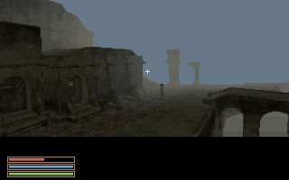
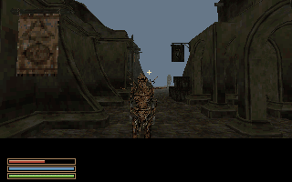

# AmiWind v0.0.24-rc2 — Welcome to Balmora test candidate

This is an interim checkpoint requested during the model-budget investigation.
It is a prerelease for testing; final v0.0.24 remains pending. Start a fresh
character: changed placement/content invalidates prior-build saves.

| Balmora bridge | Streets and residents |
| :---: | :---: |
|  |  |

## Included changes

- Character class confirmation omits the birthsign until that selection stage.
- NPC identity and Talk targeting use the visible model bounds and shared direct
  target, including close-range views. The name is independent of voice cooldown.
- Initial ground residents resolve their height in the sub-cell that owns their
  position; overlap copies retain that canonical height. The independent audit
  checks actual quantized mesh contact and explicit initial-state classification.
- The reported eastern Balmora ground patch uses the adjoining hill material,
  guarded by its source cell/tile and original material.
- `dbg gallery` (also `dbg aw charplane`, `dbg modelgallery`, `dbg npcgallery`)
  opens a one-model inspection plane. Tab/B opens friendly-name keyword search;
  Shift+N/P changes models; Shift+B selects equipped/base body. F1 is gallery-only
  help. Ctrl+X or `dbg gallery exit` restores the captured supported game state.
  E previews an already-converted greeting when available; full dialogue trees
  remain future work. The selected name stays below the viewport.
- The complete base-master catalogue contains 2,935 NPC/creature records,
  including 260 creature records, mapping to 3,551 distinct model assets. Of these,
  3,526 converted successfully; 25 remain visible as unavailable entries.
  A checksum-based inspection table links shared appearances to source IDs.
  Conversion success is not individual visual acceptance.
- Three model-specific trial allowances cover 765, 774 and 775 triangles.
  `aw_allow_poly_budget_over true` with `aw_poly_budget_over_cap auto` enables
  those exact packaged models. The extension defaults off; numeric caps remain
  available from 666 to 777. Ordinary models retain the previous vertex budget.
- Options exposes loading method and read-ahead size. Method 1 remains default.
  Method 2 uses a bounded 128/256/512 KiB cache; it is an opt-in experiment,
  not seamless background streaming. Matched visible pauses remained roughly
  0.30–0.38 seconds; larger buffers did not consistently improve them.
- Longer Options and scene lists have scrolling controls. General dialogue/topic
  scrolling and world-coordinate HUD mapping remain roadmap items.
- Auto build workers now respect CPU quota/affinity and available memory, with
  bounded scheduling and one numerical-library thread per worker. The worker
  count is selected at startup, not continually resized during a running pool.

## Known issues and acceptance boundaries

- The new strict foot-contact audit reports 135 grounded placements, 23 unresolved
  contact findings and three explicit authored corpses across 161 distinct
  placements / 1,613 copies. All reported Balmora floater references pass this
  mesh-contact check, but the broader gate has **not passed**. Uneven soles,
  slopes and ledges still need investigation. The snapshot includes the failed
  receipt; no actor has been reclassified to conceal a failure.
- The Balmora city-centre obstruction at `-63,-51,86`, nearby stair report at
  `-98,-73,88`, and region terrain around `1970,-1612,128` still reproduce stalls
  in focused native walking checks. They are not fixed in this checkpoint.
- Earlier RC1 positive-Y `stairs10` at `-685,+619,141` and the exact rock/stair
  wedge at `-225,348,131` remain open. Preserve those reports independently.
- 25 models still exceed the bounded conversion allowance. The gallery contains
  their identities rather than substituting a severely reduced model. The three
  extended models require the opt-in setting. Every creature's appearance and
  both body variants have not been individually inspected in the native renderer.
- The creature gallery uses the converted rest mesh. Original animation states,
  including Vivec's levitating pose, flight and scripted falls, are not reproduced
  by this view yet. It is a finite fogged plane; actors have no gallery AI.
- Natural intro, unrestricted room/city roaming, audio listening quality and
  complete owner acceptance remain outstanding. Full services, combat, schedules
  and quest simulation are outside the current bounded greeting implementation.

The strict `build_aga.py image` production placement gate remains fail-closed.
This requested diagnostic RC2 snapshot is packaged separately from the existing
converted payload with its unresolved audit attached. It must not be promoted
as a passed final-placement build.

## Verification for this checkpoint

The source suite passed 310 tests, including the external BSP compiler test.
The gallery control test was rerun after the final native-only text-formatting
correction. Production compilation retains the baseline 82 warnings with no
added warning; existing diagnostics remain technical debt.

All 8,037 packaged payload files were independently read from the finished HDF
and checked against their SHA-256 receipts. The production executable matches
its source build receipt. The final writable-copy HDF run saved Hors, loaded the
opt-in Tarhiel model and Vivec rest mesh, displayed the full browser, returned to
Balmora and quickloaded: 156 frames, zero surface/edge overflow frames. The
baseline deliverable was verified unchanged. These are focused checks, not an
all-model visual acceptance run. The 1,024 MiB FFS partition is storage only.

## Reference and documentation

Reference emulator: A1200/AGA/PAL, 68040/FPU/JIT, 2 MiB Chip, 16 MiB Z3,
11 MiB runtime heap. These are Linux FS-UAE checks, not physical Amiga or Windows
validation. Null-audio tests establish sample selection and triggering only.
The HDF's storage size is unrelated to runtime RAM residency.

See [gallery controls and budgets](CHARACTER_MODEL_GALLERY.md),
[placement workflow](NPC_GROUND_CONTACT.md),
[loading comparison](PERSISTENCE_AND_STREAMING.md),
[original owner reports](FEEDBACK-v0.0.24-rc1.md),
[evening notes](HORSTATORS_MUSINGS_2026-09-29.md), and
[Amiga limits](RELEASE_WORKFLOW.md#amiga-limitations).
