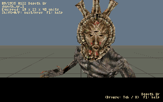
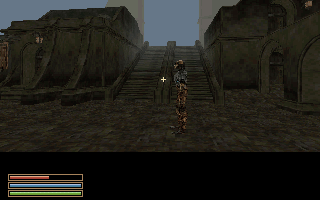

# AmiWind v0.0.24-rc3 — Welcome to Balmora recovery candidate

This is the owner's requested checkpoint while final v0.0.24 work continues.
It is a prerelease. The strict ground-contact gate still has 23 findings; RC3
must not be presented as a passed final-placement build. Start a new character.

| Dagoth Ur's mask | Balmora streets |
| :---: | :---: |
|  |  |

## What changed since RC2

- All **3,551 distinct gallery assets** now convert, covering the same 2,935
  base-master NPC/creature records, including 260 creature records. The 25 missing
  RC2 models are present. Shared appearances retain source IDs, friendly names,
  stable conversion numbers and checksum-based inspection rows.
- **29 model-specific geometry allowances** retain protected shape and clothing
  geometry within a bounded 1,024-triangle / 3,072-vertex extended path. Ordinary
  models keep the original 2,000-vertex path. Enable
  `aw_allow_poly_budget_over true` and `aw_poly_budget_over_cap auto` to view
  all extended models. The extension remains off by default; numeric caps from
  666 to 1,024 remain available. Each allowance checks the exact model bytes.
- Dagoth Ur's 903-triangle conversion retains the original mask, crest and neck
  geometry, uses larger texture tiles, and keeps the original gold mask texture.
  Both original Dagoth Ur records share the improved asset. The gallery uses
  steady daylight for clearer inspection; ordinary scene lighting is unchanged.
- Vivec and the cliff racer use selected authored idle poses and keep their
  source-derived height above the gallery floor. These are static inspection
  poses, not a complete animation, levitation, flight or scripted-fall system.
- The longstanding **grey blotches on pale faces** traced to stale lighting and
  fog columns after warm palette entries had been reserved. Those columns now
  match the final palette. The image builder rejects stale tables. This adds no
  table size, runtime RAM or per-pixel lookup cost. Other texture seams and
  low-resolution facial detail remain separate visual work.
- The gallery browser has its own visible mouse cursor; pointer movement stays
  in the overlay. Click rows, click/drag the scrollbar, or use the preserved wheel
  scrolling. Page Up/Down work with the supplied FS-UAE preset; Shift+Up/Down
  also pages on classic keyboards. Tab/B opens the browser, Shift+B switches
  equipped/base body, F1 opens gallery-only help, and Ctrl+X or
  `dbg gallery exit` restores the captured supported game state.
- Collision tracing now applies its separation tolerance once to the completed
  movement, rather than at every BSP split. Focused ordinary walking clears the
  RC2 centre, nearby stair and regional terrain stalls after diagnostic placement.
  This does not certify every approach, stair or overlap boundary.
- Worker planning accounts for reclaimable clean cache while respecting memory,
  CPU affinity and quota. Pools choose their bounded worker count at startup.
- The roadmap now covers M for the world map, I for inventory/equipment and J for
  the two-page progression journal with clickable topics. Immediately after
  v0.0.24, island terrain/textures and a polygon-density survey should guide
  expansion using original cells, with sub-cells only where measured need warrants
  them. These are plans, not newly implemented gameplay systems.

Method 1 remains the loading default. Method 2 and the 128/256/512 KiB options
remain experimental: RC2 comparisons did not show a consistent benefit.
The accepted frozen-frame Loading... presentation, 90-degree FOV, base player
hull, race/sex view heights and Shift+V remain.

## Verification and remaining limits

The source suite passes **313 tests**, including the external BSP compiler case.
Production compilation retains the RC2 baseline of **82 warnings**, with no added
warnings. Existing diagnostics remain debt. A focused RC3 native run loads the
new models, opens the browser, returns, quickloads and exercises the three RC2
walking reports: **604 frames, zero surface/edge overflow frames**. Separate
close views inspect Dagoth Ur and Sjorvar. Earlier focused native checks load all
28 expanded NPC conversions; this is not individual visual acceptance of all
3,551 assets. The browser input check exercises actual Page Up/Down, wheel and
pointer input; host checks also cover click/drag and camera input capture.

The strict contact audit still reports **135 grounded placements, 23 unresolved
contact findings and three authored corpses**, across 161 placements / 1,613
copies. All originally reported Balmora floaters pass that mesh-contact check,
and the owner's RC2 roaming found no further levitators. Uneven soles, slopes and
ledges still need investigation. No classification or tolerance was changed to
hide a failed placement. The production image builder remains fail-closed; the
separate diagnostic package carries its failed audit and verification receipts.

The older positive-Y stairs10 report at `-685,+619,141` and exact wedge at
`-225,348,131` remain open. Natural intro, unrestricted roaming, every creature's
appearance and subjective audio quality still need acceptance. E in the gallery
previews existing converted greetings; full dialogue trees, services, combat,
schedules and quests remain future work.

Reference: A1200/AGA/PAL, 68040/FPU/JIT, 2 MiB Chip, 16 MiB Z3 and an 11 MiB
runtime heap. Validation is Linux FS-UAE, not physical Amiga or Windows. The
1,024 MiB FFS partition is storage, not RAM residency. All 8,088 payload files were independently read back from the finished HDF
and verified against their SHA-256 receipts. Its production executable matches
the packaged source build. A writable-copy HDF check saved Hors, loaded Dagoth
Ur and Vivec, opened the browser, returned to Balmora and quickloaded: 156 frames,
zero surface/edge overflow frames. The deliverable image remained unchanged.
These focused checks and the failed contact receipt accompany the private package.

See [gallery controls and coverage](CHARACTER_MODEL_GALLERY.md),
[ashen-face investigation](IMPLEMENTATION_JOURNAL.md#j027--pale-faces-mapped-back-to-sky-grey),
[placement workflow](NPC_GROUND_CONTACT.md), [loading comparison](PERSISTENCE_AND_STREAMING.md),
[original reports](FEEDBACK-v0.0.24-rc1.md), [roadmap](ROADMAP.md),
[Horstator's musings](HORSTATORS_MUSINGS_2026-09-29.md) and
[release limitations](RELEASE_WORKFLOW.md#amiga-limitations).
