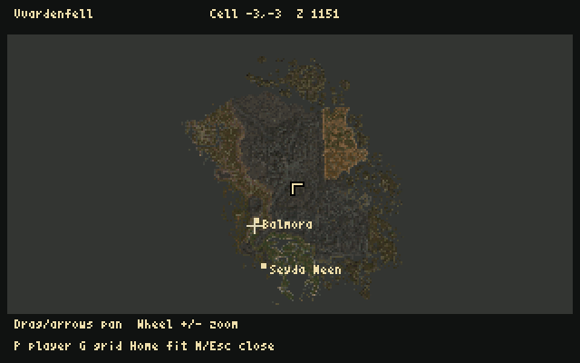

# AmiWind v0.0.24-rc4 — Vvardenfell map and journal candidate

This development checkpoint follows the owner's request to begin the island
survey and in-game journal while final v0.0.24 acceptance continues. It is a
prerelease. RC3 remains the previous recovery baseline. Start a new character;
this content set and its journal assets have a new save fingerprint.

| Whole-island overview | Two-page progression journal |
| :---: | :---: |
|  |  |

## New in this checkpoint

- **M opens the Vvardenfell map**, with the current exterior player position,
  labelled Balmora/Seyda Neen, pan/zoom and original-cell grid. It loads about
  245 KiB on demand and frees it on close. Interiors explicitly have no exterior
  position fix. Ocean fills the map beyond supplied terrain.
- **J opens a two-page journal** with dated, earned entries, page navigation,
  visible pointer and clickable quest links/index. Quest rows support wheel,
  page keys and a scrollbar. Text stays on disk and is fetched by source ID and
  stage. The private catalogue contains all 2,489 journal texts in the supplied
  master. Having their text does not implement all their quests.
- **AWS2 saves record journal history** separately from numeric quest indices.
  Duplicate grants do not duplicate entries, and capacity failure cannot silently
  advance a quest. Legacy AWS1 decoding retains indices without inventing dates.
  Existing content identity checks remain mandatory.
- **The whole-island survey** covers 1,404 exterior cells and 1,292 height grids,
  measuring 134,865 placed scenery/item references and 34,924,945 source
  triangles. All 1,405 unique scenery meshes were measured. Adjacent terrain
  height edges agree. Existing town regions fit into the common source space.
- **Polymapping and subdivision candidates** accompany a private interactive
  atlas. At the first reference threshold, 1,078 cells fit whole, 314 suggest
  2 by 2 regions and 12 suggest 4 by 4. These are source-geometry screening
  results; converted terrain, textures, collision, actors, heap and native
  transitions must determine the accepted runtime splits.
- Full source terrain samples are preserved. A private terrain-only inspection
  mesh contains 661,504 triangles at 512-source-unit spacing. It is a host-side
  inspection mesh, not a playable whole-island conversion.
- Packaging now checks each public screenshot's explicit tracking exception as
  well as its source allowlist, preventing the RC3 ignored-image omission from
  recurring. The two RC3 screenshots are included with corrected exceptions.

## Controls

M: drag/arrows/WASD pan; wheel or +/- zoom; P centre player; G grid; Home fit;
M/Escape close. J: arrows/Page Up/Down/wheel turn pages; Home/End first/last;
Tab or Quests opens the index; click/Enter follows a quest; Backspace shows all
entries; J/Escape closes. Both panels capture world input. F10 closes the panel
and opens the console. Bindable commands are `aw_worldmap` and `aw_journal`.
Gallery shortcuts retain their existing separate meaning.

## Boundaries and pending acceptance

The playable world still consists of the existing converted scenes. The island
map, atlas and inspection mesh do not yet enable continuous whole-island walking
or endless ocean travel. This is the base master only, without Bloodmoon.
The map uses reduced averaged terrain colours, not full source UV textures.

The journal currently supports 32 quest IDs and 256 dated entries. Its reader
uses 28,188 bytes while open; history adds up to 4,100 bytes per in-memory state
and serialized save. It links known quests; general learned-topic hyperlinks,
full quest scripting and saved reading position remain future work. Inventory
and equipment through I remain on the roadmap.

The strict initial placement audit remains independent: **135 grounded
placements, 23 unresolved contact findings and three authored corpses**. The
production image builder still stops on that failed gate. This separately
packaged diagnostic candidate carries its failed audit; it is not a passed
final-placement build. All previously reported Balmora floaters passed RC3's
mesh contact check. The owner reports that Balmora's stairs now feel good, but
the earlier exact positive-Y stairs10 and wedge reports remain independently
open. No tolerance or actor classification was relaxed in this checkpoint.

All 3,551 gallery assets and RC3's colour/model/collision improvements remain.
Method 1 remains the loading default; method 2 and cache sizes remain experimental.
The 90-degree FOV, player hull and race/sex view heights retain their settings.
Full NPC services, combat, schedules, dialogue trees and quest simulation remain
unfinished. Complete natural intro, free roaming and subjective audio acceptance
are separate from the focused checks below.

## Verification

The source suite passes **324 tests**, including the external BSP compiler case.
Production compilation retains the same 82 baseline warnings, with no additions.
The focused native UI check opens, pans/zooms and locates the player on the
map, follows the journal quest index, returns and quickloads the earned entry:
244 frames, zero surface/edge overflow. Host checks cover multi-record lookup,
malformed bounds, history capacity/corruption and legacy decoding. Atlas script
checks cover coordinate lookup, layers and pan/zoom using a mock canvas/DOM;
that check is not a full browser rendering test.

All **8,093 files** in the final HDF were independently read back and hashed.
Its production binary matches the packaged native source build. A writable-copy HDF run loads Dagoth Ur and Vivec, opens the gallery browser,
returns, opens the map and journal, and quickloads the journal again: 220 frames,
zero surface/edge overflow. Both journal opens are checked, and the journal
pixels match before/after restore. The deliverable image stayed unchanged.
The failed contact audit accompanies the private package.
Reference profile: Linux FS-UAE, A1200/AGA/PAL, 68040/FPU/JIT, 2 MiB Chip,
16 MiB Z3 and 11 MiB runtime heap. Physical Amiga and Windows are not validated
by these checks. HDF partition size is storage, not resident RAM.

See [world survey](WORLD_SURVEY.md), [map/journal controls and format](WORLD_MAP_AND_JOURNAL.md),
[ground-contact gate](NPC_GROUND_CONTACT.md), [roadmap](ROADMAP.md),
[implementation journal](IMPLEMENTATION_JOURNAL.md) and
[Horstator's musings](HORSTATORS_MUSINGS_2026-09-29.md).
