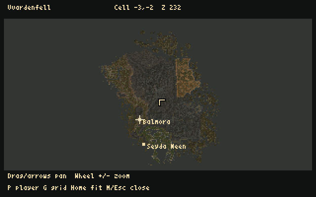

# v0.0.24 - Welcome to Balmora (and Vvardenfell!)

A major milestone in mapping the entire island of Vvardenfell, and the final
v0.0.24 milestone following the owner's RC playtesting and release approval on
1 October 2026. The island coverage is the base master: Bloodmoon's Solstheim
and Tribunal expansion content are excluded. Whole-island mapping is available;
continuous whole-island 3D travel remains future work.

| Welcome to Balmora | Dagoth Ur |
| :---: | :---: |
|  |  |
| **Vvardenfell map** | **Progression journal** |
|  | [Corrected journal screenshot (v0.0.25-dev1)](images/amiwind-v0.0.25-dev1-journal.png) |

## Explore, create, inspect

- **Balmora:** 64 overlapping exterior regions, 43 destination interiors
  (42 city interiors and Tharys Ancestral Tomb), 93 interior NPC placements and
  80 living voice sets. Targeted RC checks covered all 70 exterior entrance/return
  pairs and both same-room Fighters Guild links. Seyda Neen and the opening
  scenes remain available alongside it.
- **Character creation:** name, race, gender, head/hair, class, birthsign and
  final review, with a rotating appearance preview and saved character state.
  Class confirmation no longer announces a birthsign before its selection.
- **Every catalogue model converted:** 2,935 base-master NPC/creature records,
  including 260 creature records, map to 3,551 distinct assets. `dbg gallery`
  offers name/source-ID search, a visible browser cursor, wheel/page navigation,
  equipped/base-body inspection and return to the supported captured game state.
  Dagoth Ur retains his original gold mask texture and protected mask/crest
  geometry. All conversions being present is not individual visual acceptance.
- **M: Vvardenfell map**, with original-cell grid, pan/zoom and current exterior
  player position. Existing Balmora and Seyda Neen regions share the source
  world coordinates. Interiors explicitly have no exterior position fix.
- **J: two-page journal**, with dated earned entries, clickable quest index,
  page navigation, mouse controls and save/restore. The source catalogue holds
  2,489 journal texts; the game shows earned history, not all entries at once.
- **Whole-island terrain and polymapping:** 1,404 exterior cells, 1,292 height
  grids, 134,865 placed scenery/item references and 34,924,945 source triangles
  measured. All 1,405 unique scenery meshes were measured; adjacent height
  edges agree. At the initial reference threshold, 1,078 cells fit whole,
  314 suggest 2 by 2 regions and 12 suggest 4 by 4. These are screening
  candidates, to be accepted against converted geometry, collision, actors,
  textures, heap and native transition measurements.

The terrain survey preserves full source heights and includes a private
661,504-triangle inspection mesh and interactive atlas. Neither is a playable
whole-island BSP. Ocean fills the map outside its supplied terrain; endless
playable ocean travel is not implemented. Map colours use reduced terrain
texture averages, not full source UV detail.

## Improvements carried through the candidates

Ground residents retain their owner-sub-cell height across overlap copies.
The reported Balmora floaters pass the mesh-contact check; owner RC2 roaming
found no further levitators. NPC names and E targeting use visible model bounds,
including close views. Guarded terrain-material repairs and the completed-sweep
collision tolerance address the reported RC2 patches and walking stalls. The
owner reports Balmora's stairs now feel satisfactory.

Pale-face grey blotches were traced to stale lighting/fog palette columns.
Those tables now match the final palette, with a build consistency check and
no extra per-pixel lookup or table size. Dagoth Ur's 903-triangle asset uses
larger texture tiles. Twenty-nine exact-model allowances use the bounded
1,024-triangle / 3,072-vertex extension; ordinary models retain the original
2,000-vertex path. Enable `aw_allow_poly_budget_over true` and
`aw_poly_budget_over_cap auto` for all extended gallery models. It defaults off.
Vivec and the cliff racer retain selected authored static idle poses and height;
this is not a full flight, levitation or animation system.

Method 1 remains the default loader. Method 2 and the 128/256/512 KiB read-ahead
options remain experimental: RC comparisons showed no consistent benefit.
The 90-degree FOV, player hull, race/sex view heights and Shift+V remain.

## Known limits accepted for this milestone

The owner chose to release v0.0.24 with the **23 strict ground-contact findings
still open**, alongside 135 grounded placements and three authored corpses.
No tolerance or initial-state classification was changed to hide a failure.
The ordinary `build_aga.py image` gate remains fail-closed. The matching private
release is assembled from the independently verified RC4 converted payload,
with freshly built final-version runtime/preflight binaries, and carries the
failed audit. Release approval is not a passed placement certificate.

The earlier exact positive-Y stairs10 (`-685,+619,141`) and wedge
(`-225,348,131`) reports remain independently open. The full natural intro,
unrestricted roaming, every model's appearance and subjective audio quality
have not all been individually accepted. Full dialogue trees, combat, quests,
NPC services, schedules and inventory/equipment remain future work.

The journal currently supports 32 quest IDs and 256 dated entries, not a
certified whole-playthrough history capacity. General learned-topic links and
saved reading position remain future work. The map allocates about 245 KiB only
while open; the journal reader uses 28,188 bytes while open. History adds at
most 4,100 bytes per in-memory state and serialized save.

## Verification and release identity

All 324 source tests passed: 323 in the normal suite, then the external BSP
compiler case separately with its required tool. The restored native build
emitted 75 warnings, with no new diagnostic signatures against RC4's 82-warning
log. This is not a claim that seven source defects were fixed; no native logic
changed in the final promotion. Existing warnings remain technical debt.

All 8,093 files were independently read back from the finished HDF and checked
against their SHA-256 receipts. Its newly compiled runtime and preflight match
the final-version source receipt. The writable-copy final HDF run loaded Dagoth
Ur, captured Balmora, opened the map and journal, returned and quickloaded the
journal: 282 frames, zero surface/edge overflow. Journal pixels match before
and after restore; the deliverable HDF stayed unchanged. Fresh documentation
screenshots come from this final HDF run. Separate composition runs are retained
privately; they do not replace the packaged-image check.

Historical RC checks remain attributed to their original versions. Focused
captures do not certify every approach, model, animation, sound or playthrough.

Reference emulator: Linux FS-UAE, A1200/AGA/PAL, 68040/FPU/JIT, 2 MiB Chip,
16 MiB Z3 and an 11 MiB runtime heap. Physical Amiga and Windows need separate
validation. HDF partition size is storage, not resident RAM. Start a fresh
character when changing from older content; content fingerprints remain checked.

Public assets contain source and selected documentation captures only. Converted
game data, the playable image, ROM and terrain/model survey data remain private.

See [gallery](CHARACTER_MODEL_GALLERY.md), [map and journal](WORLD_MAP_AND_JOURNAL.md),
[world survey](WORLD_SURVEY.md), [ground contact](NPC_GROUND_CONTACT.md),
[release workflow](RELEASE_WORKFLOW.md), [roadmap](ROADMAP.md),
[implementation journal](IMPLEMENTATION_JOURNAL.md) and
[Horstator's musings](HORSTATORS_MUSINGS_2026-09-29.md).
