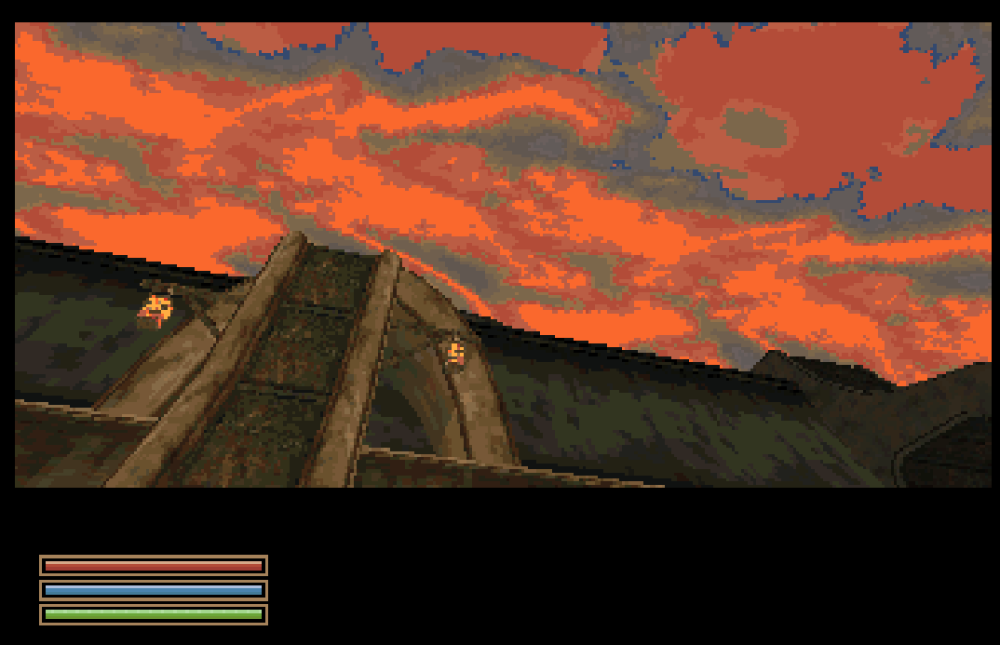
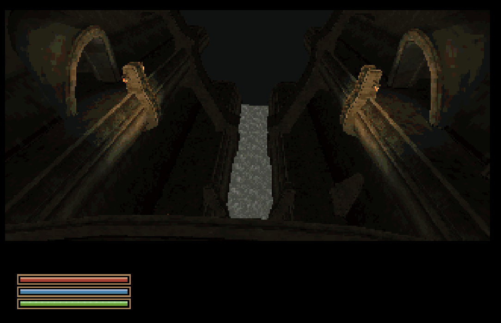

# AmiWind v0.0.32 - Last Stop on the Old Line: Window-Shopping in Vivec

A first look at Vivec: the Arena canton as an outside-only preview, with stairs
you can climb and residents standing where Morrowind puts them. The engine is
now safe for a real 68040's FPU, the console edits like a terminal prompt, fires
stay in view, and the repository builder builds the whole game itself, from
scratch, in parallel.

This is the last release on the old line: the **AmiQuake-based legacy engine**
and the legacy builder (region maps). The next release, v0.0.33 "Towards CHIM:
Replacing the Engine Block", is the first on the **CHIM** engine: a world
streamer that stores every mesh, collision hull and texture once and places it
by reference ([world streamer](WORLD_STREAMER.md), [roadmap](ROADMAP.md)).

<!-- v0.0.32 photos -->
| | |
| --- | --- |
|  |  |
| **A lantern-lit bridge pillar** against a blazing sunset. | **A Vivec canal at night**, lanterns on both sides. |

More in the [gallery](GALLERY.md).

<!-- /v0.0.32 photos -->

What's new:

- **Vivec Arena preview:** the Arena canton, its walkways, bridges and the
  pieces of the neighbouring cantons that reach into it, built from your own
  Morrowind data. Outside only: its doors say "Interior unavailable". It is a
  separate area: `dbg tp vivec_arena` (or `dbg tp vivec`, `dbg tp arena`) takes
  you to the canton top.
- **Stairs and residents in Vivec:** the Arena stairs, bridges and covered
  walkways can be walked; converted architecture keeps its authored collision
  surfaces where the simplified hull would close more than a step, and every
  Arena resident stands on the floor the original puts under them.
- **Horizon:** the default horizon is the v0.0.30 look (`aw_skyline_fill 0`),
  the owner-approved method (Horstator approved). The skyline fill of v0.0.31
  stays selectable (`aw_skyline_fill 1`) as an experimental mode, buggy for now:
  sprites still need their shapes from the alpha channel. Saved settings from
  v0.0.31 move to the new default once.
- **Fire:** the static flame budget keeps the flames you can see, ranked by size
  over distance, so a hearth no longer vanishes behind a row of candles
  (`aw_static_flames_nearest 1` keeps the old nearest-first rule).
- **Console like a terminal prompt** (`aw_console_mode 1`, default): the cursor
  moves without deleting, Home/End, Ctrl+A/E/U/K, and the last 31 commands kept
  in `console-history.txt`; Up stays on the oldest command. `aw_console_mode 0`
  keeps id's classic editor. The Amiga Del key is Delete again.
- **`dbg daynight off`** holds the clock at 12:00 midday through the normal
  clock path (sky, light, lamps, windows and HUD); `dbg daynight on` resumes.
- **68040 FPU:** no library sine and cosine every frame, AmiWind's own text and
  number conversion, own `atan2` and `tan`; the builder fails an engine that can
  reach FPU instructions a 68040 does not have.
- **FPU support library (optional, your own copy):** `--amiga-libs DIR` puts
  your own `68040.library` or `68060.library` on the boot disk; the boot
  checklist shows the result and `dbg fpu` reports it. AmiWind never ships it
  ([FPU support library](FPU_SUPPORT_LIBRARY.md)).
- **Map loader:** map data is decoded from 16 KiB slices straight into its
  final structures instead of being staged whole, lowering the memory peak while
  a map loads; every map is checked against the loader's heap model when the
  image is built.
- **Measuring tools:** `dbg rcount` renderer counters, the `awbench` hardware
  benchmark for owners, and a warning when entities beyond the visible-entity
  limit are dropped.
- **New logo** and start-up lines: "An open-source RPG engine / for the
  Commodore Amiga".
- **Builder:** builds the whole game from your own Morrowind data in one command,
  with first-person hands, mushroom harvest, trees and grass and the Vivec Arena
  on by default; `--jobs N` reaches every stage; the image step runs in parallel
  with byte-identical results; a build profiler in every build; a known-inputs
  check identifies your Morrowind data, Kickstart and Amiga libraries
  ([known inputs](KNOWN_INPUTS.md)); Seyda Neen interiors keep their lantern
  hooks, ropes and ferns, and every left-out placement is receipted.
- **Bug tracking:** one register, now 370 records, each with a report page.

What we gained (measured):

- **Per-frame FPU work on a 68040:** Balmora's library `cexp` calls per frame
  (the 68040 has no sine or cosine instruction) went from 3,547 to 0.
- **NPC targeting:** once per frame instead of 2-4 times; in Balmora 5 searches
  over 70 NPCs per frame became 1 search with none tested.
- **Map load memory:** up to 925 KB less peak heap per map while loading (median
  about 165 KB on Vivec maps), with byte-identical results on all 1,664 shipped
  maps.
- **Builds:** the repository builder now builds the release from scratch; the
  image step uses every core instead of one for about 23 minutes per pass.

Emulator numbers are relative until a hardware number exists
([BENCH-JIT-PROFILE-32](bugs/BENCH-JIT-PROFILE-32.md)).

## Vivec Arena

The preview is one frame centred on the Arena canton (local +-1536 units, fog at
540). Objects whose footprint reaches into the frame are kept, so the Arena sits
among the edges of the Redoran, Telvanni, St. Delyn, St. Olms and Foreign Quarter
cantons; those end in a straight cut at the frame edge. Residents stand, the
stairs climb, and `dbg tp vivec_arena` lands on the canton top, never in the
water ([VIVEC-ARENA-ACTORS-32](bugs/VIVEC-ARENA-ACTORS-32.md),
[VIVEC-ARENA-TP-ARRIVAL-32](bugs/VIVEC-ARENA-TP-ARRIVAL-32.md)). The cantons'
interiors, the rest of Vivec and the link to the open world come with CHIM.

## Seyda Neen

Seyda Neen's 66 region maps ship byte for byte as recorded in v0.0.31: the
legacy builder cannot regenerate them, and the world streamer rebuilds Seyda Neen
next, so the legacy builder is not fixed. The builder takes them as a recorded
input (`--seyda-recorded`), checks them byte for byte after every image pass, and
ships `seyda.bsp` as the sn029 alias ([BUILD-SEYDA-REGEN-30](BUGS.md)).
Three of them (sn019, sn026, sn035) exceed the loader heap model's reserve
allowance (not the allocation ceiling). They pass the otherwise strict heap gate
through a **temporary pre-CHIM bypass** pinned by map name and SHA-256
(`config/heap-bypass.json`), which ends when Seyda Neen moves to CHIM (milestone
M2) ([HEAP-SEYDA-OVERLAP-32](bugs/HEAP-SEYDA-OVERLAP-32.md)).

## Builder

One command builds the release: `tools/build.py` with your Morrowind data and,
for Seyda Neen, the recorded v0.0.31 stage. The release image is checked against
a from-scratch build with the same builder ([RELEASE_WORKFLOW.md](RELEASE_WORKFLOW.md)).
Development builds can reuse verified unchanged stages (`--reuse-from`); releases
are built from scratch ([build profile and stage reuse](BUILD_PROFILE.md),
[parallel host builds](PARALLEL_BUILD.md)).

## Repaired in this release, awaiting a playtest check

- [VIVEC-ARENA-ACTORS-32](bugs/VIVEC-ARENA-ACTORS-32.md): Five Vivec Arena residents fail the actor placement gate
- [VIVEC-ARENA-TP-ARRIVAL-32](bugs/VIVEC-ARENA-TP-ARRIVAL-32.md): dbg tp vivec_arena leaves the player at the frame origin under the water
- [DEBUG-TP-TOWN-NAMES-32](bugs/DEBUG-TP-TOWN-NAMES-32.md): dbg tp help omits new towns and has no short town names
- [FLAME-RANGE-NEAREST-32](bugs/FLAME-RANGE-NEAREST-32.md): A hearth fire shows only up close when many candles are nearer
- [CONSOLE-HISTORY-EMPTY-32](bugs/CONSOLE-HISTORY-EMPTY-32.md): Console Up past the oldest command shows an empty line and stays there
- [KEYS-AMIGA-EDIT-32](bugs/KEYS-AMIGA-EDIT-32.md): Amiga Del arrived as F11; FS-UAE sent Home/End as keypad ( and Help
- [ENGINE-FPU-UNIMPL-31](bugs/ENGINE-FPU-UNIMPL-31.md): Every-frame math traps on a real 68040 (sin+cos become cexp)
- [ENGINE-FPSP-MISSING-31](bugs/ENGINE-FPSP-MISSING-31.md): Boot disk loads no 68040 FPU support library (optional, your own copy)
- [NPC-TARGET-REDUNDANT-31](bugs/NPC-TARGET-REDUNDANT-31.md): NPC targeting runs 2-4 times per frame and checks every NPC
- [LAMPS-CACHE-31](bugs/LAMPS-CACHE-31.md): Night lamps beyond 96 per 3x3 cells are silently dropped (Vivec)
- [VIVEC-TEXINFO-31](bugs/VIVEC-TEXINFO-31.md), [MODEL-MARKSURF-SIGNED-31](bugs/MODEL-MARKSURF-SIGNED-31.md), [MESH-EXTENT-GRID-31](bugs/MESH-EXTENT-GRID-31.md), [LIGHTMAP-GRID-31](bugs/LIGHTMAP-GRID-31.md), [LIGHTMAP-TAIL-31](bugs/LIGHTMAP-TAIL-31.md): engine and converter limits that dense Vivec maps reached
- [LOADER-STAGING-PEAK-32](bugs/LOADER-STAGING-PEAK-32.md): Map loading stages most lumps in temporary memory before decoding
- [RENDER-VISEDICTS-OVERFLOW-32](bugs/RENDER-VISEDICTS-OVERFLOW-32.md): Entities beyond MAX_VISEDICTS are dropped silently (now counted and warned)
- [BOOT-CONSOLE-WIDTH-32](bugs/BOOT-CONSOLE-WIDTH-32.md): Boot check lines wrap on the 64-column boot console
- [ENGINE-BUILD-REPRO-31](bugs/ENGINE-BUILD-REPRO-31.md): Engine builds from identical source give different binaries
- [BUILD-SEYDA-HULL2-32](bugs/BUILD-SEYDA-HULL2-32.md), [BUILD-ACTOR-CONTACT-CALL-32](bugs/BUILD-ACTOR-CONTACT-CALL-32.md): from-scratch builds stopped since v0.0.27/v0.0.28
- [BUILD-FLORA-OPTIN-32](bugs/BUILD-FLORA-OPTIN-32.md), [BUILD-HANDS-NOT-BUILT-32](bugs/BUILD-HANDS-NOT-BUILT-32.md), [BUILD-HARVEST-NOT-BUILT-32](bugs/BUILD-HARVEST-NOT-BUILT-32.md), [BUILD-EXTRA-TOWN-OPTIN-32](bugs/BUILD-EXTRA-TOWN-OPTIN-32.md): shipped features the builder left out or made opt-in
- [BUILD-DRESSING-EXCLUDED-32](bugs/BUILD-DRESSING-EXCLUDED-32.md): The builder dropped lantern hooks and other dressing in Seyda Neen maps without a receipt
- [BUILD-WORLD-LAYOUT-DRIFT-32](bugs/BUILD-WORLD-LAYOUT-DRIFT-32.md): The world region layout depended on the town maps
- [BUILD-INPUTS-UNVERIFIED-32](bugs/BUILD-INPUTS-UNVERIFIED-32.md): The builder did not check user inputs against known versions
- [HARVEST-SEYDA-STALE-32](bugs/HARVEST-SEYDA-STALE-32.md), [HARVEST-PILOT-SHIPPING-32](bugs/HARVEST-PILOT-SHIPPING-32.md), [HARVEST-GEOMETRY-GATE-32](bugs/HARVEST-GEOMETRY-GATE-32.md): harvest catalogues regenerated from the shipped maps and gated
- [CI-BOOTSTRAP-NUMPY-32](bugs/CI-BOOTSTRAP-NUMPY-32.md): The public CI tool bootstrap failed

## Known in this build

Vivec:

- The Vivec Arena preview is a **separate area**, not connected to the rest of
  Vvardenfell: reach it with `dbg tp vivec_arena`; walking off its edges leads
  nowhere. Joining Vivec to the world is CHIM work (milestones M3/M4).
  [VIVEC-ARENA-FRAME-EDGE-32](bugs/VIVEC-ARENA-FRAME-EDGE-32.md): neighbouring canton bodies end at the frame edge, in view
- [TOWN-EDGE-UNBUILT-32](bugs/TOWN-EDGE-UNBUILT-32.md): Vivec and the open world are not merged: leaving the Vivec area (for example in noclip) drops the player into a bare open-world map (flat grey ground, no flora), and Vivec cannot be seen from the open world. Fix with CHIM (M3/M4)
- [VIVEC-ARENA-WATER-FALL-32](bugs/VIVEC-ARENA-WATER-FALL-32.md): The sea ends at the Arena canton edge: sky below the horizon, and the player falls out of the area through the water
- [VIVEC-ARENA-FLOATING-NPC-32](bugs/VIVEC-ARENA-FLOATING-NPC-32.md): A resident by the Telvanni canton stands at a walkway end with sky drawn below his feet
- [VIVEC-CANTON-SKY-HOLE-32](bugs/VIVEC-CANTON-SKY-HOLE-32.md): Sky shows through a canton wall seen from below
- [VIVEC-DISTANT-BRIDGES-32](bugs/VIVEC-DISTANT-BRIDGES-32.md): Distant bridges between the Vivec cantons may not be drawn
- [IMPORT-TOWN-NO-INTERIORS-32](bugs/IMPORT-TOWN-NO-INTERIORS-32.md): No Vivec interiors; every Arena door says "Interior unavailable"
- [HARVEST-EXTRA-TOWNS-32](bugs/HARVEST-EXTRA-TOWNS-32.md): No harvestable mushrooms in the Vivec Arena preview
- [FOG-TOWN-HEAVY-32](bugs/FOG-TOWN-HEAVY-32.md): Heavy fog at the Vivec Arena (the canton is larger than the 540 fog band)

Seyda Neen:

- [BUILD-SEYDA-REGEN-30](BUGS.md): Seyda Neen ships as the recorded v0.0.31 maps (owner decision); `seyda.bsp` is the sn029 alias
- [HEAP-SEYDA-OVERLAP-32](bugs/HEAP-SEYDA-OVERLAP-32.md): sn019, sn026 and sn035 pass the heap gate through the temporary pre-CHIM bypass, until CHIM M2
- [HARVEST-SEYDA-HEAP-REFUSED-32](bugs/HARVEST-SEYDA-HEAP-REFUSED-32.md): Seven Seyda Neen sub-cells have no harvestable plants (sn018, sn019, sn020, sn021, sn026, sn035, sn055), six of which had them in v0.0.31
- [SEYDA-LANTERNS-MISSING-31](bugs/SEYDA-LANTERNS-MISSING-31.md): Seyda Neen lanterns light the night but are not in its maps

Stairs (most stairs work, including the Vivec Arena's; these flights may block
the player):

- [STAIRS-BALMORA-B01-32](bugs/STAIRS-BALMORA-B01-32.md): A Balmora Hlaalu house staircase cannot be approached from below
- [STAIRS-BALMORA-WESTSOUTH-32](bugs/STAIRS-BALMORA-WESTSOUTH-32.md): A Hlaalu hall staircase in a Balmora interior has no clear foot
- [STAIRS-SEYDA-WAREHOUSE-32](bugs/STAIRS-SEYDA-WAREHOUSE-32.md): A spiral stair in the Seyda Neen warehouse tower is blocked
- [STAIRS-SEYDA-LIGHTHOUSE-32](bugs/STAIRS-SEYDA-LIGHTHOUSE-32.md): Seyda Neen lighthouse stairs are blocked (outside and inside)
- [STAIRS-ADDAMASARTUS-32](bugs/STAIRS-ADDAMASARTUS-32.md): A low step in the Addamasartus cave is blocked
- [COLLISION-STAIR-SLOPE-32](bugs/COLLISION-STAIR-SLOPE-32.md): Convex collision proxies can make stairs unclimbable; the stair rule and a stair gate come in the next release

Game:

- [QC-AW-FLAME-SPAWN-32](bugs/QC-AW-FLAME-SPAWN-32.md): The game logic prints harmless "No spawn function for aw_flame" errors to the console in rooms with fires (Census office: 51 flames)
- [CENSUS-LOAD-SLOW-32](bugs/CENSUS-LOAD-SLOW-32.md): With the remote debugging console enabled (`aw_remote 1`, test sessions) those errors make such loads slow; normal play is not affected (Census office 0.13-0.16 s in FS-UAE)
- [REMOTE-CONSOLE-LOG-COST-32](bugs/REMOTE-CONSOLE-LOG-COST-32.md): With the remote debugging console on, every console line costs about 7-18 ms in FS-UAE (test sessions only)
- [DEBUG-TP-SHIP-FREEZE-32](bugs/DEBUG-TP-SHIP-FREEZE-32.md): The game froze once on `dbg tp balmora` issued 6 s after `dbg tp prisonship` (seen once, debug path)
- [DEBUG-MAP-SAVE-VALIDATION-32](bugs/DEBUG-MAP-SAVE-VALIDATION-32.md): After a debug `map` load of an open-world map the autosave fails validation (earlier saves are kept)
- [WAIT-NOCLIP-MESSAGE-32](bugs/WAIT-NOCLIP-MESSAGE-32.md): In noclip, T (wait) is refused with a message about registration, dry ground and speech instead of the real reason
- [CONSOLE-HISTORY-ARROWS-32](bugs/CONSOLE-HISTORY-ARROWS-32.md): Console Up/Down recalled nothing on one FS-UAE setup; check with this build
- [HORIZON-FLORA-SPRITES-32](bugs/HORIZON-FLORA-SPRITES-32.md): The selectable skyline fill is experimental and buggy
- [HORIZON-HOLES-31](bugs/HORIZON-HOLES-31.md): Distant buildings break up against the sky
- [TOWN-VIS-OCCLUSION-31](bugs/TOWN-VIS-OCCLUSION-31.md): Converted buildings, rooms and rocks do not block Quake visibility; tested occluders and hints give negligible benefit with the current partitioning, town occlusion is deferred pending a better approach
- [LAMPS-RANGE-31](bugs/LAMPS-RANGE-31.md): Only the nearest lamps light up at night
- [NIGHT-0400-DARK-31](bugs/NIGHT-0400-DARK-31.md): Exterior suddenly much darker around 04:00

Disks, emulators and hardware:

- [WORLD-THIRD-PARTITION-32](bugs/WORLD-THIRD-PARTITION-32.md): The world disk has a fourth partition (DW2); the supplied launchers mount it, WinUAE mounting of DW2 is untested
- [EMULATOR-TEMPLATES-WORLD-32](bugs/EMULATOR-TEMPLATES-WORLD-32.md): The static emulator templates list only the boot disk; use the launchers
- [WORLD-HDF-OVER-2GIB-32](bugs/WORLD-HDF-OVER-2GIB-32.md): The world hard disk image is 32,768 bytes over 2 GiB
- [BOOT-68060-FPU-FAIL-32](bugs/BOOT-68060-FPU-FAIL-32.md): On a 68060 with Kickstart 3.1 and no 68060.library the boot check fails the FPU line
- [BENCH-JIT-PROFILE-32](bugs/BENCH-JIT-PROFILE-32.md): Frame-rate and load-time figures are emulator measurements, relative until a hardware number exists
- Everything else open in the [bug register](BUGS.md).
