# AmiWind v0.0.33 - Towards CHIM: Replacing the Engine Block

**Introducing AmiWind's CHIM engine, a.k.a. [C]hunks and [H]eaps [I]n [M]emory**

Running on CHIM Engine v0.1.0. The boot checklist says it the short way:
"AmiWind v0.0.33 / CHIM v0.1.0".

This is the first release on the **CHIM engine**: Balmora and Seyda Neen are no
longer cut into overlapping region maps that each carry their own copy of every
house, rock and lamp. The world is cut into chunks, every mesh, collision hull and
texture is stored once and placed by reference, and only the chunks around you are
in memory. It is still the AmiQuake engine underneath (renderer, lighting,
collision, QuakeC); what changed is how the world reaches it.

<!-- v0.0.33 photos -->
<!-- /v0.0.33 photos -->

## What is CHIM?

- **[C]hunks:** the exterior world is cut into pieces of terrain and placements
  that are streamed in and out as you move. A chunk holds references ("this house
  mesh, here, turned this way"), not copies.
- **[H]eaps:** the chunks live in Quake's own memory model: the Hunk, where a map
  keeps what stays for as long as it is loaded, and where CHIM reserves one chunk
  zone of fixed size when a town loads; inside it, chunks and the meshes they use
  come and go least recently used first, the way Quake's Cache already handles
  models and sounds.
- **[I]n [M]emory:** only what is near you is resident: a ring of chunks around
  the player, inside a fixed, measured budget (2 MiB Chip + 16 MiB Fast, the
  standard profile). Everything else stays on disk until you walk towards it.

And yes, the name is a nod to Morrowind's own CHIM, the secret syllable of royalty.

## What's different from the legacy engine

- **Every asset stored once.** A legacy region map was a self-contained Quake map:
  a 768-unit core plus an overlap on every side wide enough for the draw distance,
  so each placed object was stored about **9.8 times**
  ([WORLD-REGION-DUPLICATION-31](bugs/WORLD-REGION-DUPLICATION-31.md)). CHIM stores
  each mesh, hull and texture once and places it by reference, the way Morrowind
  places its meshes. Fix an asset once and every placement gets the fix: the silt
  strider repaired for Balmora is the same object every caravan town will place.
- **Streaming instead of region loads.** There is no "region loading" stop when you
  cross a region border: chunks are read ahead of you and joined into the running
  world a little at a time (a per-frame budget), so streaming does not block the
  frame. The old whole-world rebuild is still there as a selectable method.
- **One builder.** `tools/build.py --builder chim` builds the CHIM world from your
  own Morrowind data, with the same stages, `--jobs`, profiler and receipts as
  before; receipts record `builder`, `chim_version` and `world_format`. The legacy
  builder stays in the code and selectable (`--builder legacy`) for older releases,
  but never runs inside a CHIM build ([CHIM build guide](chim/build_guide/README.md)).
- **Vis kept effective.** Chunks and placements are linked to the visibility leaves
  they touch, so Quake's visibility data culls them; there is no "everything is a
  func_wall" path any more, and every CHIM change is checked with the renderer
  counters on the benchmark cameras ([world streamer](WORLD_STREAMER.md#visibility-and-culling-requirement)).
- **Memory rules.** The chunk ring, the frame world and the model cache have fixed,
  measured budgets inside Quake's heaps; the builder runs a strict heap gate on every
  CHIM area with the engine's own numbers, and a limit that remains is stated by the
  command that hits it, never a silent clamp.
- **Pure CHIM towns: Balmora and Seyda Neen.** Both exteriors are drawn only by CHIM;
  no legacy region map is built or shipped for them, and the CHIM builder is now the
  default (`--builder legacy` still builds the old way). CHIM converts Seyda Neen and the
  intro docks from your data and passes the strict heap gate, so the temporary heap
  bypass of v0.0.32 is gone ([HEAP-SEYDA-OVERLAP-32](bugs/HEAP-SEYDA-OVERLAP-32.md)).
  The builder still asks for the recorded v0.0.31 Seyda Neen maps
  (`--seyda-recorded DIR`): the CHIM frame maps are checked against them, so that
  exception stays open ([BUILD-SEYDA-REGEN-30](BUGS.md)).
- **Interiors stay Quake maps**, entered and left through doors, by design.
- **Still legacy: the open world between the towns.** The countryside ships as the
  legacy region maps, marked "not yet CHIM"; it moves to CHIM with milestone M4.
- **Left out: the Vivec Arena exterior.** The legacy preview of v0.0.32 is not in this
  release; its doors and `dbg tp vivec_arena` say "Area unavailable" until the
  Arena comes back on CHIM (milestone M3), with all of Vivec joined to the world
  after it ([roadmap](ROADMAP.md)).
- **Horizon and far terrain:** CHIM draws the distance with the v0.0.32 method (Horstator
  approved, `aw_skyline_fill 0`). Beyond the streamed ring a resident far terrain layer
  (13.2 KB for Balmora, built once per frame) draws the land past the fog plane in the
  fog colour, so valleys and far shores are not empty fog
  ([far terrain](chim/FAR_TERRAIN.md)). Distant buildings are not drawn yet: the house
  silhouettes v0.0.32 showed on the horizon are a known issue of this release
  ([CHIM-FAR-OBJECTS-33](bugs/CHIM-FAR-OBJECTS-33.md)).
- **Start-up line:** "RPG engine powered by CHIM".

## Also in this release

- **Melee combat:** one shared layer for every NPC: hit chance, weapon and
  hand-to-hand damage, armour, block, knockdown, knockout, fatigue, death, the
  original hit and miss sounds, battle music and the enemy's health bar
  ([combat](COMBAT.md)). The Arena Pit minigame can be tried from the debugger
  (`dbgmode arenapit`).
- **Photo mode:** `dbg photomode` or Options > Photo mode hides the HUD, crosshair
  and hands for clean screenshots; `dbg crosshair` and Options > Show crosshairs
  turn the crosshair off and on ([keymaps](KEYMAPS.md#photo-mode-and-crosshair)).
- **Stairs** follow Morrowind's own rules, and the image step walks every flight
  of stairs of every map.
- **Menu logo:** the gold name without the rule above it (`--menu-logo legacy`
  keeps the previous one).
- **Builder:** quick test builds (`--exclude`, `--exclude-unreferenced`), a
  prerendered store for development builds, live progress with an ETA, a build
  profile that names idle cores, and `--heap-mb` for the game heap
  ([CHIM build guide](chim/build_guide/README.md)). Fixed for this release: reuse of
  finished stages (`--reuse-from`) no longer refuses byte-identical stages, the image
  step runs its payload checks first and lists every error at once
  (`tools/build.py --check-payload RUN`), the harvest catalogue check covers every
  caller, and a small `--jobs` budget no longer stalls the stage scheduler.
- **No disk writes during play:** diagnostic logs stay in memory until you ask for
  them or leave the game, so closing the emulator mid-game no longer leaves the
  volume "not validated" from a write in progress.

## Measured gains

Counts (bytes, faces, entities, chunk copies) are the main currency; frame times
are FS-UAE emulator measurements, relative until a hardware number exists
([BENCH-JIT-PROFILE-32](bugs/BENCH-JIT-PROFILE-32.md)), and each says whether the
host was quiet or busy. Every chart puts legacy v0.0.32 and CHIM on the same axis,
and shows CHIM where it is slower too. The numbers are in
[CHIM-v0.0.33-MEASUREMENTS.json](performance/CHIM-v0.0.33-MEASUREMENTS.json) and the
charts are drawn from it by `tools/release_graphs.py`.

### Disk: each asset once

Balmora's exterior takes **21.3 MB** on CHIM against **162.1 MB** of legacy region
maps (7.6x less); Seyda Neen with the intro docks and the courtyard takes **7.8 MB**
against **190.4 MB** (24.3x less: Seyda Neen's legacy maps stored each face about 24
times, Balmora's about 7).

Over the whole island the legacy layout stores about 1.4 million copies of 143,147
exterior placements, and would need about 20 GB of maps. The CHIM projection for the
whole island comes with the open world on CHIM (M4). The disk limits, the savings and the
size budget of the whole game: [Disk space](chim/DISK_SPACE.md).

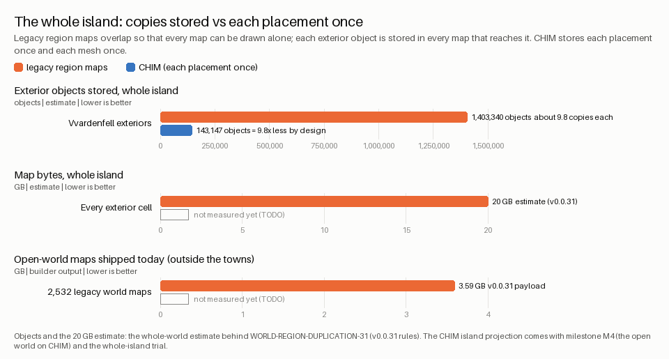

### Loading: smaller steps, no region stop

On the same Balmora walk through all 70 load doors, CHIM reads **40.7 MB** instead of
**73.5 MB**, in 83 small crossings instead of 18 region maps: the median read per area
change drops from 94 ms to 21 ms and the longest stall from 112 ms to 71 ms. The total
read time over the walk is the same (1.64 s against 1.65 s): CHIM spreads it thinner,
it does not remove it.
This walk was replayed with an earlier CHIM world (format 0.4) on a busy host; the
release world (format 0.5) has not been replayed yet.

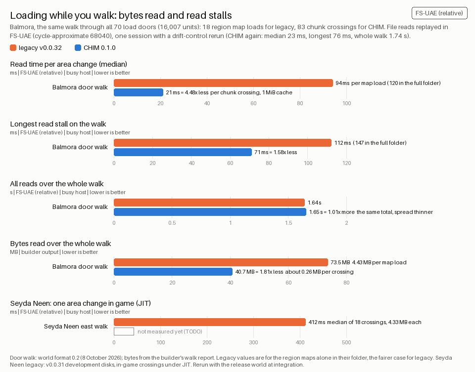

### Frame time and renderer counters

At the five fixed Balmora cameras, CHIM sends **46-114** brush models to the renderer
where the legacy maps sent **512-654**, and walks **9-10** BSP nodes per clipped face
instead of **27-52**: the shallow per-chunk trees replace the deep region trees. Faces
clipped drop by 5-25 %; CHIM draws 1-6 % more spans.

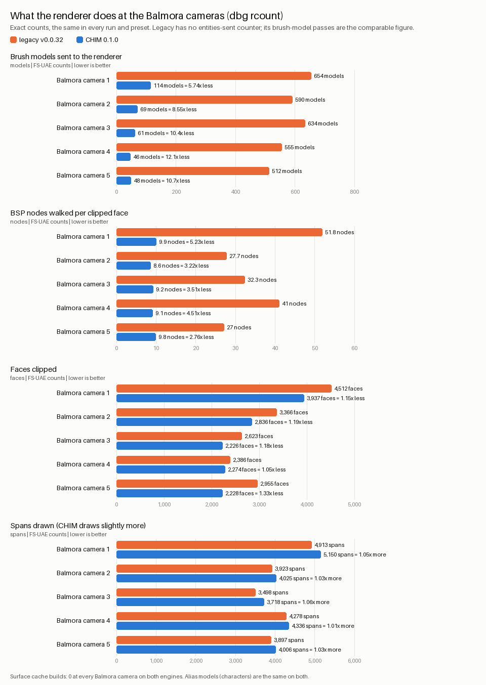

On the standard (JIT) preset the median frame time falls from 40-87 ms to 15-20 ms.
On the slow cycle-exact x14 preset (a 49.7 MHz 68040 without the JIT), measured with the
CHIM preview engine (0d8bf4f) and a legacy rerun as the drift control, it falls from 2.0-4.1 s to 1.1-1.6 s per frame: most
of the gain is in drawing the placed models (2.5-3.8x less). CHIM spends 17-28 % more
time outside the 3D view (streaming and the frame world), and the chart shows that too.
The JIT figures come from one busy-host session without a drift-control rerun; they
vary about two times between busy sessions, so read them as a direction, not a number.

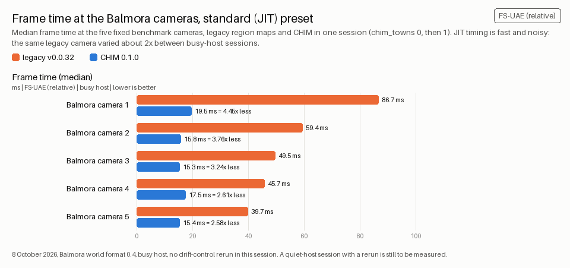

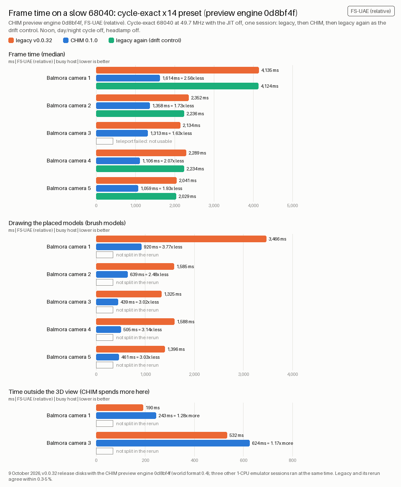

### Memory

CHIM reserves its chunk zone in the Hunk when a town loads, so the Hunk peak is
higher than a single legacy map's and less of the Hunk is left. In the CHIM preview,
Seyda Neen left only 1.10 MB, under the 2 MiB rule
([CHIM-SEYDA-HUNK-GAP-33](bugs/CHIM-SEYDA-HUNK-GAP-33.md)): its frame map carried all
229 flora sprites and the actors at once. In this release the statics and sprites
stream with their chunks, and each frame map states the Hunk it needs after the zone
(with a 24 KiB margin), so Seyda Neen keeps more than 2 MiB free after its first load
(measured in FS-UAE: 1,099,200 bytes before, more than 2,097,200 after). The builder's
heap gate passes Seyda Neen with 520 KB to spare inside the zone, where the legacy sn019
map was 238 KB over its budget and shipped through a temporary bypass. Balmora passes
with 2.5 KB to spare at the corner of its busiest ring.

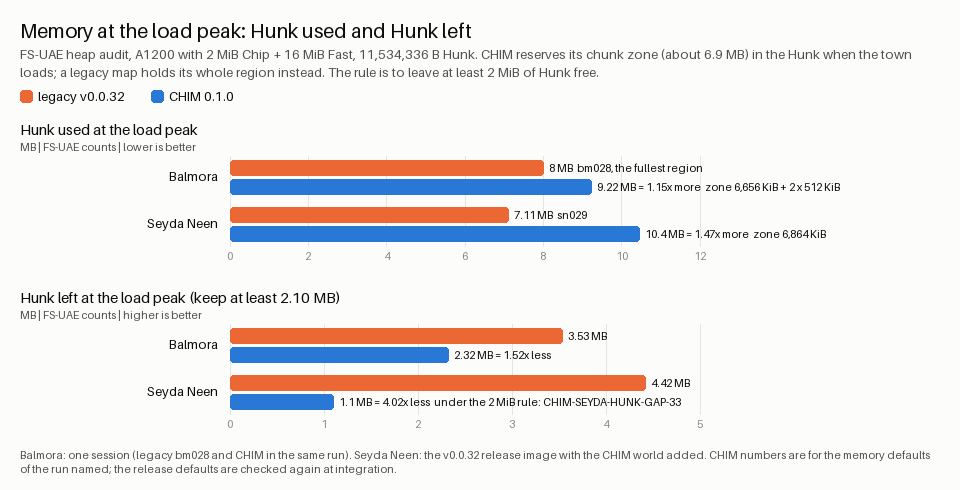

### Build time

The builder stage that makes Balmora's exterior takes 5.2 minutes on CHIM against
8.5 minutes for the 64 legacy region maps, and 5.1 against 24.1 CPU minutes. The two
come from different builds (CHIM on a host about 98 % busy with other jobs, legacy on a
quiet one), so they are labelled per bar.

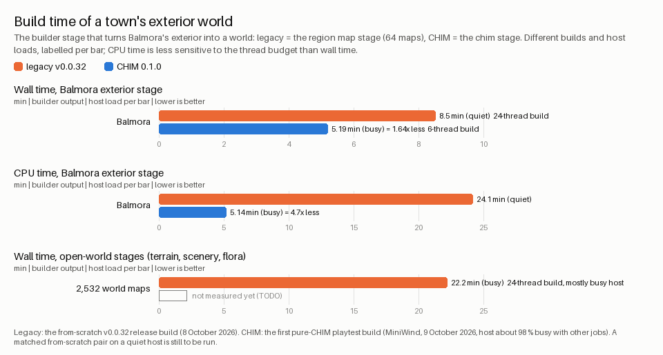

## Let's fix those bugs

Tonight's repairs, each shown at the same pose before and after. FS-UAE frames,
headlamp off.

**The silt strider's open hull, repaired but held back** ([MESH-LOD-OPEN-SEAMS-33](bugs/MESH-LOD-OPEN-SEAMS-33.md)):
mesh reduction tore the seams between the strider's parts, so the sky shows through
its shell. The repair keeps shell, arms and legs at full detail and reduces the claws
with their borders locked: no sky through the hull. On CHIM the larger model puts
Balmora's busiest ring of chunks 108,672 bytes over its memory budget
([CHIM-STRIDER-RING-33](bugs/CHIM-STRIDER-RING-33.md)), so this release keeps the
v0.0.32 strider; the repair ships once the memory is found. Balmora, the silt strider,
Morrowind position -21616, -19056, 13:03, headlamp off. Left: the shipped model;
right: the repair, from a test build.

| Shipped (v0.0.32 model) | Repair (held back) |
| --- | --- |
| 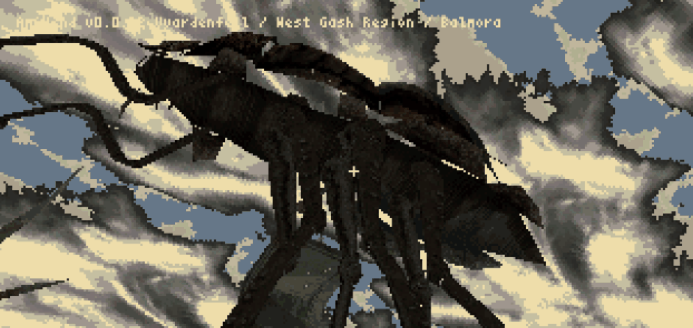 | 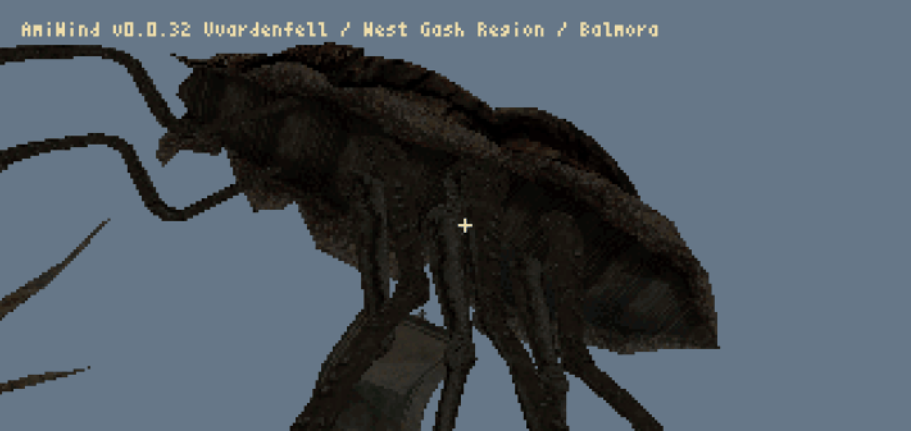 |

**Balmora's specks became an effect** ([CHIM-TEXTURE-SPECKS-33](bugs/CHIM-TEXTURE-SPECKS-33.md)):
bright single-texel specks on CHIM-drawn walls came from palette entries that the sky
uses; the CHIM world now goes through the same palette guard as the legacy maps, and
the look lives on as the opt-in texture effect `autumn_glitter_leaves`. Balmora, the
river wall by the bridge arches, near Morrowind position -20081, -18113, 14:00,
headlamp off. Before: the CHIM preview world; after: the repaired world; right: the
effect turned on (a Balmora street, near -23807, -15931).

| Before | After | The effect |
| --- | --- | --- |
|  |  |  |

**The prison ship's light** ([OPENING-BRIGHT-31](bugs/OPENING-BRIGHT-31.md),
[OPENING-JIUB-LANTERN-32](bugs/OPENING-JIUB-LANTERN-32.md),
[NPC-LIGHT-COHERENCE-32](bugs/NPC-LIGHT-COHERENCE-32.md)): the hold was brighter
than the original, the lantern above Jiub gave no warm light and hid its candle, and
characters were lit by the floor below them. The ship now has its own light profile,
the lantern's glass and candle show with warm light, and characters take the light
where they stand. The prison ship, the start position looking at Jiub, headlamp off.
Before: v0.0.32; after: the repaired build; right: the original game in OpenMW at the
same spot, for reference.

| Before (v0.0.32) | After | Reference (OpenMW) |
| --- | --- | --- |
| 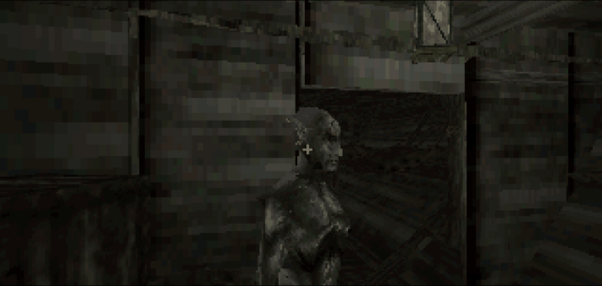 | 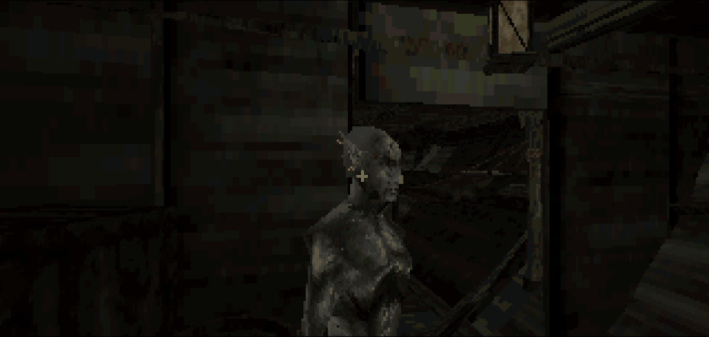 | 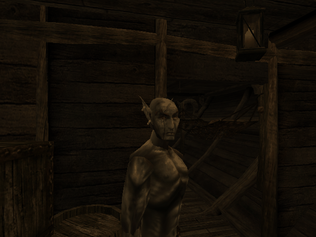 |

**Balmora's holes** ([CHIM-CHUNK-LOAD-FAIL-33](bugs/CHIM-CHUNK-LOAD-FAIL-33.md)):
in CHIM Preview 1, houses near you could be missing. The chunk zone filled with locked
blocks split into pieces smaller than a house, and a loading chunk could throw out its
own models. Chunks are now pinned only while they load, farther chunks give way first,
and a chunk shows as soon as its ground is in. On the owner's route the nearest chunk
without ground moved from 69 to 438 units away, failed loads fell from 180 to 95 and
the bytes read from 24.8 to 16.7 MB.

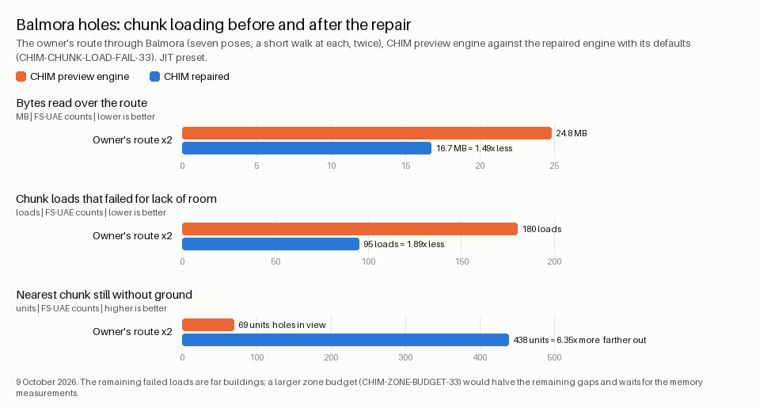

## Known in this build

Everything open is in the [bug register](BUGS.md); these are the ones you are most
likely to meet.

CHIM:

- [CHIM-FAR-OBJECTS-33](bugs/CHIM-FAR-OBJECTS-33.md): houses between the streamed ring and the horizon are not drawn; the far terrain shows the land only
- [CHIM-ARENA-MEMORY-33](bugs/CHIM-ARENA-MEMORY-33.md): the Vivec Arena preview of v0.0.32 is left out (its canton bodies do not fit the chunk zone yet); `dbg tp vivec_arena` says the area is unavailable
- [MESH-LOD-OPEN-SEAMS-33](bugs/MESH-LOD-OPEN-SEAMS-33.md) and [CHIM-STRIDER-RING-33](bugs/CHIM-STRIDER-RING-33.md): the silt strider still shows the sky through its shell; the repair is held until Balmora's ring has room for it
- [CHIM-BORDER-COLLISION-33](bugs/CHIM-BORDER-COLLISION-33.md): collision near a chunk border ignores the neighbouring chunk's ground
- [CHIM-ACTORS-OUTSIDE-RING-33](bugs/CHIM-ACTORS-OUTSIDE-RING-33.md): actors outside the streamed ring have no terrain collision
- [CHIM-ANIM-TEXTURES-33](bugs/CHIM-ANIM-TEXTURES-33.md): animated shared textures show only their first frame on CHIM
- [CHIM-LIGHT-CONTENTS-33](bugs/CHIM-LIGHT-CONTENTS-33.md): actor lighting and water contents ignore CHIM chunks
- [CHIM-VIEW-FACES-33](bugs/CHIM-VIEW-FACES-33.md): placed-model faces still dominate each Balmora view; the streamer alone does not fix the frame rate
- [CHIM-HIDDEN-FACES-33](bugs/CHIM-HIDDEN-FACES-33.md): CHIM draws model faces under the terrain that the old Seyda Neen maps culled
- [BUILD-CHIM-HULL-RING-33](bugs/BUILD-CHIM-HULL-RING-33.md): Balmora's busiest ring fits its memory budget with only 2.5 KB to spare
- [COLLISION-HULL-CHAINS-33](bugs/COLLISION-HULL-CHAINS-33.md) and [CHIM-HULL-CHAIN-COST-33](bugs/CHIM-HULL-CHAIN-COST-33.md): large placed models still collide through the long chains of convex pieces that v0.0.32 used (the builder default is `--model-hull chain`); routed standing hulls, which are much cheaper to trace, come in the next release

Towns and the open world:

- [WORLD-REGION-DUPLICATION-31](bugs/WORLD-REGION-DUPLICATION-31.md): the countryside between the towns is still the legacy region maps (each object stored about ten times); it moves to CHIM with milestone M4
- [BUILD-SEYDA-REGEN-30](BUGS.md): the builder still needs the recorded v0.0.31 Seyda Neen maps (`--seyda-recorded`) to check the CHIM frame maps against
- [CHIM-HARVEST-SPECIALS-33](bugs/CHIM-HARVEST-SPECIALS-33.md): the 17 harvestable plants on the intro docks cannot be picked on CHIM
- [LIGHT-ENTITIES-UNWIRED-33](bugs/LIGHT-ENTITIES-UNWIRED-33.md) and [CHIM-MESHLESS-LIGHTS-33](bugs/CHIM-MESHLESS-LIGHTS-33.md): exteriors, CHIM and legacy alike, are lit by the night lamp table only (lamps, torches, fires and candles); Morrowind's other light sources are not baked yet: CHIM terrain has one uniform light value and placed models have no lightmaps

Game:

- [NPC-WEAPON-MESH-33](bugs/NPC-WEAPON-MESH-33.md): NPCs hold no visible weapons or shields
- [NPC-IDLE-ONLY-ANIM-33](bugs/NPC-IDLE-ONLY-ANIM-33.md): NPCs play their idle animation only; walking, running and the other animation groups come with the animation kit in the next release
- [NPC-FOLLOW-FLOORS-33](bugs/NPC-FOLLOW-FLOORS-33.md): the test companion (`dbg companion`) cannot find stairs to another floor of an interior
- [COMBAT-NOT-SAVED-33](bugs/COMBAT-NOT-SAVED-33.md): combat state and NPC deaths are not saved
- Melee combat rules that differ from the original (repaired for the next release):
  [COMBAT-FIST-BLOCK-33](bugs/COMBAT-FIST-BLOCK-33.md) (NPCs with a shield can block while fighting with their fists),
  [COMBAT-NO-CONDITION-33](bugs/COMBAT-NO-CONDITION-33.md) (weapon and shield condition are ignored),
  [COMBAT-PLAYER-ATTACK-TYPE-33](bugs/COMBAT-PLAYER-ATTACK-TYPE-33.md) (the player's attack type and swing strength are random),
  [COMBAT-HIT-RECOVERY-33](bugs/COMBAT-HIT-RECOVERY-33.md) (fatigue hits do not stagger, staggered fighters can still block, knockdowns last 0.5 s too long) and
  [COMBAT-PLAYER-KNOCKDOWN-33](bugs/COMBAT-PLAYER-KNOCKDOWN-33.md) (the player's own knockdown and knockout exist only in the combat rules)

Disks, emulators and hardware:

- [BENCH-JIT-PROFILE-32](bugs/BENCH-JIT-PROFILE-32.md): frame-rate and load-time figures are emulator measurements, relative until a hardware number exists
- [BOOT-VOLUME-NOT-VALIDATED-33](bugs/BOOT-VOLUME-NOT-VALIDATED-33.md): after an emulator session was closed mid-write, AmigaOS validates the volume at the next boot
- [BOOT-68060-FPU-FAIL-32](bugs/BOOT-68060-FPU-FAIL-32.md): on a 68060 with Kickstart 3.1 and no 68060.library the boot check stops at the FPU line
- [AUDIO-HOST-LOAD-33](bugs/AUDIO-HOST-LOAD-33.md): music and sound crackle when the emulator shares a fully loaded host CPU

## What's next

That was just the demo. Here's where the real CHIM begins!

- **The open world on CHIM (milestone M4):** the countryside between the towns
  converted cell by cell, island-wide, with every audit run on every cell as it
  goes, so the legacy region maps can go.
- **Vivec on CHIM (milestone M3):** the Arena canton back, then all of Vivec in
  one frame joined to the world, with landmarks standing on the horizon.
- **Animations:** walking, running and the other animation groups for every
  character type, from the original animation data.
- **Arena combat:** the melee of this release fought in the Vivec Arena, once the
  Arena is back on CHIM.
- **Fixes held from this release:** the closed silt strider hull, routed
  collision hulls, distant house silhouettes, plants on the intro docks and lights
  that the light compiler can bake.

No dates promised; the [roadmap](ROADMAP.md) and the
[CHIM features](chim/FEATURES.md) page track where each one stands.

A dreamer dreams big... and a true dreamer knows CHIM.

## Credits

- AmiWind runs on the CHIM engine, built on GPLv2 code from **id Software's
  Quake** (John Carmack and the id team) and its Amiga port **AmiQuake** (Peter
  McGavin, NovaCoder, Stephen Leary).
- The **CHIM builder** that converts your own Morrowind files, and AmiWind's
  other host tools, are GPLv3
  ([licensing and credits](LICENSING_AND_CREDITS.md)).
- An unofficial, experimental project bringing Morrowind to the Commodore Amiga.
  Not affiliated with or endorsed by Bethesda Softworks or ZeniMax. You need your
  own copy of Morrowind.
