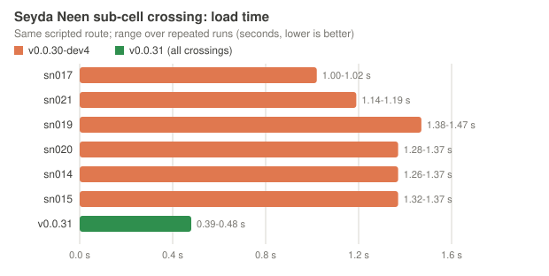

# Seyda Neen cell-crossing performance

Seyda Neen is split into 64 overlapping sub-cell maps. Each crossing between
sub-cells is a full map load, and those loads are the pause players feel when
walking through the town. This page records how the crossings were measured,
what a crossing consists of, and what each optimization changed. Numbers come
from the scripted benchmark below; physical Amiga timings are not measured
here and will differ.

## Benchmark

- Emulator: FS-UAE 3.1.66, A1200/AGA, 68040 with FPU, 2 MiB Chip + 16 MiB Z3
  Fast, warp off. Each run boots a fresh copy of the unplayed disks.
- Route `seyda-east-y-300`: start in the town at a fixed position, then walk
  straight east (console `+forward`) for 60 seconds.
- Expected sub-cell sequence, derived from the region cores and the 96-unit
  hysteresis: sn011, sn017, sn021, sn019, sn020, sn014, sn015. A run is valid
  only if every planned crossing happens in that order and nothing else in
  Seyda Neen loads; loads after leaving the town (open-world regions) are
  recorded but not part of the plan.
- Per crossing the engine writes `cell-load-profile.tsv` (bytes read, read
  calls, read time, total load time) and `heap-audit.log` (heap and cache
  state per load phase, including cache evictions).

## Baseline: v0.0.30-dev4

Two valid runs:

| Sub-cell | Load time (s) | Bytes read |
| --- | ---: | ---: |
| sn017 | 1.00-1.02 | 4,739,069 |
| sn021 | 1.14-1.19 | 5,865,922 |
| sn019 | 1.38-1.47 | 7,987,736 |
| sn020 | 1.28-1.37 | 7,465,152 |
| sn014 | 1.26-1.37 | 7,479,764 |
| sn015 | 1.32-1.37 | 7,475,281 |
| open-world regions (for comparison) | 0.51-0.60 | 2.4-3.0 MB |

About 80 % of a Seyda Neen load is file reading.

## What a crossing reads (sn019)

The sub-cell map itself is 4.98 MB:

| BSP lump | MB |
| --- | ---: |
| planes | 1.06 |
| texinfo | 0.70 |
| faces | 0.65 |
| nodes | 0.55 |
| textures | 0.42 |
| vertexes | 0.38 |
| clipnodes | 0.35 |
| surfedges + edges | 0.77 |
| other | 0.10 |

The remaining ~3 MB of the 8 MB read are actor models and flora sprites:

- **Cached models evicted by the map load.** Entering sn019 evicted 15 cached
  models (cache 2.52 MB down to 1.37 MB), which were then read again from disk
  moments later. The heap is simply full once the sub-cell is loaded (see the
  rejected cache compaction below).
- **Actor models read twice.** The streaming model loader read each converted
  actor model (about 200 KB) once to validate it and again to decode it.
- **Flora sprites** are always reloaded on a map change.

The small read size (about 3.5 KB per call) is deliberate: while loading music
plays, the loader reads in 4 KB slices and services the music between them.
Larger slices would starve the music, so the call count is not the target.

## Heaviest objects

Faces per mesh in sn019 (32,491 faces in the map, 898 of them world brushes):

| Mesh | Placements | Faces each |
| --- | ---: | ---: |
| Terrain and water (one entity) | 1 | 6,771 |
| Imperial prison ship at the docks | 1 | 3,931 |
| Silt strider | 1 | 2,448 |
| Lighthouse | 1 | 1,491 |
| Dunmer shack 02 / 03 | 2 / 2 | 974 / 733 |
| Nord house 02 | 2 | 890 |

The eight largest single objects hold about half of the map's faces. They are
candidates for visual simplification with collision and silhouette kept.

## Optimizations

Each change has a console variable so it can be compared or switched off
without a rebuild. A change is kept only if the benchmark shows a gain and the
switched-off run reproduces the previous build's reads byte for byte.

### Kept: single-pass actor model loading (`aw_alias_single_pass`, default 1)

The streaming loader for converted actor models used to read each file twice:
a validation pass, then a rewind and a decoding pass. The decoding pass already
performs every check the validation pass did, so the loader now reads only the
header and skin type up front, allocates the final cache block and decodes in
one pass. A model with frame groups releases its block and falls back to the
generic loader, as before. Memory use is unchanged: the same cache block and no
staging buffer. `aw_alias_single_pass 0` restores the separate validation pass.

Result (route above, one run with only this change, two runs with it plus the
rejected compaction below, which made no difference):

| Sub-cell | Bytes read, dev4 | Bytes read, single pass | Load time, dev4 (s) | Load time, single pass (s) |
| --- | ---: | ---: | ---: | ---: |
| sn017 | 4,739,069 | 4,739,069 | 0.97-1.02 | 0.98 |
| sn021 | 5,865,922 | 5,668,322 | 1.12-1.19 | 1.11-1.13 |
| sn019 | 7,987,736 | 6,745,932 | 1.34-1.47 | 1.27-1.28 |
| sn020 | 7,465,152 | 6,420,948 | 1.27-1.38 | 1.19-1.22 |
| sn014 | 7,479,764 | 6,435,560 | 1.30-1.39 | 1.20-1.21 |
| sn015 | 7,475,281 | 6,431,077 | 1.28-1.37 | 1.17-1.20 |

About 14-16 % fewer bytes on the heavier crossings and roughly 0.1 s less per
load in the emulator. sn017 loads no actor model that is not already cached, so
it is unchanged. With the switch off, the same engine reads exactly the dev4
byte counts on every crossing.

### Rejected: cache compaction between maps

Idea: between maps, move every cache block up in the heap so the next map can
grow without evicting cached models. Two variants were measured:

- **Packed against the top of the heap: worse.** sn017 read 6.72 MB instead of
  4.74 MB and every crossing evicted 5-13 blocks. The map loader reads each BSP
  section through a temporary buffer taken from the top of the heap (up to the
  largest section, 1.06 MB of planes in sn019), so blocks at the top were
  evicted from that side instead.
- **With a 1,280 KB reserve under the top: no gain.** Evictions stayed the same
  (15 when entering sn019, 5 on later crossings) and the bytes read matched
  the run without compaction.

Conclusion: the evictions are not fragmentation. A fully loaded Seyda Neen
sub-cell uses about 8.9 MB of the 11.5 MB heap for the map, actors and
statics, which leaves about 2.6 MB for the cache. The models of the previous
sub-cell plus the new ones do not fit, whatever the block order. Keeping models
across crossings needs less map memory per sub-cell (lighter meshes, shared
textures, fewer duplicated faces), not a different cache layout. The
compaction code was removed.

## Where the sub-cell geometry comes from

Partitioning the full Seyda Neen conversion with the public tools and terrain
culling switched off gives much smaller sub-cells than the ones that ship:

| Sub-cell | Shipped | Public partition, no terrain cull |
| --- | ---: | ---: |
| sn011 | 3.68 MB, 24,533 faces | 2.68 MB, 14,086 faces |
| sn017 | 4.35 MB, 26,551 faces | 3.61 MB, 18,479 faces |
| sn019 | 4.98 MB, 32,491 faces | 4.34 MB, 25,415 faces |
| sn029 | 4.72 MB, 30,599 faces | 4.34 MB, 25,296 faces |

The shipped sub-cells replace the town's own ground with the denser canonical
world terrain (about 7,700 terrain faces in sn019 against about 4,000), so the
town meets the surrounding world without seams. That step was done outside
the public build and cannot be regenerated with it yet
([BUILD-SEYDA-REGEN-30](BUG_JOURNAL.md)). A seam-free ground with fewer faces
(error-bounded simplification of flat ground, shoreline and edges kept exact)
is the next large saving after the meshes.

## Not changed

- The 4 KB read slices while loading music plays (see above).
- The sub-cell layout. Fewer, larger zones need heap headroom first.
