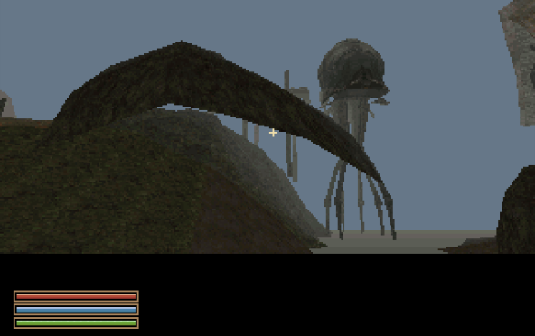
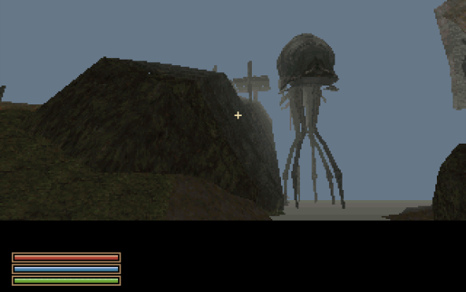

# What are rocks? — terrain coverage and conversion workflow

Findings from the owned base master and NIFs, 29 September 2026, v0.0.23-dev3.

## LAND is only one part of the landscape

Morrowind LAND records provide a height field and its ground materials. They do
not contain the entire visible landscape. CELL references place separate NIF
meshes over and into that ground: boulders, outcrops, cliffs, building foundations,
platforms and other structural scenery. Those meshes can cover a coarse slope or
hide a join. A correct heightmap alone does not guarantee an intact-looking hill.
Never seal a reported opening with invented terrain until the source placements,
transforms, render visibility and collision have been inspected.

In this export the rock base objects are **STAT** records, placed through CELL
references with position, rotation and scale. There is no separate ROCK record
category. The base ID and MODL filename identify useful families, but matching a
name is a conversion policy, not proof that an object is decorative or removable.

| Identified family | Examples in this area | Observed source triangles per mesh |
| --- | --- | ---: |
| Terrain rocks | `terrain_rock_bc_*`, `terrain_rock_ai_*`, `terrain_rock_rm_*`; `meshes/f/Terrain_rock_*.nif` | 70–180 |
| Nordic rock/foundation pieces | `ex_nord_rock_01/02`; `meshes/x/Ex_nord_rock_*.nif` | 30–35 |

Directory `f/` alone is not a foliage classifier. Terrain rocks there must not be
removed by a broad vegetation filter. Deleted references remain excluded; keep
the original scale and all three rotation components.

## Silt Strider case: inclusion was correct, orientation was wrong

The reported camera is local `XYZ 263 463 19`, yaw 352, pitch -17. The large rock
covering this part of the port hillside is `terrain_rock_bc_18`, reference 251560,
from exterior cell (-2,-9). Its original placement is approximately
(-8536.042, -69810.516, 417.597), scale 2. Its local origin is
(681.990, 467.371, 104.399); rotations are approximately
(5.783185, 6.083185, 5.016813) radians. It was already in both the exported scenery
and final BSP: simply adding more rock references would not repair this defect.

The converter composed rotations as Rz × Ry × Rx. TES3 placement here requires
Rx(-x) × Ry(-y) × Rz(-z) for column vectors, the same convention already corrected
for the intro collision boxes. A yaw-only test cannot catch this error. The wrong
order tilted the rock above the LAND surface like a floating roof, exposing the
background underneath. With entities hidden, native captures showed the intact
underlying LAND slope; with the corrected rock transform, the gap closed.

Runtime still applies entity yaw. The host now bakes the inverse of that yaw
against the full authored transform, so the composed result is correct. Tilted
placements with different yaws no longer incorrectly share a bake. Geometry,
texture coordinates, collision pieces and selection bounds use the same transform.
No hand-positioned filler and no increased draw distance were required.

## Low-poly policy

Terrain rocks now use a host-side **64 visual-triangle target per source mesh**,
retaining originals when already below it. Reduction respects separate material
components, so the target is not an unconditional hard cap. Tiny disconnected
pieces may need extra triangles. Textures remain 64×64; original geometry still
supplies the approximate collision conversion. Small Nordic pieces remain at
30–35 source triangles. This is a static bake, with no runtime LOD switching.

The rebuilt exterior has 49 distinct terrain-rock bakes: 3,119 BSP faces versus
5,179 before reduction. The port rock drops from 174 source triangles to 64 visual
triangles. Individual reduced rock bakes use 63–65 BSP faces (UV/material splits
can differ from triangle counts).

Rock coverage is structural. Inspect the reduced silhouette and the LAND overlap
at the source placement, especially for large scaled rocks. If a reduction exposes
a seam, preserve the needed boundary or use a documented per-model exception;
do not hide it by increasing fog. Count final BSP surfaces/edges as well as input
triangles: UV splitting may create additional rasterizer work. Native visibility,
walkability, memory and frame-cost checks decide whether the reduced asset ships.

## Required workflow

1. Record camera XYZ, yaw, pitch, current map and version; retain a native capture.
2. Inspect source LAND and nearby CELL references, including meshes whose bounds
   intersect the area even when their origins are outside it.
3. Resolve STAT/ACTI/DOOR model paths and verify source → exported reference → BSP
   presence. Inspect separate visual and authored collision geometry.
4. Compare a terrain-only view, full scene, fog-off and culling diagnostics. A
   disappearing wall is not automatically a missing mesh or missing ground.
5. Validate compound rotation, scale, winding and material coordinates before
   simplification. Rebuild geometry and collider/bounds together.
6. Apply the low-poly budget and repeat the original camera plus nearby angles;
   walk the route and check collision independently. Record measured counts,
   exceptions, evidence and remaining uncertainty in the checkpoint.

The separate Vodunius-house hole was a renderer ordering defect: far-culled world
leaves could still supply stale order keys to clipped brush fragments. The fix
makes world, brush-fragment and entity-split traversal agree on the far plane.
It did not require changing the house mesh, disabling culling or importing rocks.

## Native evidence

| Before: wrong compound rotation | After: corrected, 64-triangle visual rock |
| --- | --- |
|  |  |

FS-UAE captures at the reported port position, cropped only to the game viewport.
The displayed repair is verified at these views. Full port walking/collision
acceptance and other rock seams still require inspection; a visual closure does
not certify every collider.

## dev4 follow-up

The owner confirms the port rock fix in dev3. The later missing rider was an
entity spawn-order problem: actor floor traces ran before the platform brushes
were linked. The cut-off town tree was a signed sprite-depth comparison against
the background. Neither required changing the accepted rock mesh or terrain.
See [dev3 feedback trials](FEEDBACK-v0.0.23-dev3.md) for the discarded culling
experiment and the final fixes. Preserve structural rocks when optimizing LAND.
