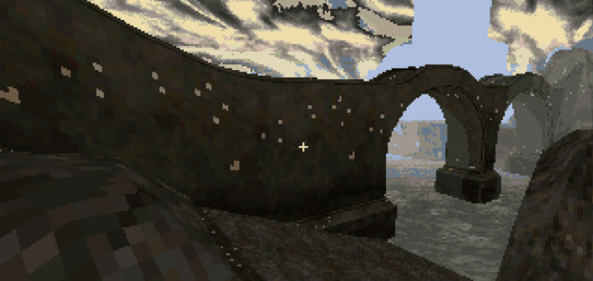
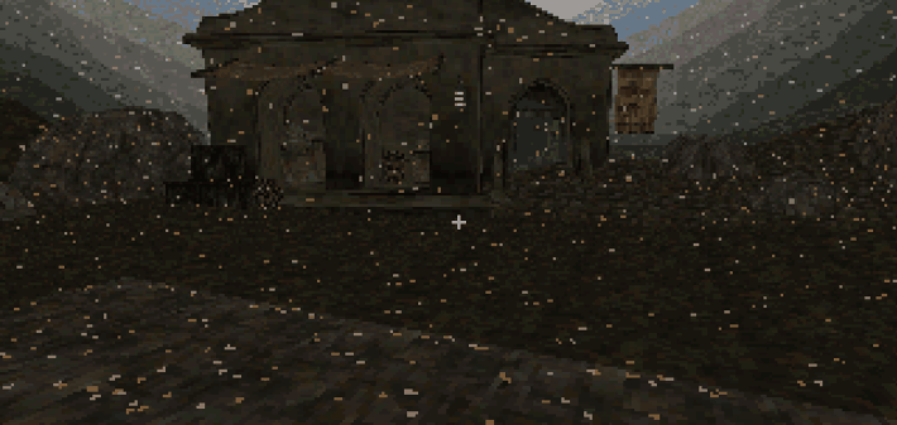

# CHIM-TEXTURE-SPECKS-33: CHIM-drawn surfaces show bright single-texel specks that legacy frames do not

<!-- BEGIN GENERATED FACTS: edit docs/bugs/bugs.json, then run tools/bug_register.py render -->

| Fact | Value |
| --- | --- |
| Reported by | audit |
| First noticed | 8 October 2026, in v0.0.33-dev |
| Where | CHIM shared textures (texture pack in tools/chim) |
| Reproduction | always |
| Duplicate of | no |
| Persists in | v0.0.33-dev (last seen) |
| Severity | medium: CHIM-drawn surfaces show many bright specks that legacy frames lack. |
| Family | CHIM world streamer (`chim-streamer`) |
| CHIM | Builder ([CHIM Engine tracker](CHIM_TRACKER.md)) |
| Playtest version | CHIM Preview 1 |
| From commit | source 0f467e4, engine 0d8bf4f, CHIM world unknown |
| CHIM engine version | CHIM 0.1.0, engine 0d8bf4f, world format 0.4 |
| Unknown because | the CHIM world receipt records no commit: world built 8 October 2026 17:54 +03:00 on the v0.0.33-chim-format branch before 8caf66e (CHIM-RECEIPT-COMMIT-33) |
| Build note | first seen in a development emulator session of the same Balmora world on 8 October 2026 (a3ef932); the owner saw it in CHIM Preview 1 on 9 October 2026 |

<!-- END GENERATED FACTS -->

<!-- contents start -->
## Contents

- [Status: 9 October 2026](#status-9-october-2026)
- [Symptom](#symptom)
- [Where](#where)
- [How it happened](#how-it-happened)
- [Why it was not caught](#why-it-was-not-caught)
- [Reproduction](#reproduction)
- [Repair](#repair)
- [Verification](#verification)
- [Prevention](#prevention)
- [From bug to effect](#from-bug-to-effect)
- [Bugs in the same category](#bugs-in-the-same-category)

<!-- contents end -->

## Status: 9 October 2026

Fixed in source (8caf66e, 8 October), not shipped. The owner's playtest of a CHIM preview build on
9 October showed the specks all over Balmora: that build carried a CHIM world built before the
repair. The CHIM validator now refuses a world that keeps texels on the sky bank, and the look is
kept as an opt-in texture effect, `autumn_glitter_leaves` ([CHIM texture effects](../chim/TEXTURE_EFFECTS.md)).

Found by the first FS-UAE comparison of Balmora drawn by CHIM and by the legacy maps (8 October).

## Symptom

Surfaces drawn from the CHIM world (placed models and terrain) show scattered bright single-texel
specks that the legacy frame at the same pose does not have: orange and cream by day, glowing
orange and red at dusk, white near lamps at night. They sit on the texels (bigger up close, thinner
with distance) and follow the lighting like any other texel.

## Where

CHIM shared textures (`tools/chim/`, the texture pack); the legacy maps' textures are the
reference.

## How it happened

The image's sky overlay (`tools/sky_palette_overlay.py`) moves every indexed pixel of the boot
payload off seven palette entries (83, 95, 133, 140, 156, 221, 222) and repaints those entries as
sky colours (cream, red, orange, amber, magenta, blue, purple), which the engine's sky code tints
through the day (`r_sky.c`). The CHIM world is packed on its own volume and never went through the
overlay, so its texels on those entries were drawn in the sky colours. Quake mechanism: palette
indexed miptex texels, shaded by the colormap under the baked lightmap in the surface cache
(`d_surf.c`), so the specks react to light; nothing else in the engine is involved.

Measured (8 October 2026):

- 38 of the textures in the legacy Balmora region map bm028 differ by 1 to 92 texels from the
  closest CHIM shared texture;
- isolated bright specks: 5 in the legacy textures against 333 in the CHIM ones for the same set;
  700 across all 176 CHIM textures.

The specks remain with `r_fullbright 1`, `aw_emissive 0` and `r_drawentities 0`, and grow into
blocks with `d_mipcap 3` (smaller mip levels), so they are in the texture data, not made by the
engine.

Measured on the preview build's world (9 October 2026): 858 of 247,808 full-size texels in 86 of
176 textures on banked entries (406 on 140, 438 on 83, 14 on 221). A world of the same frame built
after the repair has 0. Texels on palette entries 224 to 254 are the same 3,088 in both worlds, so
they are not the cause.

## Why it was not caught

The CHIM validator checked texture counts, sizes and sharing, not the palette entries the image
repaints. The repair landed in source, but the register still said open, and the preview build was
assembled from a world built a few hours before the repair; nothing checked that world's textures.

## Reproduction

The same Balmora pose under CHIM and legacy in FS-UAE; texel comparison of each CHIM shared
texture with the matching texture of the legacy region maps; or count the texels on the seven
banked entries in the world's textures.

## Repair

8caf66e: the overlay's pixel translation is one shared function (`remap_miptex`), applied by the
CHIM builder to every texture of a frame when the palette passes the overlay's guard; the material
quantization is one function for the legacy converter and the CHIM texture unit.

9 October: `tools/chim/validate.py --palette` fails a world with texels on the banked entries
(textures an opted-in texture effect changed are exempt, from the receipt), and `chim_build.py
--validate` passes the build palette, so the builder's `chim` stage gates every CHIM world.

The look itself is kept on purpose, off by default: `tools/chim/effects/autumn_glitter_leaves.chimfx`
puts the same three colours back in the same shares on 2 % of texels, deterministic and stable
across mip levels, with `--chim-texture-effect autumn_glitter_leaves` (builder) or
`--texture-effect` (CHIM builder). Seen in FS-UAE on the repaired world at the same poses.

## Verification

FS-UAE, the same image (the v0.0.32 image with the CHIM engine), headlamp off, six poses in
Balmora by day, at dusk and at night: A = the legacy maps (`chim_towns 0`), B = the preview's CHIM
world, C = the same image with the repaired world, D = B with `r_drawentities 0`. B shows the
specks on terrain, walls and arches at every pose, D on the terrain alone; A and C are clean and
match each other. Chunk loads that fail for lack of zone room happen in B and C alike, so they are
not linked to the specks. Tests: `tests/test_chim_textures.py` (parity with the legacy chain) and
`tests/test_chim_texture_effects.py` (the validator gate, the effect off by default, its format,
determinism, density and mip stability).

## Prevention

The validator gate above (part of every CHIM build with `--validate`), and the register is updated
in the same change as a repair.

## From bug to effect

Some bugs are worth keeping. The specks looked like autumn leaves blowing through Balmora, so the
look became a reusable texture effect instead of being thrown away.

Before: the CHIM preview build's world (CHIM 0.1.0 engine on the v0.0.32 image, world built
before the repair). Balmora, the river wall by the bridge arches, near Morrowind position
-20081, -18113, 14:00, headlamp off, FS-UAE.

After: the same image and pose with the repaired CHIM world: clean, as the legacy maps draw it.

The effect: the repaired world with `autumn_glitter_leaves` turned on. Balmora, a street near
Morrowind position -23807, -15931, 14:00, headlamp off, FS-UAE.

The look now lives in the public CHIM effects library ([tools/chim/effects/](../../tools/chim/effects/README.md))
as [autumn_glitter_leaves.chimfx](../../tools/chim/effects/autumn_glitter_leaves.chimfx), a short
text file: the three colours of the original specks in the same shares, on 2 % of texels. It is off
by default. Turn it on with `--chim-texture-effect autumn_glitter_leaves` (with `--builder chim`),
or list it in a build config under `"chim_texture_effects": ["autumn_glitter_leaves"]`. Anyone can
reuse or adapt it: copy the file, change its colours, density, size, seed or `targets` (texture
name patterns) and point the builder at the new file. The format is described in
[CHIM texture effects](../chim/TEXTURE_EFFECTS.md).

<!-- BEGIN GENERATED CATEGORY: edit docs/bugs/bugs.json, then run tools/bug_register.py render -->

## Bugs in the same category

Family: CHIM world streamer (`chim-streamer`). The CHIM streamer keeps Quake's visibility effective and its renderer counters must not get worse. See [families](README.md#families).

- [CHIM-ACTOR-RING-33](CHIM-ACTOR-RING-33.md): A scripted actor step could move the CHIM chunk ring to the actor
- [CHIM-ACTORS-OUTSIDE-RING-33](CHIM-ACTORS-OUTSIDE-RING-33.md): Actors outside the CHIM ring have no terrain collision
- [CHIM-ANIM-TEXTURES-33](CHIM-ANIM-TEXTURES-33.md): Animated shared textures in CHIM show only their first frame
- [CHIM-ARENA-MEMORY-33](CHIM-ARENA-MEMORY-33.md): The Vivec Arena does not fit the CHIM zone: canton bodies are single models of 1.4-2.5 MB
- [CHIM-BORDER-COLLISION-33](CHIM-BORDER-COLLISION-33.md): Collision near CHIM chunk borders ignores the neighbour chunk's ground
- [CHIM-CHUNK-LOAD-FAIL-33](CHIM-CHUNK-LOAD-FAIL-33.md): Balmora chunks fail to load on CHIM, never recover, and leave holes without ground
- [CHIM-FAR-OBJECTS-33](CHIM-FAR-OBJECTS-33.md): Houses between the CHIM ring and the legacy overlap depth are missing from the fogged horizon
- [CHIM-FAR-TERRAIN-33](CHIM-FAR-TERRAIN-33.md): A CHIM frame has no distant ground: beyond the active ring the land is missing (empty valleys, Vivec not visible from the world)
- [CHIM-FRAME-WORLD-BOUNDS-33](CHIM-FRAME-WORLD-BOUNDS-33.md): A CHIM frame map must carry an empty world whose bounds cover the frame
- [CHIM-FROZEN-ACTORS-33](CHIM-FROZEN-ACTORS-33.md): Frozen CHIM actors: projectiles stop mid-air and timers stop
- [CHIM-GRAFT-REPACK-EMPTY-33](CHIM-GRAFT-REPACK-EMPTY-33.md): A frame world repack without room for the whole ring drops every chunk: the world vanishes and the player falls under Seyda Neen
- [CHIM-HARVEST-NAMING-33](CHIM-HARVEST-NAMING-33.md): A town-wide CHIM harvest catalogue does not fit the name and size limits
- [CHIM-HARVEST-REMOVED-MAPS-33](CHIM-HARVEST-REMOVED-MAPS-33.md): A pure CHIM image stops at the save fingerprint: harvest catalogues of the removed town region maps have no matching map
- [CHIM-HIDDEN-FACES-33](CHIM-HIDDEN-FACES-33.md): CHIM draws placed-model faces under the terrain that the recorded Seyda Neen region maps cull
- [CHIM-HULL-CHAIN-COST-33](CHIM-HULL-CHAIN-COST-33.md): Large placed models collide through one long chain of convex pieces: a trace near the Arena canton walks about 6,600 planes
- [CHIM-HULL2-33](CHIM-HULL2-33.md): CHIM terrain uses the player hull for large entities
- [CHIM-LEAF-SPAN-33](CHIM-LEAF-SPAN-33.md): 160 of 1,488 Balmora placements span more than 16 leaves
- [CHIM-LIGHT-CONTENTS-33](CHIM-LIGHT-CONTENTS-33.md): Actor lighting and water contents ignore CHIM chunks
- [CHIM-PACK-DIRS-33](CHIM-PACK-DIRS-33.md): CHIM pack directories are fully resident and would grow to about 400 KB for the island
- [CHIM-PAYLOAD-PARITY-33](CHIM-PAYLOAD-PARITY-33.md): The CHIM world misses the image step's edits to Balmora (harvest mushrooms, town flora)
- [CHIM-PVS-HOLLOW-33](CHIM-PVS-HOLLOW-33.md): Chunk visibility culls almost nothing in Balmora: houses have hollow collision shells
- [CHIM-READ-BUDGET-33](CHIM-READ-BUDGET-33.md): CHIM per-frame read budget can be exceeded by a whole lump
- [CHIM-REBUILD-COST-33](CHIM-REBUILD-COST-33.md): Each CHIM crossing rebuilds the whole frame world; the cost is not measured
- [CHIM-RECEIPT-COMMIT-33](CHIM-RECEIPT-COMMIT-33.md): CHIM world receipts do not record the commit the world was built from
- [CHIM-SEYDA-ACTOR-CONTACT-33](CHIM-SEYDA-ACTOR-CONTACT-33.md): rc1 image step refuses Seyda Neen's CHIM frame map: six actors stand 0.8-3.3 units off the CHIM ground
- [CHIM-TERRAIN-GRAFT-33](CHIM-TERRAIN-GRAFT-33.md): CHIM chunk terrain is a brush entity, not part of the world tree, so it does not occlude
- [CHIM-TERRAIN-HULL-BEVELS-33](CHIM-TERRAIN-HULL-BEVELS-33.md): A standing box rests above the ground at convex CHIM terrain edges
- [CHIM-VALIDATOR-ORDER-33](CHIM-VALIDATOR-ORDER-33.md): The CHIM validator walk depended on Python string hashing
- [CHIM-VIEW-FACES-33](CHIM-VIEW-FACES-33.md): Model faces dominate each Balmora view: the streamer alone does not fix frame rate
- [CHIM-ZONE-RING-THRASH-33](CHIM-ZONE-RING-THRASH-33.md): Balmora's chunk ring does not fit the default 6 MiB CHIM zone, so the cache thrashes
- [CHIM-ZONE-TMP-NOEXEC-33](CHIM-ZONE-TMP-NOEXEC-33.md): The CHIM zone walk gate cannot load its host library when /tmp is mounted noexec

<!-- END GENERATED CATEGORY -->
