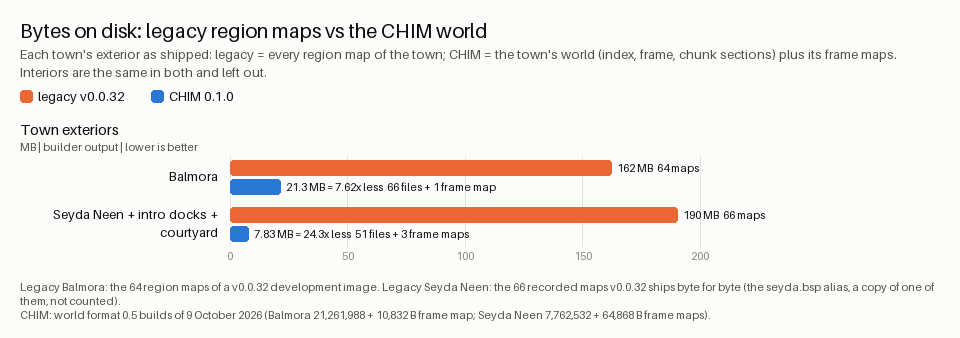

# Disk space: Amiga limits and what CHIM saves

AmiWind has to fit a whole Morrowind on classic Amiga disks. This page states
the disk limits the builder enforces, why the legacy region maps ran out of
room, what CHIM saves (measured on the first two towns, estimated for the
island), and what the whole game is expected to weigh once everything is
CHIM-optimized. Every number is marked as measured or estimated.

<!-- contents start -->
## Contents

- [1. Amiga disk limits](#1-amiga-disk-limits)
- [2. Why the legacy method ran out of room](#2-why-the-legacy-method-ran-out-of-room)
- [3. What CHIM changes (measured)](#3-what-chim-changes-measured)
- [4. Today's sizes](#4-todays-sizes)
- [5. Whole-island estimate for the world data](#5-whole-island-estimate-for-the-world-data)
- [Whole game on CHIM: size budget](#whole-game-on-chim-size-budget)

<!-- contents end -->

*AmiWind is an unofficial, experimental project. Not affiliated with or
endorsed by Bethesda Softworks or ZeniMax.*

## 1. Amiga disk limits

These are platform facts, not preferences. The builder's disk-layout gate
refuses a layout that breaks any of them, so a build stops instead of
producing a disk that fails on an Amiga.

| Limit | What it means |
| --- | --- |
| Every partition below 2 GiB | A classic Amiga FFS partition on Kickstart 3.1 cannot reach 2 GiB. The builder sizes each partition from its payload plus about 20 percent and 16 MiB of headroom, rounded up to 128 MiB, and stops if the result would reach 2 GiB (`partition_mib` in `tools/chim/disk.py`; the boot partition in `tools/build_aga.py` uses the same rule). With that headroom one partition holds about 1.66 GB of files. |
| Every partition must also *start* below 2 GiB on its drive | Kickstart 3.1 does not mount a partition that starts past the 2 GiB mark. A v0.0.33 development build hit this: the Amiga asked "Please insert volume AW_WORLD3", because the AW_WORLD3 partition started beyond the limit. The builder now orders the partitions so that every one starts below 2 GiB, and its disk-layout gate refuses a layout where one does not. Tracker entry: AMIGA-DISK-2GIB-LIMIT-33. |
| Files well under 2 GiB | World packs stay below about 1 GiB and are sharded (the validator enforces 1 GiB per file; [world format](WORLD_FORMAT.md#disk-layout)). A drive image file should also stay clear of 2 GiB for host tools; see WORLD-HDF-OVER-2GIB-32 in the [bug register](../BUGS.md). |
| Drive images below 4 GiB | One drive image (a hard file with a partition table) stays below 4 GiB, partition table and alignment included. Two partitions of exactly 2 GiB would already break it ([storage notes](../STORAGE.md)). |
| Classic FFS rules | File names of at most 30 characters, at most 72 entries per directory (one directory block has 72 hash chains), every file whole on the disk and written in the order the engine reads it. |

The disk-layout gate lives in `tools/chim/disk.py` (`layout_gate`, with
`name_rules` for the name and directory rules) and is tested in
`tests/test_chim_disk.py`; the partition size rule is in `tools/build_aga.py`.
Its report goes into the image's `build.json`
([world format](WORLD_FORMAT.md#disk-layout), [build output](../BUILD_OUTPUT.md)).

The target is the whole game on one hard file. Two drive images are the
absolute maximum ([world streamer](../WORLD_STREAMER.md#disk-budget)).

## 2. Why the legacy method ran out of room

In the legacy method every exterior region is a self-contained Quake map. A
region is a 768-unit core plus an overlap of 896 units on every side, so
everything visible from the core, out to the draw distance, has to be inside
that map in full detail. A region map covers about eleven times its core area.

The result, measured by the whole-world estimate
([WORLD-REGION-DUPLICATION-31](../bugs/WORLD-REGION-DUPLICATION-31.md)):

- Across all exterior regions the objects placed add up to 1,403,340 against
  143,147 exterior objects in the game: each object is stored **about 9.8
  times**, with its faces, collision and lightmaps.
- The whole island would need **about 20 GB of maps** (about 18 GB of them
  exterior maps), against 4.79 GB of game files for the two towns that
  v0.0.31 shipped.
- Per face, measured on the shipped towns: Seyda Neen's maps store each face
  24.1 times on average, Balmora's 7.3 times
  ([sub-cell redundancy](../SUBCELL_REDUNDANCY.md)).
- Textures repeated in every map add up to more than the original game's whole
  texture set.

For scale, the original game's masters are small: `Morrowind.bsa` is
310,459,500 bytes and `Morrowind.esm` 79,837,557 bytes; the expansions add
`Tribunal.bsa` (64,986,032), `Bloodmoon.bsa` (118,425,318) and their `.esm`
files ([Morrowind editions](../MORROWIND_EDITIONS.md)). The original game
stores each mesh once and places it by reference. CHIM does the same.

## 3. What CHIM changes (measured)

CHIM stores every mesh, collision hull and texture **once**, places it by
reference, streams the world in small chunks around the player, and keeps one
small resident layer for the far view. See [CHIM](README.md) and the
[world format](WORLD_FORMAT.md).

Measured on world format 0.5 builds of 9 October 2026, exteriors only, bytes on
disk:

| Area | Legacy region maps | CHIM world | Smaller by |
| --- | ---: | ---: | ---: |
| Balmora exterior | 64 maps, 162 MB | 21.3 MB (21,261,988 B, plus a 10,832 B frame map) | 7.62 times |
| Seyda Neen, the intro docks and the courtyard | 66 maps, 190 MB | 7.83 MB (7,762,532 B, plus 64,868 B of frame maps) | 24.3 times |

Seyda Neen gains more because the legacy maps stored each of its faces about
24 times, Balmora's about 7.

## 4. Today's sizes

- A **MiniWind** sandbox (Balmora on CHIM, a private partial-area test build,
  [MiniWind](../MINIWIND_PLAYTESTER.md)) is a **1 GiB** disk.
- The v0.0.33 development full build is a **hybrid**: the CHIM towns plus the
  legacy open world. It comes to about 4 GB plus a 2.4 GB world disk (two
  drive images; the exact sizes are in each build's receipt). That is why the
  partition rules above mattered: the more partitions the hybrid needs, the
  sooner one starts past 2 GiB.
- The target is the **whole island on CHIM on one hard file**. The budget
  below says whether that is realistic.

## 5. Whole-island estimate for the world data

The repository's own estimate for the whole game's world data is the
[asset census](../ASSET_CENSUS.md) (section 6, "Disk"), computed from
measured per-placement costs and the island's placement counts with
`tools/world_chunk_estimate.py`. That tool reads converted region maps, so it
cannot be run without game data; the numbers below are the census's documented
output. They are estimates, made before the CHIM world format existed, and the
island-wide conversion (milestones M4 and M5 in [CHIM](README.md#milestones))
will replace them with measurements.

| Scenario | World data | Plus today's non-world payload (694 MB, v0.0.31) | Fits |
| --- | ---: | ---: | --- |
| Per-variant geometry and hulls, 16-unit lightmaps | 2.30 GB | 3.00 GB | one drive image, 90 % full |
| Recommended: one geometry per mesh (scale and tilt at run time), 32-unit terrain lightmaps | 1.06 GB | 1.75 GB | one drive image, 53 % full |
| Lean: unexpanded hulls, 32-unit interior lightmaps | 0.91 GB | 1.61 GB | one partition |

Assumptions: interiors move from one copy per placement (about 20.9 KB per
placement, about 3.9 GB for every interior of the game, measured on 58
interiors) to shared kit pieces with per-placement lightmaps; exteriors keep no
per-placement lightmaps; terrain becomes a quantized heightfield (12.9 KB per
cell). Against the 20 GB of maps the legacy method needs, the recommended
world data is roughly **twenty times smaller**; it is about 1.8 times the
original game's `Morrowind.bsa` plus `Morrowind.esm`, as the census notes.

## Whole game on CHIM: size budget

The census above covers the world data. This section adds the rest of the game
and gives one total. Sizes are decimal megabytes (MB) unless a unit says
otherwise.

How to read the columns:

- **Today** is measured unless it says *estimate*; the source and build are
  named.
- **CHIM-optimized** is always an *estimate*: the measurement that would settle
  it is named in the last section.
- **Confidence** is high when the number is a measured payload that CHIM does
  not change, medium when it is computed from measured unit costs, and low when
  it rests on the census alone.

### The budget, row by row

| Category | Today | CHIM-optimized (estimate) | Basis and assumptions | Confidence |
| --- | --- | --- | --- | --- |
| Exterior world (CHIM chunks plus the resident far layer) | Legacy region maps: about 18 GB for the island (estimate, [WORLD-REGION-DUPLICATION-31](../bugs/WORLD-REGION-DUPLICATION-31.md)). Measured on two towns: Balmora 162 MB, Seyda Neen area 190 MB. | **188 MB**: terrain 19 MB, exterior hulls 161 MB, placement records 8 MB | Census "recommended" scenario ([asset census](../ASSET_CENSUS.md)). Measured CHIM towns: Balmora 21.3 MB, Seyda Neen area 7.83 MB. The resident far layer is the quantized heightfield (12.9 KB per land cell, 16.7 MB for Vvardenfell), already inside the terrain figure. Balmora alone is more than a tenth of the island figure; that is plausible because towns are far denser than open country, and it is one reason the confidence is low. | Low |
| Interiors | Every interior stored as its own map, one copy per placement: about 3.9 GB (estimate from 58 measured interiors, [asset census](../ASSET_CENSUS.md)). | **578 MB**: interior hulls 479 MB, interior lightmaps 99 MB (the geometry is in the shared store) | Census "recommended": shared kit pieces placed by reference with per-placement lightmaps at 16-unit samples (25 MB at 32-unit). Not built yet: interiors are still per-cell maps in every build, so this is the design target, not a result. | Low |
| Shared mesh and texture store | Not a separate item: meshes and textures are repeated inside every map; the textures alone exceed the original's texture set ([world streamer](../WORLD_STREAMER.md#disk-budget)). | **294 MB**: exterior geometry 70 MB, interior geometry 205 MB, textures 19 MB | Census "recommended": one model per mesh, run-time scale and tilt, every texture once. The original game's whole art archive is 310 MB, so this is the same order of size. | Low to medium |
| NPCs (resident actor models) | Baked whole, one model per actor. Measured: 128 models, 27.6 MB in the v0.0.32 image (median 201 KB); Balmora, 191 NPC records, 18 MB (MiniWind build of 9 October 2026). All 2,675 humanoid records baked whole: about 535 MB (estimate). | **67 MB** (4-level parts library) to **173 MB** (exact library) | [Modular NPCs](../MODULAR_NPCS.md): 3,500 distinct appearances use 68,001 part uses but only 1,726 distinct parts (942 mesh files), so each part is converted once and a recipe per actor composes the model at load time. The two figures are computed from the measured cost per output face. | Medium |
| NPC gallery (inspection models of all characters) | Measured: 233 MB, 2,935 records (MiniWind build of 9 October 2026); 228.7 MB for 3,551 models (v0.0.32 build from scratch). | **About 0 MB extra** if the game composes gallery models from the parts library; 7 to 73 MB if a separate gallery library is kept | [Modular NPCs](../MODULAR_NPCS.md), "Build time and disk": "the gallery's disk use falls from 228.7 MB to the library size". | Medium |
| Voices (dialogue audio) | The media stage of the MiniWind build of 9 October 2026 wrote 207 MB of sound for 6,447 voice files and 717 sound effects. Derived split: Balmora's 4,158 voices take 121 MB (29 KB each), so all 6,447 voices are about 188 MB. Derived, not itemised. | **188 MB**, unchanged | Audio is not world geometry; CHIM does not change it. Leaving out the voices of NPCs a build does not include is a build option, not a CHIM saving. | Medium |
| Sound effects | The remainder of the 207 MB: about 19 MB for 717 effects (derived). | **19 MB**, unchanged | As above. | Medium |
| Music | 56 MB, 19 tracks (same build; the same figure as [storage notes](../STORAGE.md)). | **56 MB**, unchanged | Streamed PCM; not touched by CHIM. | High |
| Videos | 100 MB of intro videos (same build). | **100 MB**, unchanged | Optional content. | High |
| Fonts, UI, menus, engine, tables | "Other media" 62 MB in the media stage of the same build. The engine executable, tables and configuration are not itemised separately. | **About 62 MB**, unchanged | The engine gains a world streamer, which adds little code next to this. | Medium |

Cross-check: the census's non-world payload of v0.0.31 was 694 MB (sound,
music, intro video, gallery, actor models, executables, tables). The measured
rows above for sound, videos, music, gallery and other media add up to 658 MB,
which is consistent.

### Totals against the limits

| Scenario | Total (estimate) | One partition (about 1.66 GB of files) | One drive image (below 4 GiB) |
| --- | ---: | --- | --- |
| Everything CHIM-optimized, 4-level NPC library, gallery composed from the library | **about 1.55 GB** (1,552 MB) | Fits, with about 0.1 GB to spare | Fits, with room for saves |
| Everything CHIM-optimized, exact NPC library | **about 1.66 GB** (1,658 MB) | At the edge: the partition size rule reaches 1,920 MiB, still below 2 GiB, with nothing to spare | Fits |
| World on CHIM, NPCs and gallery baked whole as today | **about 2.25 GB** (2,253 MB) | Does not fit; needs two partitions | Fits in one image: both partitions start below 2 GiB, because the first ends below it |
| Legacy region maps (today's method, whole island) | **about 21 to 23 GB** (20 GB of maps from the register, about 22 GB with the census's interiors, plus 0.7 GB of everything else) | No | No: several drive images, which is why the legacy method cannot be the whole game |

The third column is the point: with every saving in place the whole game is
close to *one* partition, and the 4 GiB image limit is far away. Without the
modular NPCs and the instanced interiors, it needs both partitions of one
image.

### What dominates, and what a user can leave out

- **The world data dominates:** exterior, interiors and the shared store are
  about 1.06 GB of roughly 1.55 GB (68 percent). Inside it, interiors (578 MB)
  are the largest single row and the least certain one, since they have not
  been converted the CHIM way yet.
- **Audio is the next block:** voices, effects and music add up to about
  263 MB (17 percent) and CHIM does not change them.
- **Optional items:** the intro videos (100 MB) can be left out without
  affecting play. The NPC gallery (233 MB today) is an inspection feature, not
  gameplay; the builder keeps it by default and the `--no-npc-gallery` option
  leaves it out, labelled as a quick-test build. With the modular NPC library
  the gallery costs almost nothing, so the saving from leaving it out shrinks
  to the size of the library. Leaving out both the videos and the baked gallery
  removes 333 MB from the 2.25 GB scenario.
- The voices of NPCs that a given build does not include are a further
  build-time saving (MiniWind builds use it), not a property of the whole game.

### What will settle the open rows

- **Exterior world:** the island-wide CHIM conversion (M4 and M5) with the
  builder's `chim-stats.json` disk figures ([CHIM statistics](STATS.md)),
  compared with the census figure and with the two measured towns.
- **Interiors and the shared store:** convert Balmora's interiors with the
  shared-kit method, measure bytes per interior and per placement, then
  extrapolate with the census's placement counts; the island-wide interior
  conversion replaces the extrapolation.
- **NPCs and gallery:** build the parts library for all 1,726 parts and record
  its bytes per quota level; compare with the 67 MB and 173 MB estimates.
- **Voices, effects, music, videos, fonts and UI:** itemise the payload of one
  full build from the image's readback inventory (`build.json` lists per
  partition payload and file counts); the sound stage's split between voices
  and effects, and the executable, tables and fonts inside "other media", come
  out of that list.
- **Total:** one from-scratch whole-game build on CHIM, with its partition
  report from the disk-layout gate. That number replaces this table.
