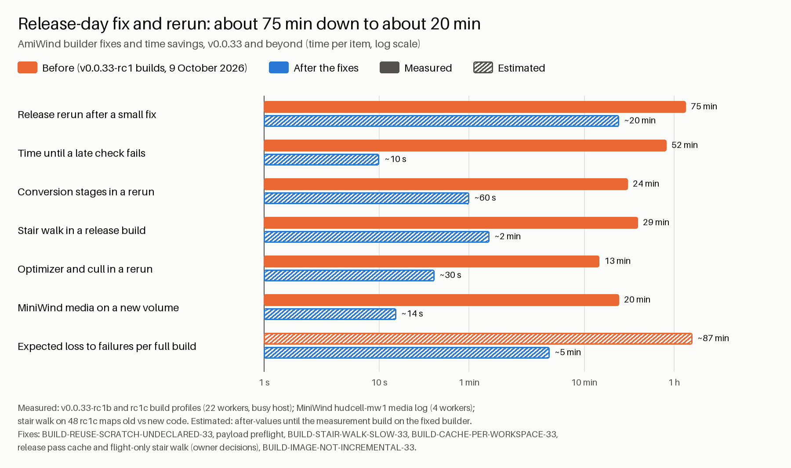

# Builder profile: where a full build spends its time

Measured 9 October 2026 from the build profiles (`build-profile.json`, section timers, one-second
core samples) of the v0.0.33-rc1 builds, and from side-by-side runs of single passes. Every number
says what host load it was taken under: all full builds of that day ran on a **busy host** (other
builds and gates used 25 to 60 % of the 24 threads), so core counts and wall times are lower and
longer than on a quiet host. Processor-seconds (CPU-s) are the steadier currency; wall times on a busy
host are compared only with wall times of the same session.

<!-- contents start -->
## Contents

- [Contents](#contents-1)
- [Builder fixes and time savings, v0.0.33 and beyond](#builder-fixes-and-time-savings-v0033-and-beyond)
- [Ranked table: v0.0.33-rc1c (busy host)](#ranked-table-v0033-rc1c-busy-host)
- [The image step, section by section](#the-image-step-section-by-section)
- [Cost of a failure](#cost-of-a-failure)
- [Top items and what was done](#top-items-and-what-was-done)
- [The stair walk in detail](#the-stair-walk-in-detail)
- [Passes measured and left unchanged](#passes-measured-and-left-unchanged)
- [Decisions for the owner](#decisions-for-the-owner)

<!-- contents end -->

How to read the columns:

- **wall**: seconds from the stage's start to its end;
- **CPU-s**: processor-seconds of the stage and every process it started;
- **cores**: CPU-s / wall, against **jobs**, the workers the stage held;
- **idle core-s**: wall x (jobs - cores), the worker time the stage held but did not use;
- **recoverable**: on the critical path, the wall time a fix could remove (the idle share for an
  under-used stage, the whole wall for a stage that ran again although `--reuse-from` named a run
  with the same inputs);
- **expected loss**: failure rate x (time to detect + time to get back to the failure point).

Regenerate the stage table after any build with `tools/build.py profile` (per build) and compare
builds with its `compare` mode ([BUILD_PROFILE.md](../BUILD_PROFILE.md)).

## Contents

- [Ranked table: v0.0.33-rc1c (busy host)](#ranked-table-v0033-rc1c-busy-host)
- [The image step, section by section](#the-image-step-section-by-section)
- [Cost of a failure](#cost-of-a-failure)
- [Top items and what was done](#top-items-and-what-was-done)
- [The stair walk in detail](#the-stair-walk-in-detail)
- [Passes measured and left unchanged](#passes-measured-and-left-unchanged)
- [Decisions for the owner](#decisions-for-the-owner)

## Builder fixes and time savings, v0.0.33 and beyond

Solid bars are measured, hatched bars estimated; the axis is logarithmic, so 10 seconds and 87 minutes
fit one chart. The chart is drawn by `tools/builder_savings_chart.py` from
[builder-savings.json](builder-savings.json); when the measurement build on the fixed builder replaces
an estimate, the value and its kind change in the JSON and the chart is drawn again.

| Item | Before | After | What changed | Source of the before value |
| --- | ---: | ---: | --- | --- |
| Release rerun after a small fix | 75 min (measured) | 20 min (estimated) | stage reuse, preflight, release pass cache, flight-only stair walk | rc1c: 4,527 s from start to the image error, every stage run again |
| Time until a late check fails | 52 min (measured) | 10 s (estimated) | payload preflight before the image step | rc1c: harvest catalogue error 3,099 s into the image step |
| Conversion stages in a rerun | 24 min (measured) | 60 s (estimated) | BUILD-REUSE-SCRATCH-UNDECLARED-33 | rc1c: 1,427 s of stages before the image step, 33 of 34 run again |
| Stair walk in a release build | 29 min (measured) | 2 min (estimated) | BUILD-STAIR-WALK-SLOW-33, flight-only walk in release builds | rc1c: 1,751 s; new code 3.67 times less CPU on 48 maps (measured) |
| Optimizer and cull in a rerun | 13 min (measured) | 30 s (estimated) | release pass cache (only changed maps run) | rc1c: optimizer 685 s + cull 123 s on all 2,724 maps |
| MiniWind media on a new volume | 20 min (measured) | 14 s (estimated) | BUILD-CACHE-PER-WORKSPACE-33 | hudcell-mw1: 4,862 of 4,875 sounds converted; rc1c with a warm pool: 14 s |
| Expected loss to failures per full build | 87 min (estimated) | 5 min (estimated) | preflight, resume, faster image step | 6 of 9 image attempts failed, mean 3,339 s to the error (ledger) |

## Ranked table: v0.0.33-rc1c (busy host)

v0.0.33-rc1c: `--jobs 22`, `--reuse-from` the previous rc1 build, 4,527 s until the image step
stopped (critical path 4,503 s). Before the cache-reuse repair (BUILD-REUSE-SCRATCH-UNDECLARED-33)
only one of 34 stages was reused, so every stage below "ran again"; with that repair most of the
stages before the image step are expected to be reused, which is the largest single saving.

| Rank | Stage | Critical | Wall s | CPU-s | Cores / jobs | Idle core-s | Ran again | Recoverable s |
| ---: | --- | :---: | ---: | ---: | ---: | ---: | :---: | ---: |
| 1 | image | yes | 3,099 | 25,249 | 8.2 / 22 | 42,923 | (never reused by design) | see the image table |
| 2 | world-flora | yes | 269 | 2,925 | 10.9 / 22 | 2,990 | yes | 269 |
| 3 | balmora-interiors | yes | 262 | 2,379 | 9.1 / 22 | 3,392 | yes | 262 |
| 4 | world-scenery | yes | 151 | 1,804 | 12.0 / 22 | 1,517 | yes | 151 |
| 5 | character | yes | 125 | 1,125 | 9.0 / 22 | 1,622 | yes | 125 |
| 6 | area | yes | 114 | 564 | 5.0 / 8 | 292 | yes | 114 |
| 7 | balmora | yes | 113 | 806 | 7.1 / 14 | 806 | yes | 113 |
| 8 | world-terrain | yes | 98 | 956 | 9.8 / 22 | 1,194 | yes (per-map cache warm) | 98 |
| 9 | actor-contact | yes | 71 | 486 | 6.8 / 22 | 1,082 | yes | 71 |
| 10 | interior | yes | 59 | 118 | 2.0 / 22 | 1,181 | yes | 59 |
| - | chim | no | 147 | 314 | 2.1 / 15 | 1,910 | yes (key holds the version: BUILD-KEY-OVERBROAD-33) | off the path |
| - | npc-gallery | no | 76 | 141 | 1.9 / 6 | 307 | yes | off the path |
| - | hand-catalog | no | 73 | 260 | 3.6 / 6 | 150 | yes | off the path |
| - | world-survey | no | 57 | 149 | 2.6 / 10 | 422 | yes (not reproducible: BUILD-SURVEY-NOT-REPRODUCIBLE-33) | off the path |
| - | engine | no | 10 | 32 | 3.1 / 4 | 7 | always (SDK not in its key: BUILD-ENGINE-KEY-SDK-33) | off the path |

The previous build of the same day (v0.0.33-rc1b, busy host) shows the same order, with world-terrain
at 1,015 s / 12,385 CPU-s because its per-map cache was cold. A from-scratch reference build of that
day spent 2,772 s in the NPC gallery and 1,315 s in world-terrain (no section timers recorded).

Stages under 60 s (setup, terrain, scenery, scene, bsp, npcs, hands, intro, census, door-audio,
reading, opening-references, world-ui, media with a warm pool, music, harvest) add up to under
4 minutes on the critical path.

## The image step, section by section

v0.0.33-rc1c, 22 workers, busy host (58 % of the host used by other work while it ran):

| Section | Wall s | CPU-s | Cores | Note |
| --- | ---: | ---: | ---: | --- |
| stair walk (`check_map_cached`, 2,596 maps) | 1,751 | 14,645 | 8.4 | BUILD-STAIR-WALK-SLOW-33, repaired: 3.67 times less CPU |
| BSP optimizer (`optimize_maps`, 2,724 maps) | 685 | 7,511 | 11.0 | 95 % of it is the two independent verification oracles |
| sky preparation, UI check, hands, guard torches | about 160 | - | about 1 | serial; sky palette pass about 30 to 60 s of it |
| hidden-surface cull | 123 | 1,370 | 11.2 | parallel |
| optimizer verify, harvest, actor contact, entity gate, world progress, night lighting, CHIM frame maps | about 140 | - | 1 to 4 | mostly serial checks |
| actor support fitting (`bake_ground`) | 43 | 414 | 9.6 | |
| Balmora layout repair | 33 | 195 | 5.9 | |
| sky configuration of every map | 34 | 235 | 7.0 | |

Low-core stretches of the step (one-minute buckets of the core samples): about 3 minutes at one
core before the sky configuration, about 5 minutes at one to three cores between the optimizer and
the stair walk, and the last 2 minutes of the stair walk at 4 to 6 cores (a large map handed out
last; the walk now hands maps out largest first).

## Cost of a failure

From the build ledger (22 runs that reached their stages, 9 October 2026):

| Stage | Failed / reached | Time to detect (from build start) | Get back to that point today | With reuse, preflight and resume |
| --- | ---: | --- | --- | --- |
| image | 6 / 9 | 1,418 to 4,999 s (mean 3,339 s) | the whole build again (reuse refused all but one stage) | the image step only; catalogue and payload errors in seconds (payload preflight) |
| chim | 4 / 17 | 462 to 1,138 s | the stages before it again | the chim stage only |
| actor-contact, interior, world-flora | 1 each | 117 to 1,297 s | the stages before it again | that stage only |

The three v0.0.33-rc1 image failures of that day were found late:

| Build | Error | Found after | Of which in the image step |
| --- | --- | ---: | ---: |
| rc1 (from scratch) | CHIM frame map: actors not standing on the frame | 3,078 s | 624 s |
| rc1b | harvest catalogue without its map | 4,999 s | 2,803 s |
| rc1c | the same check, another caller | 4,527 s | 3,099 s |

Expected time lost per full build at that rate: 0.67 x (3,339 s + about 4,500 s to get back) = about
5,200 s, more than a whole successful build. The payload preflight (a check of seconds before the
image step) and image-step resume are owned by the image-resume work; the stair-walk repair below
shortens every image attempt, failed or not.

## Top items and what was done

| # | Item | Measured | Status |
| ---: | --- | --- | --- |
| 1 | Per-file caches per workspace: a reused build on a new volume converts everything again (BUILD-CACHE-PER-WORKSPACE-33, MINIWIND-NOT-MINUTES-33) | MiniWind media 1,195 s, 4,862 of 4,875 sounds converted, against 14 s and 7,164 reused in the reuse source's workspace | repaired in source: read-only fallback to the `--reuse-from` workspace's caches |
| 2 | Stair walk (BUILD-STAIR-WALK-SLOW-33) | 1,751 s / 14,645 CPU-s in rc1c | repaired in source: identical rows on 48 maps, 737 to 201 CPU-s (busy host, both runs side by side) |
| 3 | Stages run again despite `--reuse-from` (BUILD-REUSE-SCRATCH-UNDECLARED-33) | 33 of 34 stages in rc1c, about 1,400 s before the image step | repaired in the integration line |
| 4 | Late image failures (cost of a failure above) | 6 of 9 image attempts, mean 3,339 s to detect | payload preflight in the integration line; resume in progress |
| 5 | BSP optimizer verification oracles | 685 s / 7,511 CPU-s | measured, not changed (see below) |
| 6 | Stage keys holding more than the stage reads (BUILD-KEY-OVERBROAD-33, BUILD-ENGINE-KEY-SDK-33) | chim 125 to 210 s, engine 15 to 90 s every build | in progress in the shared stage-key code |
| 7 | World survey not reproducible (BUILD-SURVEY-NOT-REPRODUCIBLE-33) | 2 of 2,819 files differ between runs; blocks reuse of its dependents | repaired in source |
| 8 | Workers split evenly between running stages (BUILD-SCHEDULER-EVEN-SHARE-33) | MiniWind media, the longest stage, on 1 to 3 of 4 workers for 1,195 s | open, repair proposed |

## The stair walk in detail

Rows of the rc1c image: 614,745 (516,164 ramps, 98,143 single steps, 438 steps of flights). Only
flight steps can stop a build; the rest are reported as advisory findings.

Where the time went (heaviest open-world map, 2,591 rows, one core): 78 % in the interpreted
collision trace, of which a large part was generator-based dot products and a Python loop over
every placement's bounds for every trace; most of the rest in headroom tests against every visible
triangle of the map. A repeat of the same trace within a map is rare (47,749 traces, 47,517 distinct),
so memoizing traces would not help.

Repair: the same arithmetic in the same order, with the products inlined, a plan-view grid of the
placements' bounds for the trace and a plan-view grid of the visible triangles for the headroom
tests (both keep the original order, so the first match is the same one), and maps dispatched
largest first. Measured side by side on 48 maps (15,506 rows): byte-identical rows, 737 CPU-s
before, 201 CPU-s after. Largest maps: one large interior 278 to 91 CPU-s, the heaviest open-world
map 126 to 24 CPU-s.

Expected in a full image step: about 4,000 CPU-s instead of 14,645, so about 3 minutes on 22 free
workers instead of 29 minutes on a busy host.

Store-once result pool (a result per stair flight, keyed by the collision and visible geometry
around it in the flight's own frame, shared by every placement of the same building): measured on
the rc1c image with a key of the walked placement's model and every placement whose bounds meet the
walk corridor, relative to the step. This is an upper bound on the reuse such a pool can reach:

| Rows | Count | Distinct keys | Reuse |
| --- | ---: | ---: | ---: |
| flight steps (the gate) | 438 | 438 | none |
| single steps (advisory) | 98,143 | 31,940 | 3.1 times |
| ramps (advisory) | 516,164 | 178,737 | 2.9 times |

The gating rows do not repeat: every flight sits against its own neighbours or terrain. A pool
would also need the walk to run in the flight's own frame to give the same answer for every
placement, which changes the walk's arithmetic (and so its rows) compared with walking in map
coordinates. With the 3.67 times faster walk the pool is not pursued now; the per-map pass cache
(same map bytes, same rows) already gives a warm rebuild of an unchanged map in milliseconds.

The same "one result per local geometry" pattern fits other per-map passes only where a result
depends on nothing but one model and its neighbours; the hidden-surface cull and the optimizer
read the whole map's tree and are keyed per map instead.

## Passes measured and left unchanged

- BSP optimizer: 95 % of a map's time is the two independent verification oracles (each decodes
  every face of both maps it compares); memoizing the shared map's faces made it slower and used
  2.8 times the memory (more objects kept alive for the garbage collector), so it was not kept.
- Sky palette pass of the image step: reading and hashing about 11,000 files; on a busy host with 4
  workers it went from 31 to 48 s serial to 26 to 37 s, within the noise of the host, so it was not
  kept.

## Decisions for the owner

Both proposals below were accepted by the owner on 9 October 2026 and are in the builder (v0.0.34
development line): `pass_cache.setting(..., allow_release_reuse)` and `tools/build.py --stair-walk`,
tested by `tests/test_release_pass_rules.py`.

1. **Per-map pass cache for release candidates and finals.** Release candidates and finals use the
   image step's pass cache (optimizer, cull, stair walk) under the same rule as the world terrain and
   media caches (`--allow-release-reuse`: only while the from-scratch reference build runs separately
   on the same commit); each pass receipt counts its hits and misses (`pass_cache`), and the
   from-scratch reference build's payload is compared file by file with the release payload before
   every release (a difference stops the release). Saving on an rc rebuild with few changed maps:
   most of the optimizer, cull and stair walk (about 20,000 CPU-s before the stair-walk repair,
   about 9,500 after).
2. **What the stair walk walks in a release build.** Only flight steps (438 rows of the v0.0.33
   payload) gate a build; the other 614,000 rows are advisory findings. Release candidates and
   finals walk only flight steps (`--stair-walk auto`, or `flights`); development builds and the
   nightly full report (`--stair-walk all`) walk everything. A flight row is identical in both
   walks (tested), and the release receipt says that ramps and single steps were not walked.
