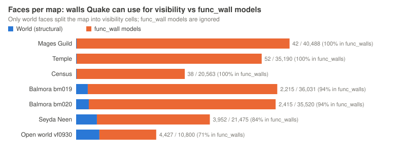
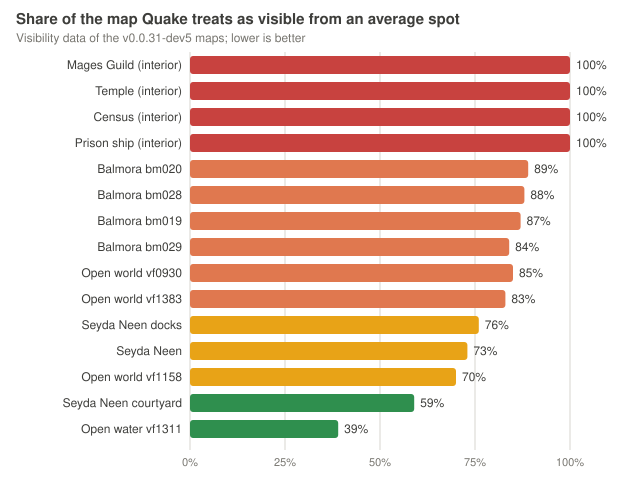

# Town visibility: why buildings do not hide what is behind them

Measured 7 October 2026 on the v0.0.31-dev5 maps. Bug:
[TOWN-VIS-OCCLUSION-31](../bugs/TOWN-VIS-OCCLUSION-31.md).

## How Quake decides what to draw

Quake's map compiler splits a map into leaves, and its `vis` tool stores, for
every leaf, the list of leaves that can possibly be seen from it (the PVS,
potentially visible set). At run time the engine only considers geometry in
leaves on that list, then clips what is left to the view. Only solid
structural brushes of the world (`worldspawn`) form the walls of leaves.
Brush entities such as `func_wall` are drawn and collide, but they never block
visibility.

## What the converter does today

Morrowind buildings are triangle meshes. The converter turns each placed mesh
into its own `func_wall` brush model, so its look, collision and per-object
records stay intact. The world itself is only the terrain.

| Map | Faces in the world | Faces in `func_wall` models | `func_wall` models | Map visible from an average leaf |
| --- | ---: | ---: | ---: | ---: |
| balmora (bm019) | 2,215 | 36,031 | 590 | 87 % |
| bm020 | 2,415 | 35,520 | 638 | 89 % |
| bm028 | 2,539 | 35,245 | 654 | 88 % |
| bm029 | 2,406 | 22,420 | 417 | 84 % |
| seyda | 3,952 | 21,475 | 217 | 73 % |

Over 94 % of a Balmora map's faces are in building models that `vis` cannot
use, so from almost anywhere in town Quake treats almost the whole town as
visible. Everything in front of the player is transformed, clipped and sorted
every frame, including houses hidden behind the one being looked at; only what
is behind the player is skipped by the view test. Shortening the fog distance
helps (owner measurement in Balmora: fog distance 250 roughly doubles the
frame rate) because the far cut-off is then the only thing removing hidden
buildings.

## Not only towns: every converted map type

| Map type | Examples | Leaves | Faces in `func_wall` models | Map visible from an average leaf |
| --- | --- | ---: | ---: | ---: |
| Interiors | Mages Guild, Temple, Fighters Guild, Census, prison ship | 2 | 20,563-40,488 | 100 % |
| Town exteriors | Balmora maps | 812-955 | 22,420-36,031 | 84-89 % |
| Seyda Neen | town, docks, courtyard | 178-1,585 | 7,716-21,475 | 59-76 % |
| Open world with rocks and trees | sampled `vf` regions | 1,096-2,814 | 4,078-10,800 | 69-85 % |
| Open water | sampled `vf` regions | 200-304 | 0 | 36-39 % |

Interiors are the extreme case: the world of an interior map is one empty box
(two leaves) and every wall, floor and room is a `func_wall`, so the whole
interior is processed every frame wherever the player stands.

NPCs and creatures are affected too. They are alias models, which Quake draws
with a depth buffer rather than the edge sorting used for walls, so an NPC
hidden behind a house still costs its full drawing work. The engine only skips
an entity whose leaves are outside the visibility data, and today that data
sees through every building.

## And the visibility that exists is the rough kind

The town, interior and Census builds run `vis -threads 1 -fast`: the quick mode,
which skips the full portal flow and leaves looser visibility lists, on a single
core per map (maps are built side by side instead). With occluders in place the
shipping build should run full `vis`, using every core on the maps it rebuilds;
area test builds can keep `-fast` for speed, and the visibility report shows the
difference.

## First prototype result (8 October 2026): occluders alone are not enough

Rebuilding bm019 with 30 structural occluder blocks and full `vis` split the
map into more leaves (811 to 1,158), but 589 of its 590 building models stayed
potentially visible from every one of 213 test points. Two reasons, both in
Quake itself:

- An entity linked to more than 16 leaves (`MAX_ENT_LEAFS`) is treated as
  visible everywhere; 362 of the 590 building models cross that line.
- A brush entity is kept or skipped as a whole, never per face.

So the building faces belong in the world model, where Quake culls faces leaf
by leaf through each leaf's surface list, with occluders giving `vis` the walls
to cut with; collision and appearance stay as they are. That combination is the
next prototype.

## The Quake way to fix it

Keep each building as its brush model, and add occluders: for every building,
one or a few invisible solid blocks inside its footprint, compiled as
structural world brushes with the `skip` texture (ericw-tools, already part of
the build). `vis` then treats the building as a wall and drops the leaves
behind it; the blocks are never drawn and cost nothing at run time. The
measure of success is the visible share above, before and after, and the
frame rate at the same view.

Interiors need the same idea per room: occluder slabs inside the thick wall
and floor meshes between rooms, so `vis` splits an interior into rooms. Large
rocks in the open world can carry occluders the same way; trees and small
rocks cannot.

## Method

The visible share is read straight from each map's visibility lump: for every
leaf with visibility data, the number of leaves in its decompressed visibility
row divided by all leaves, averaged over the leaves. Faces per model come from
the model lump; `func_wall` counts from the entity lump.

The story behind it: [Horstator's musings, 7 October 2026](../HORSTATORS_MUSINGS_2026-10-07.md).
